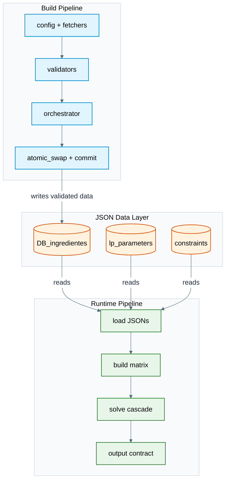
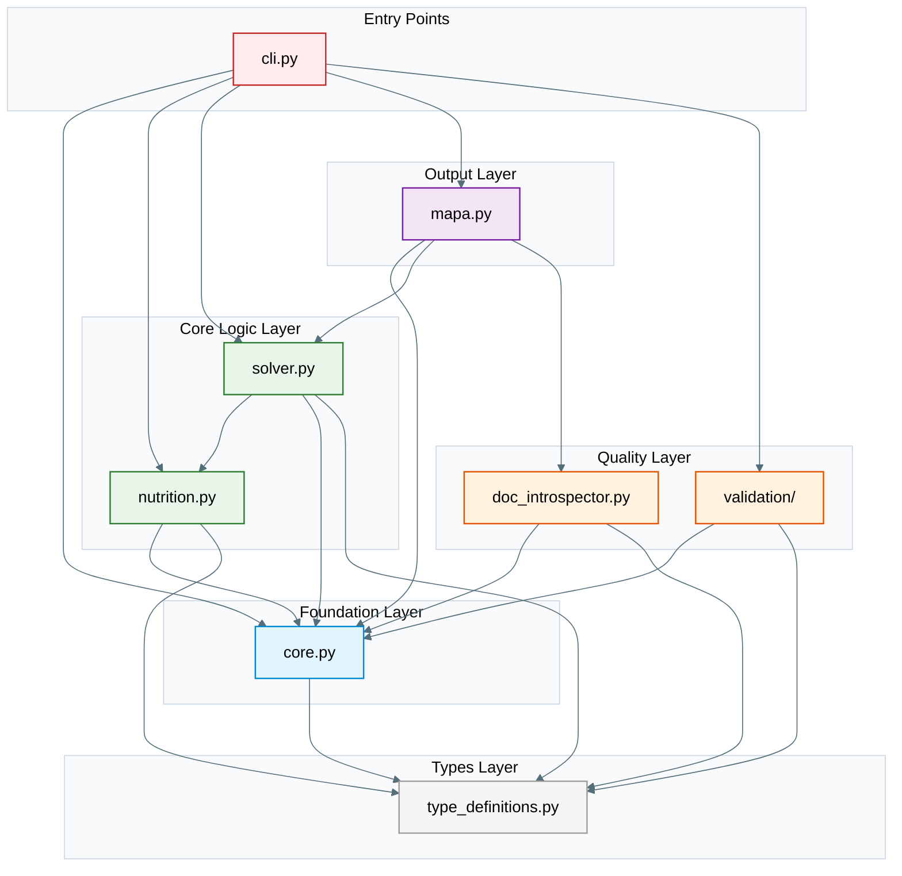
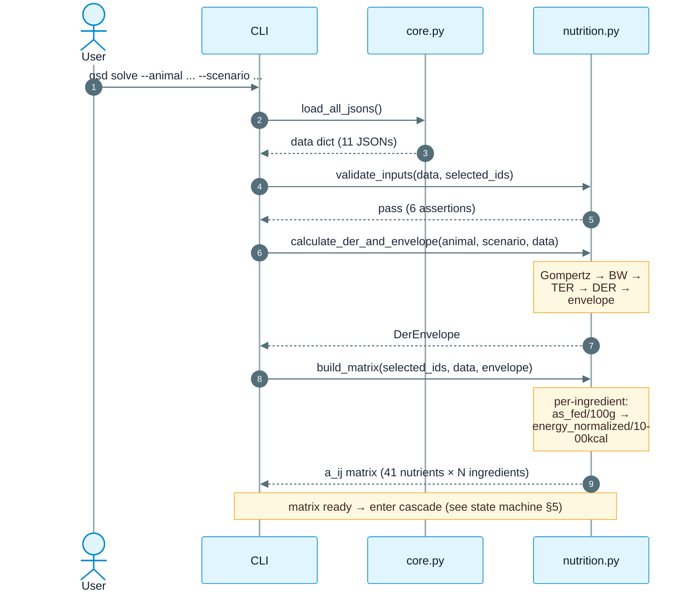
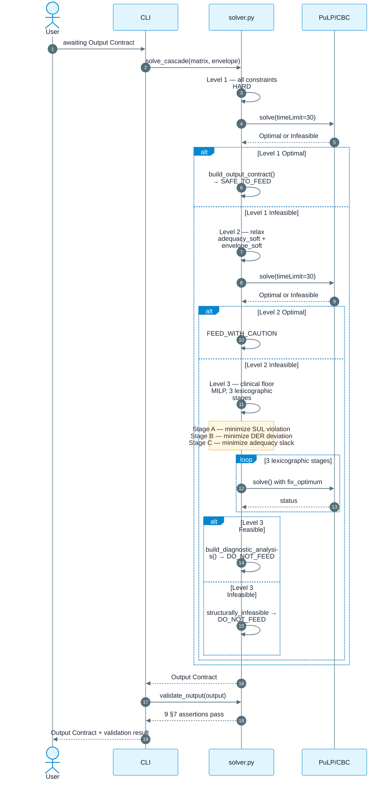
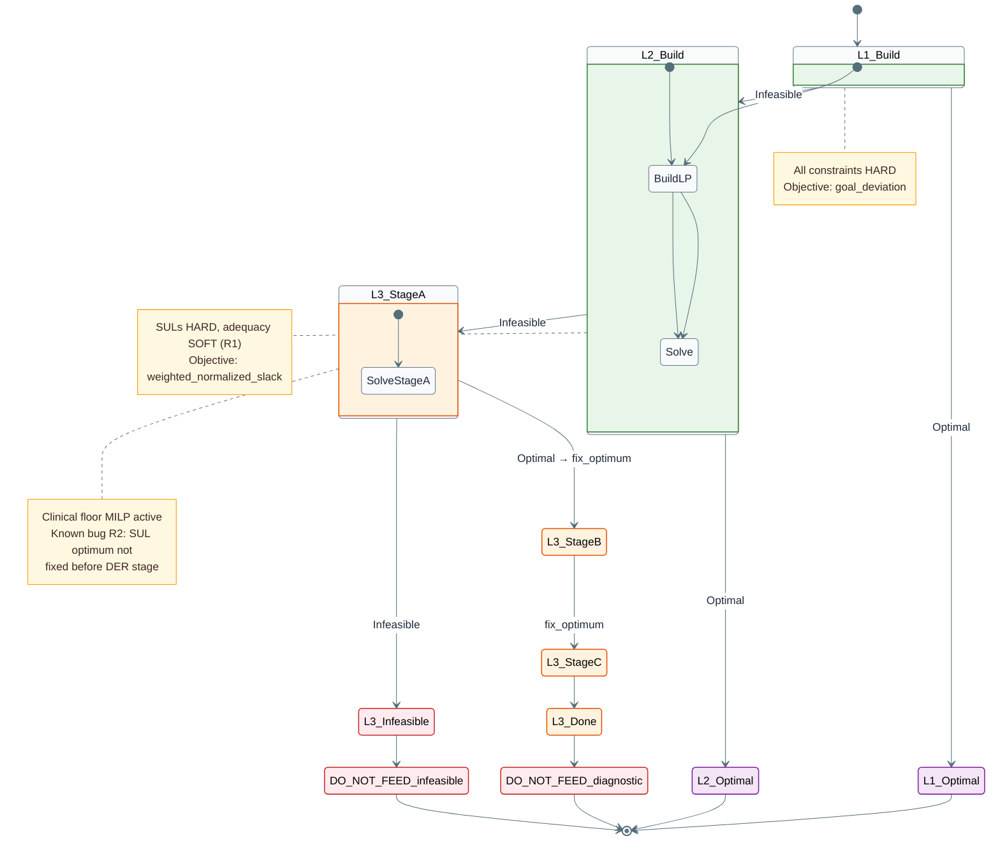
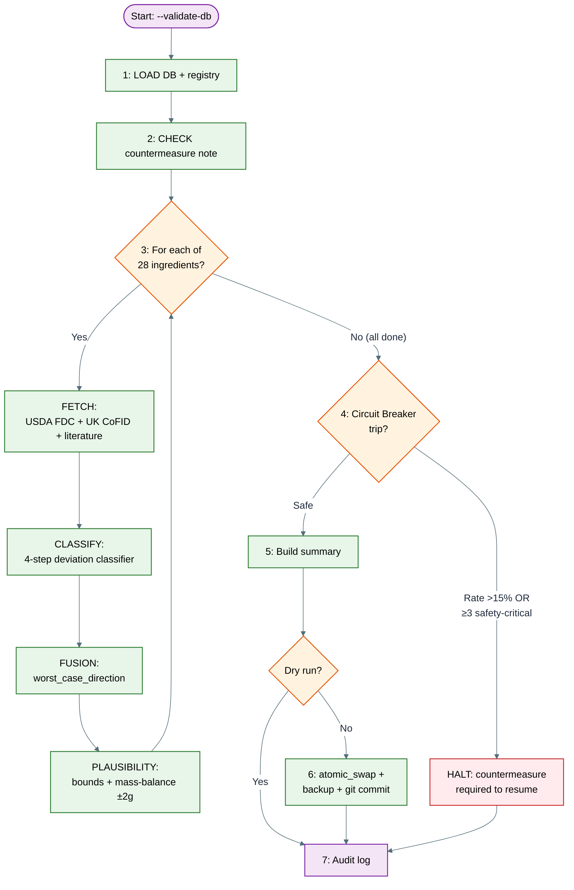
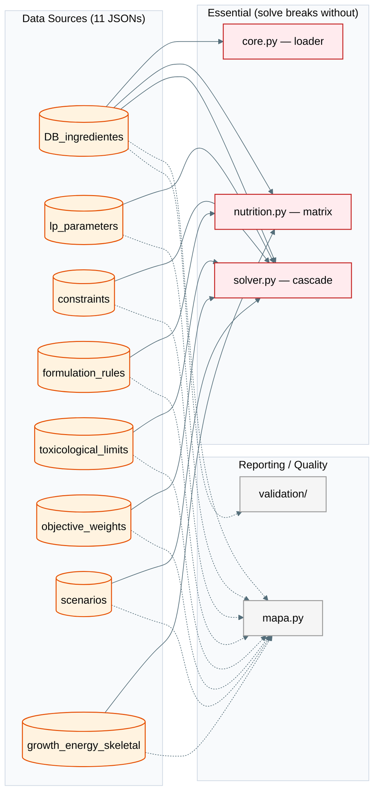
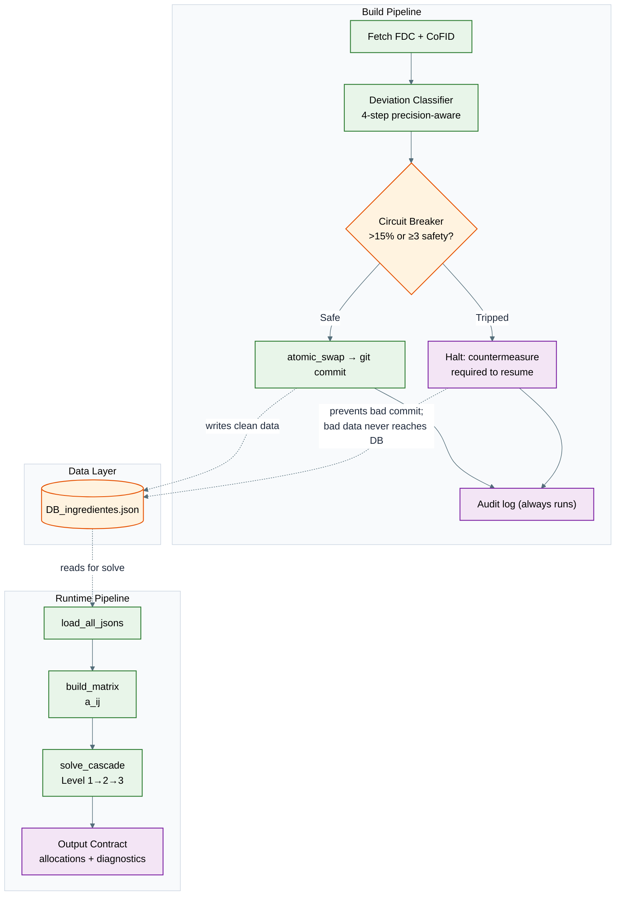

# PART 1 — The System and Its Defects: A Unified Diagnosis

**Subject:** `Hans-GSD-Raw-Calculator` (gsd-diet-calc v10.4.0) — a Linear-Programming raw-diet calculator for German Shepherd Dogs (GSD), configured against the AAFCO Large Breed Growth nutrient profile.
**Document role:** This is the complete, authoritative diagnosis of the system as it exists today. It is the first of three sequential parts. **Part 1 (this document)** catalogs every defect the system exhibits and fuses each defect with the as-built code-level mechanism that produces it, so that the reader can see, in one place, *what the system is*, *what is broken*, and *exactly how the breakage arises from the code and data that ship today*. **Part 2** carries the complete remediation program — every defect catalogued here is addressed there by a sequenced, dependency-ordered treatment plan. **Part 3** is the verified synthesis: the one-paragraph verdict, the structural-versus-surgical diagnosis, the rewrite verdict, and the master cross-reference back into Parts 1 and 2.

This document is **not a literature survey and not a stitched composite of prior reviews**. It is written in a single authoritative voice that speaks about the system as the system itself — describing its as-built structure (the modules, functions, JSON files, schemas, and pipelines that physically exist in the repository) and then naming, in the same breath, the defects that those structures produce. Defect identifiers (the A-series, B-series, C-series, D-series, E-series findings, the LP-F*, NUTR-F*, DATA-F*, VAL-F*, F-CONTRACT-*, F-ARCH-*, F-TEST-*, F-CLI-*, F-CII-*, F-DOC-*, F-TYPE-* labels, and the legacy R-01..R-09 / R1..R7 self-review IDs) are preserved throughout — but they are treated as **intrinsic technical labels woven into the narrative**, not as citations to some external review document. When the document says "the defect labeled A3 (LP-F5), also carried as the legacy R4 deviation", it is naming the same technical object the codebase and the team's own governance docs already refer to by those labels. A global key mapping every identifier namespace — findings, tasks, legacy bug IDs, governance deviations, and decision gates — with explicit disambiguation of the collisions that arise where namespaces share prefixes (e.g. finding `C7` vs task `C7`; governance `R1` vs regression-task `R1` vs legacy `R-01`), is provided as a standalone appendix (`APPENDIX-ID-KEY.md` in this directory) for cross-part navigation. A glossary of the domain acronyms used throughout (AAFCO, NRC, FEDIAF, DACVN, ECVCN, RER, DER, SUL, DOD, MILP, IIS, and others) is provided as a companion appendix (`APPENDIX-GLOSSARY.md`).

The structural backbone of the diagnosis is straightforward. The system has a single declared purpose — formulate a raw canine diet that satisfies the AAFCO Large Breed Growth profile for a German Shepherd, using a three-level linear-programming cascade with preemptive/lexicographic goal programming — and a real, working LP engine built on PuLP 3.3.2 / CBC that genuinely runs, fails closed on non-`Optimal` statuses, and is exercised by a real-data test suite (not mocks). Around that engine, however, is a constellation of placeholder outputs, soft "hard" constraints, an orphaned schema layer, a validation package that cannot import, a 42%-of-LOC documentation-generation apparatus that frequently outpaces reality, and three mutually inconsistent bug-numbering schemes. The diagnosis below walks through each subsystem in the order in which data flows through it (purpose → architecture → solver → nutrition → data → validation → output/tests/tooling) and then synthesizes the cross-cutting structural patterns that explain *why* the same failure modes (contracts that exist in name only; fragmented nutrient namespaces; Level 1 structural unreachability; documentation outpacing code) recur across subsystem after subsystem.

The headline numbers, presented here only as orientation and detailed in full in the sections that follow: the repository is 63 Python files (~22.3k LOC, of which 5,881 are in `src/gsd/`) and 34 JSON files guarded by 4 JSON Schemas; the diagnosis identifies **10 Critical, 27 High, 31 Medium, and 11 Low** defects (≈79 unique findings, deduplicated across subsystems), plus 6 empirically-cleared non-defects. The most dangerous combination is the **safety triad A2 + A3 + B2**: antagonism constraints declared hard are in fact soft at every cascade level (A2), the per-nutrient output table is hardcoded `"adequate"` with null percentages (A3, also labeled E1, F-CONTRACT-1, R4), and there is no absolute calcium maximum (B2) — so the solver can return `SAFE_TO_FEED` for a diet that violates Ca:P ratios or exceeds the safe calcium ceiling, with no flag and no test catching it. This is a direct mineral-toxicity / developmental-orthopedic-disease risk for growing large-breed dogs, and it is the central reason the system's overall verdict is *pre-alpha / prototype — no diet produced by this system should be fed to an animal until the P0 items are fixed and an independent board-certified veterinary nutritionist signs off*. The public-health and regulatory dimensions surrounding any deployment of a raw-diet recommendation system — dimensions the software-defects diagnosis does not cover — are acknowledged in `APPENDIX-PUBLIC-HEALTH-AND-REGULATORY.md`; the veterinary sign-off process and user-facing safety disclaimer are specified in `APPENDIX-SAFETY-PROCESS.md`.

---

## §1. System Purpose and Scope

### 1.1 The declared job

The system's declared job, in one sentence, is: *given an animal description (sex, weight, age, gonadal status, height) and a selection of raw ingredients from a 28-item bank, produce a daily ration — expressed in grams per ingredient — that meets the AAFCO Large Breed Growth nutrient profile, with safe-upper-limit (SUL) compliance, mineral-antagonism ratio compliance, energy-target compliance, and a transparent feeding recommendation (SAFE_TO_FEED / FEED_WITH_CAUTION / DO_NOT_FEED).* Everything else in the codebase exists to support, govern, validate, document, or scaffold that single computation.

The species target is *Canis lupus familiaris*, specifically the German Shepherd Dog, and the nutrient standard is **AAFCO Large Breed Growth** — a breed-size-specific profile that exists precisely because large-breed puppies are uniquely susceptible to **developmental orthopedic disease (DOD)**: osteochondrosis, hypertrophic osteodystrophy, and similar skeletal pathology driven by excess calcium and excessive energy intake during the growth window. The single most important safety property the system must guarantee is therefore *control of absolute calcium and energy levels during growth*, not merely ratio compliance. This baseline matters for the diagnosis because several of the most serious defects (notably B2 — no absolute calcium ceiling — and B1 — flat `k = 1.2 × RER` growth energy with no age tapering) are exactly the failures that undo the breed-specific safeguard the system is supposed to provide.

### 1.2 What the system optimizes

The optimization is a **three-level preemptive/lexicographic goal-programming cascade** built on **PuLP 3.3.2 / CBC** (the CBC binary is invoked via `COIN_CMD` with `timeLimit=30`, `gapRel=0.01`, `randomSeed=12345`). Decision variables are per-ingredient grams-per-day (`x_i`); auxiliary variables include nutrient-adequacy slack (`d_j⁻`/`d_j⁺`), SUL-violation slack (`v_j⁺`), antagonism ratio slack (`s_high_*`/`s_low_*`), DER-proximity deviation (`dev_plus`/`dev_minus`), category-goal deviation (`d_cat_*`), envelope slack, and (at Level 3) a binary `y_i` per ingredient that activates a clinical-floor MILP enforcing minimum-grams-per-used-ingredient. The objective structure is **lexicographic across stages within each cascade level**, and the cascade itself is **lexicographic across levels** — Level 1 (all constraints hard) is tried first; if infeasible, Level 2 (adequacy relaxed via clinical-criticality-weighted slack) is tried; if still infeasible, Level 3 (SULs also relaxed, three-stage lexicographic objective minimizing SUL violation → DER deviation → adequacy slack) is run, and its output is a **diagnostic** rather than a recipe.

The declared nutrient scope is **41 solver-space nutrients** (the `SOLVER_NUTRIENTS` constant in `core.py`), expanded from / collapsed into **46 DB-space nutrient keys** via an 11-entry `UNIT_RENAME_MAP` (the bidirectional `UNIT_RENAME`, `DB2SOLVER_NAME_MAP`, `SOLVER2DB_NAME_MAP` machinery in `core.py`). The 41-nutrient count is the LP optimization target; the 46-nutrient count is what the ingredient DB physically stores; the 43-nutrient count that appears in the DB schema's `minProperties:43` constraint and in `ALL_REQUIRED_KEYS` is yet another number; and the 54-nutrient count that appears in `nutrient_set_minimal.json` is yet another. This **nutrient-count inconsistency (B18, NUTR-F18) — 41 / 43 / 46 / 54 across files** — is one of the structural defects diagnosed in §4 and §5; it is mentioned here only because it shows, at the very first layer, the canonical problem the diagnosis will keep returning to: *no single authoritative registry binds the system together*.

### 1.3 What the system is not

Three negative-scope clarifications matter for the diagnosis because they bound what counts as a defect versus a non-feature. (a) The system is **not a recipe database**: the `--build-recipes` CLI mode is a stub that prints "not yet implemented" and exits 0 (E21, F-CLI-3), and the precomputed-recipe ingestion path was deliberately removed in DB v3.3.0. (b) The system is **not a general canine diet calculator**: the `growth_energy_skeletal.json` parameters are GSD-breed-line-resolved (default `working_exhibition_lines`; female `W_max` has only one line), the Gompertz growth model is parameterized for GSD, and the scenarios `SCN_A_RAPID_GROWTH` and `SCN_B_SLOW_GROWTH` are the only two allowed. (c) The system is **not a veterinary tool**: the README's own disclaimer (echoed in the diagnosis verdict) is that no diet it produces should be fed until P0 items are fixed and an independent board-certified veterinary nutritionist signs off.

### 1.4 The baseline against which defects are measured

The diagnosis measures every defect against three baseline properties the system does genuinely possess, so that the defect catalog is not a blanket dismissal but a precise map of where the system falls short of its own design.

1. **A real LP engine that genuinely runs.** The cascade solver is not a mock; `tests/test_cascade_integration.py` (1332 lines, 22 tests) loads real production JSONs via `load_all_jsons()`, builds a real PuLP problem with real compiled coefficients, solves it with real CBC, and asserts on real solver output. The anti-gamification test methodology (AAA+A, with `check_test_integrity()` in `doc_introspector.py` enforcing that every `@pytest.mark.integration` test loads real data) is a genuine strength — currently 0 violations. The defects catalogued in §3 are therefore not "the solver doesn't run"; they are "the solver runs but optimizes a different objective than documented, returns placeholder outputs, and labels violations inadequately."

2. **Correct fail-closed status mapping.** Every non-`Optimal` PuLP status (Infeasible, Unbounded, Undefined, Not Solved) collapses to `"infeasible"`, which maps through `feeding_map` to `DO_NOT_FEED` with `allocations=None`. This is the *safe* direction, and `validate_output()` (the 9-assertion output validator at `solver.py:1471-1537`) actually enforces it. The related defect (A8/E3, F-CONTRACT-2) is therefore *not* "fails open" — it is "fails closed but conflates Unbounded/Undefined/timeout with infeasibility, masking modeling bugs and discarding MILP incumbents."

3. **Scientifically credible static requirement layer.** RER is `70·BW^0.75` (correct metabolic scaling); modified-Atwater energy is `3.5×protein + 8.5×fat + 3.5×NFE` (correct factors); AAFCO per-1000-kcal minimums are the correct basis; Ca:P is hard-bounded 1.1–1.3 (stricter than AAFCO's 1:1–2:1, and appropriate); vitamin-D SUL equals the AAFCO max; EPA+DHA minimum is present; and DB ingredient values match USDA/FDC spot-checks almost exactly (chicken muscle, liver, bone, egg, fish). The nutrition defects catalogued in §4 are therefore concentrated in two places: *the growth-energy model* (B1 — flat `k=1.2×RER` with no age tapering, and inverted scenario labels) and *the missing ceilings* (B2 — no absolute Ca max; B3 — no P max). The static layer is sound; the dynamic/ceiling layer is where the safety-critical gaps live.

These three baselines — *runs, fails closed, statically credible* — are the foundation the diagnosis builds on. Every defect below is a place where the system falls short of one of these baselines, fails to extend them to a place it claims to extend them, or surrounds them with machinery that does not actually do what its name implies.

---

## §2. Architecture and Data Flow

The defects diagnosed in §3–§7 cannot be read in isolation; each one is a property of a specific seam in the as-built architecture. This section establishes that architecture in the form the rest of the document references — two pipelines that share only a JSON data layer, a six-layer module dependency graph, a setup phase that validates-then-matrix-builds, a three-level cascade state machine, and a seven-step validation orchestrator. The diagrams below are reproduced verbatim from the system's own systemic-analysis documentation because they are *content* — they describe the as-built system directly, not an interpretation of it; the prose around them is the authoritative unified voice.

### 2.1 Two-pipeline architecture

The repository contains **two completely separate pipelines that share only the JSON data layer** (`load_all_jsons()`). They have separate lifecycles, separate entry points, separate write capabilities, and they never call each other. This bifurcation is the single most important structural fact about the system, because most of the cross-cutting defects diagnosed in §8 are properties of the *seam* between them.

The **runtime (solve) pipeline** is read-only and runs on every user request. Its entry point is `scripts/mapa/build_pipeline.py` (15 lines, just `from gsd.cli import main; main()`), which delegates to `gsd.cli --runtime`, which calls `solver.solve_cascade()`. It loads the 11 runtime JSONs, validates inputs, builds the LP matrix, runs the 3-level cascade, and emits `solver_output.json`. It cannot write to the data layer.

The **build (validate) pipeline** is write-capable (with `--apply`) and runs on a curation schedule. Its entry point is `scripts/validate_db.py`, which calls `validation.pipeline.orchestrator.run_pipeline()`. It fetches reference data from USDA FDC and UK CoFID, compares against the live DB, classifies deviations, stages corrections via `CandidateWriter`, atomically swaps with `os.replace`, and git-commits. It is the only thing that mutates `DB_ingredientes.json`.

The shared contract between them is *the JSON files*, not any Python interface — and that is the structural root of multiple defects: when the runtime pipeline reads a JSON file whose shape the build pipeline never validated (because the schema that should have gated it is orphaned — C4), or when a JSON value is silently wrong because the build pipeline's deviation classifier accepted a fabricated zero as a clean validation (D3), the runtime pipeline has no way to know. The diagram below captures the topology; the prose in §8.1 returns to its consequences.



### 2.2 Module dependency graph

The runtime package `src/gsd/` is organized into six layers, with `type_definitions.py` at the base and `cli.py` at the entry-point top. The shape of this graph matters because two of the architectural defects diagnosed in §7 — E10 (F-ARCH-2: type model split across two modules "to avoid circular imports") and E9 (F-ARCH-1: `core.py` is a grab-bag mixing infrastructure, domain, and documentation concerns) — are direct consequences of how the layers are wired.



The most consequential edge in this graph is `mapa --> solver` and `mapa --> core`: the documentation-generation module reads the solver's output contract and the foundation's loaded JSONs, which means that when the solver ships a placeholder output (A3, the hardcoded `"adequate"`), the MAPA document faithfully reflects the placeholder — and when `objective_weights.json` carries 29 elaborate penalty entries that the solver never reads (A5, LP-F4), the MAPA generator nonetheless reports them as if they were the optimization's authoritative weight source. The documentation layer is structurally downstream of the defects it then propagates.

### 2.3 Runtime setup phase (linear)

The setup phase runs once per `--runtime` invocation. It is the sequence of operations that turns a user's CLI invocation into a ready-to-solve LP matrix. Four steps: load → validate → DER-envelope → matrix-build. The defects diagnosed in §3 (notably A11 — sanity assertion ignores the bioavailability factor; A12 — bioavailability keys never match real `ingredient_id`s) attach to step 4; the defects diagnosed in §4 (B1, B4, B5) attach to step 3; and the defect labeled E4 (F-CONTRACT-3, unvalidated `--runtime` input dict) attaches to the *boundary* between the CLI and step 1.



### 2.4 The cascade solve (sequence + state machine)

Once the matrix `a_ij` is ready, `solve_cascade()` takes over. It iterates `solve_cascade[]` from `lp_parameters_data.json` (the three level configurations) and stops at the first level that returns `Optimal`. The level that succeeds determines the shape of the output contract: Level 1 → `allocations` list + `SAFE_TO_FEED`; Level 2 → `allocations` list + `FEED_WITH_CAUTION`; Level 3 → `allocations=null` + `diagnostic_analysis` + `DO_NOT_FEED`; all-infeasible → `structurally_infeasible` + `DO_NOT_FEED`.



The state-machine view below makes the cascade transitions explicit and exposes one of the central structural facts of the diagnosis: **Level 1 is, in practice, frequently structurally unreachable** for realistic GSD-puppy ingredient selections, because the matrix-build defect A12 (bioavailability factors keyed by generic names never match real `ingredient_id`s, so `bio` is always 1.0) plus the missing-ceilings defect B2 (no absolute Ca max) plus the antagonism-penalty units-mismatch A4 (raw-gram penalty dominating the normalized objective by ~500×) together push the Level-1 problem toward infeasibility, sending most realistic runs into Level 2 or Level 3 — where the safety triad's worst symptoms (soft antagonisms A2, config-driven recommendation A6, hardcoded "adequate" A3) are most pronounced. The state-machine note that "Known bug R2: SUL optimum not fixed before DER stage" is *legacy text*; the R2 deviation has in fact been **fixed** (`fix_optimum: true` on the `sul_violation` stage, `call_lp_solver` lines 667–680), as the governance docs and the test suite both confirm. The diagram below preserves the original note for traceability; the verified current truth is that R2 is fixed, and the live Level-3 bug is instead A1's stage-ordering issue (which affects Levels 1 and 2, not Level 3, as §3.1 explains).



### 2.5 Validation 7-step orchestrator

The build pipeline's orchestrator (`validation/pipeline/orchestrator.py`, 764 lines) runs a seven-step flow: **LOAD** live DB + registry → **CHECK** countermeasure note (if the previous run tripped the breaker without an explanatory note) → per-ingredient **FETCH + VALIDATE** (FDC/CoFID/literature, by source type, plus Ca:P ratio check and plausibility bounds + mass-balance) → **CIRCUIT BREAKER** check → **BUILD** summary → **STAGE + SWAP + COMMIT** (if not dry-run) → **AUDIT LOG** (always). The diagram below preserves this flow exactly.



The validation pipeline's *intent* is genuinely good: tier-3 safety classification (TIGHT/WIDE/IGNORE), worst-case-direction fusion, precision-aware deviation classification, mass-balance plausibility, circuit breaker, atomic swap, backup retention, git provenance, audit logging. The defects diagnosed in §6 (D1–D22) are therefore *not* "the validation pipeline is missing safety features"; they are "the validation pipeline cannot be imported because of a missing module file (D1), its safety gate is defeatable by editing a JSON field (D5), its audit trail is overwrite-mode and not tamper-evident (D4), its atomic swap can fail cross-device with `EXDEV` mid-apply (D9), its git-provenance commit is silently swallowed after the live DB is already swapped (D8), and several other robustness gaps." The architecture is correct on paper; the *implementation* of the architecture is where the defects live.

### 2.6 The JSON→code mapping (essential vs informational)

The 11 runtime JSONs partition into **essential** (the solve breaks without them — `core.py`, `nutrition.py`, `solver.py` all read them) and **informational / quality** (consumed only by `mapa.py` and `validation/`). The single most important defect attached to this mapping is **A5 (LP-F4)**: `objective_weights.json` (322 lines, 29 entries, asymmetric penalty weights, priority tiers, gonadal multipliers, `PEN_CA_POS=10000` vs `PEN_CA_NEG=5000`, `neutered_early ×1.5`) is consumed *only* by the documentation generators (`mapa.py:530/533/1270`, `doc_introspector.py:703`) and by `core.py:60/419` for the `weight_index` it builds for the MAPA; **the solver never reads it**. The solver instead uses a hardcoded `CRITICALITY_WEIGHT = {"critical": 10.0, "high": 5.0, "moderate": 2.0, "low": 1.0}` map at `solver.py:16`. Editing `objective_weights.json` therefore changes the documentation but does not change the optimization — a fundamental trustworthiness gap and a maintenance trap. §3.5 develops this fully; the diagram below sets the topology.



### 2.7 Cross-cutting concerns (the connective tissue)

The diagnosis returns repeatedly to nine cross-cutting concerns that span multiple modules. Each is summarized here so that §3–§7 can reference them by name without re-explaining.

| Concern | Primary module(s) | Consumed by | Description |
|---|---|---|---|
| **Tie-Break System (R-03)** | `solver.py:20-103` | final stage of every cascade level | `derive_tie_break_bound()` + `enforce_tie_break_bound()`. Tie-break perturbation must stay strictly below fix-optimum tolerance. Applied ONLY to the final (non-fixed) stage. The legacy hash-perturbation form was removed; the current form is flat `tie_weight × var`. Related defects: A10 (LP-F10, tie weight can be auto-scaled below tolerance and become numerically useless). |
| **Category Goals (R-04/R-05)** | `solver.py` stages, `core.py:93-114` | `build_output_contract`, MAPA §7 | Sum-to-100% check at load time (`validate_category_goals()`). Achieved_pct = `100 × cat_grams / total_grams`. Can be disabled entirely via `category_goals_enabled: false` (the default). Related defects: A1 (LP-F1, stage order makes the category stage a no-op even when enabled). |
| **Clinical Criticality** | `solver.py:727-886`, `lp_parameters_data.json` | Level 2 slack, Level 3 Stage C | Weight map `{critical: 10, high: 5, moderate: 2, low: 1}`. Drives how severely a nutrient deficiency is penalized. Related defect: A5 (this hardcoded map displaces the elaborate `objective_weights.json`). |
| **3-State Nutrient Contract** | `nutrition.py:263-333`, `DB_ingredientes.json` | `solver.py`, `validation/validators/` | `measured` → used in LP. `missing` → skipped (0 contribution). `not_applicable` → ignored. Propagates through `build_matrix()`. Related defect: C13 (DATA-F13, the 3-state contract collapses in practice — `missing` used 0 times; 48 `measured=0` entries conflate "0" with "unknown"). |
| **Constraint Tier** | `lp_parameters_data.json` `constraint_tier` | `solver.py` cascade, `validation/` | `adequacy_soft` → relaxes in L2. `safety_hard` → stays hard until L3. `envelope_soft` → relaxes in L2. Related defect: R5 (legacy) / A6 — `_MIN` constraint IDs forcibly assigned `adequacy_soft` (`solver.py:313-317`), so what should be a hard minimum is soft from Level 2 onward. |
| **Unit Rename System** | `core.py:58-63` (`UNIT_RENAME_MAP`), `core.py:168-180` (`UNIT_RENAME`) | `nutrition.py` conversion, `solver.py` coefficients | 11 bidirectional mappings with scale factors (mg→/1000→g, ug→/1000→mg). DB IDs ↔ solver IDs. Related defects: C7 (DATA-F7, unit not bound to nutrient key — a `chloride_mg` with `unit:"g"` passes); C5 (DATA-F5, conflicting duplicate units — `chicken_blood_raw` magnesium 20.5 vs 5.0 mg). |
| **State Marker** | `doc_introspector.py` `compute_state_marker()` | `validate_mapa` Check 13 | Deterministic 16-char hash of all JSON file contents + satellite line counts. Used for MAPA staleness detection. Related defect: E11 — the doc-introspection apparatus is ~1106 LOC and feeds the MAPA, which has been observed to ship false "NOT IMPLEMENTED" claims (the team's governance docs acknowledge this drift). |
| **Circuit Breaker** | `validation/pipeline/orchestrator.py` | `validation/` pipeline | Two thresholds: deviation rate >15% OR ≥3 safety-critical violations per ingredient. Tripped state requires `countermeasure_note` to resume. Related defects: D5 (VAL-F5, the gate is defeatable by editing the JSON field); D4 (audit trail not tamper-evident). |
| **MAPA Sentinel System** | `indice_plano_central.md` | `mapa.py section1_header`, `validate_mapa` Check 12 | `<!-- MAPA:STATIC-START/END -->` for preamble extraction. `<!-- MAPA:AUTO-ROADMAP/BUNDLES -->` for auto-generated sections. Must appear exactly once each. Related defect: E11 (42% of package is doc-gen machinery; MAPA can drift from code). |

### 2.8 Known-deviation ripple effects (the structural map of legacy bugs)

The repository carries a six-item legacy bug list (`R1`–`R7`) maintained in `docs/governance/systemic_review_pipeline_vs_satellites.md`. Of these, **R2 and R3 are verified fixed**, R6 is verified still present (cosmetic), R7 is verified (37 tests pass), and **R1, R4, R5 are verified still present and map directly to Critical/High defects in the diagnosis** — R1 ↔ A2 (LP-F2, antagonisms soft at every level); R4 ↔ A3 (LP-F5, hardcoded `"adequate"`); R5 ↔ A6's underlying mechanism (`_MIN` IDs forced `adequacy_soft`). The ripple diagram below shows how a defect in one layer propagates through the cascade levels and into the output contract; §8 returns to this as the canonical example of *structural* (rather than surgical) defect patterns.

```mermaid
%%{init: {"theme": "base", "themeVariables": {"fontSize": "17px", "fontFamily": "\"Segoe UI\", Helvetica, Arial, sans-serif", "primaryColor": "#f8fafc", "primaryBorderColor": "#64748b", "primaryTextColor": "#1e293b", "lineColor": "#546e7a", "secondaryColor": "#f8fafc", "tertiaryColor": "#f8fafc", "clusterBkg": "#f8fafc", "clusterBorder": "#cbd5e1", "edgeLabelBackground": "#ffffff", "background": "#ffffff", "noteBkgColor": "#fff8e1", "noteBorderColor": "#f9a825", "noteTextColor": "#3e2723"}, "flowchart": {"nodeSpacing": 40, "rankSpacing": 55, "curve": "basis"}} }%%
flowchart TD
    classDef rootCause fill:#ffebee,stroke:#c62828,color:#000,stroke-width:1.5px
    classDef impactL1 fill:#fff3e0,stroke:#e65100,color:#000,stroke-width:1.5px
    classDef impactL2 fill:#fff3e0,stroke:#e65100,color:#000,stroke-width:1.5px
    classDef impactL3 fill:#fff3e0,stroke:#e65100,color:#000,stroke-width:1.5px
    classDef impactOut fill:#f3e5f5,stroke:#7b1fa2,color:#000,stroke-width:1.5px

    %% ==== ROOT CAUSES ====
    r1["R1: Mineral antagonisms<br/>unbounded slack"]:::rootCause
    r2["R2: Level 3 doesn't<br/>fix SUL optimum"]:::rootCause
    r3["R3: Tie-break can<br/>dominate nutrition"]:::rootCause
    r4["R4: pct_of_min/pct_of_sul<br/>both null"]:::rootCause
    r5["R5: _MIN IDs forced<br/>adequacy_soft"]:::rootCause

    %% ==== IMPACTS BY LEVEL ====
    subgraph L1["Level 1 Impacts"]
        l1Min["Mineral ratios not<br/>actually hard"]:::impactL1
        l1Tie["Tie-break adds<br/>artificial variance"]:::impactL1
    end

    subgraph L2["Level 2 Impacts"]
        l2Antag["Antagonisms have<br/>unlimited slack"]:::impactL2
        l2Tier["_MIN forced<br/>adequacy_soft"]:::impactL2
    end

    subgraph L3["Level 3 Impacts"]
        l3Sul["SUL optimum not fixed →<br/>DER stage re-introduces violations"]:::impactL3
        l3Diag["Diagnostic omits<br/>real pct values"]:::impactL3
    end

    subgraph Out["Output Contract"]
        outPct["pct_of_min + pct_of_sul<br/>both null → gap analysis broken"]:::impactOut
    end

    %% ==== EDGES ====
    r1 --> l1Min
    r1 --> l2Antag
    r3 --> l1Tie
    r5 --> l2Tier
    r2 --> l3Sul
    r4 --> l3Diag
    r4 --> outPct

    %% ==== EDGE STYLING ====
    linkStyle 0,1,2,3,4,5,6 stroke:#c62828,stroke-width:2px
```



### 2.9 Validation-to-runtime feedback loop

The diagram below captures the contract the two pipelines are supposed to honor: the build pipeline writes *clean* data into the DB (atomic swap + git commit), and the runtime pipeline reads it; the circuit breaker and audit trail are supposed to guarantee that no bad data ever reaches the DB. The defects diagnosed in §6 (notably D8 — git-commit failure silently swallowed after the live DB is already swapped, and D5 — circuit-breaker gate defeatable by editing a JSON field) are failures of *this specific feedback contract*: they allow bad data to reach the runtime pipeline's input while the build pipeline reports success. The runtime pipeline has no defense against this, because — as §2.1 established — the two pipelines share only the JSON files, and the runtime pipeline trusts them absolutely.



### 2.10 The data-integrity contract chain (3-state propagation)

The 3-state nutrient contract (`measured`/`missing`/`not_applicable`) is supposed to propagate through every layer of the runtime pipeline, from the DB cell to the output contract's `nutrient_results[]`. The chain below shows how it is *intended* to work; the diagnosis will return to it in §5 (C13 — the 3-state contract collapses in practice) and §3 (A3 — the output contract unconditionally emits `"adequate"` regardless of what the chain delivered). The chain is also where the legacy R4 deviation lives: `pct_of_min: null` and `pct_of_sul: null` in the output contract, regardless of input.

```
DB_ingredientes.json  ──→  nutrition.py          ──→  solver.py               ──→  Output Contract
  per cell:                convert_as_fed_to_       build_lp_problem():         nutrient_results[]
  {status, value}           energy_normalized():     - measured → constraint      {status, value,
  - measured ↴              - measured → convert     - missing → skip              pct_of_min: null (R4)
  - missing                 - missing → {status:     - not_applicable → skip     }
  - not_applicable           "missing", no value}
                            - not_applicable →
                             {status:
                              "not_applicable"}
                                    ↓
                            bioavailability_factor()
                            (default 1.0)
```

### 2.11 Architectural patterns and integration points

The diagnosis refers to nine recurring architectural patterns and twelve named integration points. They are summarized in §8 (Systemic Patterns) where the structural diagnosis is built; here they are listed for reference. **Patterns**: two-pipeline architecture; level-bifurcated output contract (`allocations` for L1/L2, `diagnostic_analysis` for L3); satellite documentation with the 3-Satellite Rule; CCC (Candidate → Check → Commit) write discipline; singleton safety; lexicographic goal programming; dual-contract dataclass (`DerEnvelope`); sentinel-based extraction; anti-gamification AAA+A test methodology. **Integration points**: `load_all_jsons()` → dict; `build_matrix()` → `a_ij`; `solve_cascade()` → `SolverOutput` dict; `CrossRefIndex` dataclass; `validate_ingredients_against_schema()`; `compute_state_marker()` → hash; `check_structure_contracts()`; `ImplIntrospector.check()`; `classify_deviation()` → `DeviationClass`; `atomic_swap()`; `CandidateWriter`. Each integration point has a contract; several of those contracts are violated by the defects catalogued below (notably `classify_deviation()`'s contract is violated by D3 — empty-200 accepted as clean validation — and `atomic_swap()`'s contract is violated by D9 — `EXDEV` failure mode).

This completes the architectural backdrop. The remaining sections walk through each subsystem in dependency order, naming every defect with its finding ID, severity, code-level mechanism, and implications — and weaving each defect into the structural backdrop above so that the diagnosis is one continuous analysis rather than a list.

---

## §3. The LP Solver — As-Built and Defects

The LP solver is the heart of the system and also the locus of its most safety-critical defects. This section hybridizes the function-by-function code reality of `solver.py` (1661 lines, 13 named functions) with the 20 LP-model findings (A1–A20). The order of treatment follows the solver's own execution order — tie-break setup → `build_lp_problem()` → `call_lp_solver()` → `_build_stage_objective()` → `solve_cascade()` → `compute_gaps()` → `build_output_contract()` → `build_diagnostic_analysis()` → `validate_output()` → `check_fat_source_adequacy()` — so that each defect is attached to the function whose code produces it. Where a finding spans multiple functions (the safety triad A2+A3+B2, for example, spans `build_lp_problem`, `build_output_contract`, and the data layer), the treatment is given once, at the function where the defect's *mechanism* lives, and cross-referenced from the other locations.

### 3.1 The tie-break system and `derive_tie_break_bound()` / `enforce_tie_break_bound()` (lines 20–103)

The deterministic tie-break (legacy ID **R-03**, now fixed in its original form) exists to ensure that when the primary objective has multiple optima, the solver picks a deterministic one rather than an arbitrary CBC-internal one. The legacy implementation used a per-ingredient hash perturbation (`det_hash(iid) % 10000 * 0.1`, a 0–999.9 range), which could dominate the primary objective and corrupt optimality. That form was removed; the current implementation is a flat `tie_weight × var` with no hash multiplier, guarded by a tolerance bound.

The two functions enforce a single invariant: **the tie-break's maximum contribution must stay strictly below the fix-optimum tolerance**, so it can act as a tie-breaker but never as a primary objective. The tolerance formula is `max(tol_abs, tol_rel × 1.0)` where `tol_abs = 0.01` and `tol_rel = 1e-6`. `derive_tie_break_bound()` checks whether `tie_break_weight × maxBigM < tolerance` and returns a dict with `within_bound: bool`. `enforce_tie_break_bound()` then either returns the weight unchanged (if within bound) or, in runtime mode (`raise_on_violation=False`), auto-scales the weight to `tolerance * 0.99 / grams` and emits a `UserWarning`; in config-validation mode (`raise_on_violation=True`) it raises `TieBreakConfigError`.

The defect attached to this system is **A10 (LP-F10, severity Medium, priority P2)**: the auto-scale rule can scale the tie weight so small that it *never* breaks ties — it becomes numerically invisible to the simplex. The consequence is degenerate tie-breaking and apparently non-deterministic selections among true optima, even though the implementation is deterministic in principle. The fix is to set the tie weight to a meaningful fraction of the smallest tolerated primary difference and to assert at build time that it is non-degenerate (i.e., that the auto-scaled value is still above the simplex's effective precision floor). The tie-break also depends on `randomSeed=12345` (CBC's deterministic seed); if a future PuLP upgrade changes how the seed is passed, the determinism guarantee could silently regress, which is why a build-time assertion is preferable to relying on the seed alone.

### 3.2 `build_lp_problem()` (lines 105–579) — LP matrix assembly

This 474-line function is the LP matrix builder. It is the single longest function in the codebase and the structural root of finding **E12 (F-ARCH-4)** — `solver.py` is a 1661-LOC god module and `build_lp_problem` alone is 474 lines — which is itself a Medium-priority refactor target. The function's internal flow is: variable creation → coefficient compilation → Big-M derivation → target/SUL scaling → six constraint families → clinical-floor MILP (Level 3 only). Each step carries its own defects.

**Variables (`x_i`).** A `pulp.LpVariable` is created for each ingredient that has at least one measured nutrient; ingredients with no measured nutrients are skipped with a `[WARN]` print. The latent defect here is **A15 (LP-F15, Medium, P2)**: PuLP silently creates two variables with the same name, so a future refactor that reuses a variable name (e.g. by adding a per-supplement `x_supplement_kelp` that collides with an existing ingredient ID) would silently corrupt the objective. The fix is to assert variable-name uniqueness at build time.

**Coefficient compilation (as-fed/100g → energy-normalized per-gram).** The DB stores nutrients as-fed per 100g; the LP needs them as per-gram per-1000-kcal so that the solver's gram choices automatically scale nutrients with the energy each ingredient supplies. The formula is `nutrient_per_gram = a_ij × em_per_g / 1000.0` where `em_per_g = EM_100g / 100.0` and `EM_100g` is the modified-Atwater energy. The build-time sanity assertion picks the first ingredient/nutrient pair, independently recomputes the value from the stored per-100g entry, and asserts `abs(expected - got) < 1e-9`.

The defect attached to this assertion is **A11 (LP-F11, Medium, P2)**: the sanity check compares raw vs converted nutrients *without the bioavailability factor* that the conversion applies. A real bio-factor bug could therefore pass the sanity assertion. The fix is to include the bio factor in the assertion (or to assert the round-trip with bio applied). This compounds with **A12 (LP-F12, Medium, P2)** — the bioavailability-factor lookup keys (in `formulation_rules.json`'s `bioavailability_factors` section) are generic tokens like `"muscle"` and `"liver"`, which never equal the real `ingredient_id` strings (e.g. `beef_muscle`, `chicken_liver`). The lookup therefore always misses and defaults to `1.0`, which means **the entire bioavailability machinery is dead** — every nutrient is treated as 100% bioavailable regardless of source. The fix is to key bio factors by real `ingredient_id` (or a mapped category) and to assert at load time that every ingredient resolves to a factor. (The data-layer sibling of A12 is C21 / DATA-F21, which notes that `bioavailability_factors` is fully unvalidated; the two findings describe the same defect from the code side and the data side respectively.)

**Big-M per ingredient.** `M_i = DER_kcal / EM_i_kcal_per_100g × 100` — the grams of ingredient *i* alone that would satisfy 100% of DER. This is a *tight* Big-M, much better than a uniform 10000 g constant. The defect is **A9 (LP-F9, Medium, P2)**: when `EM_i` is unavailable, the code falls back to `10000 g`, producing an `M / floor` ratio that can reach ~1e5 and weakening the MILP relaxation. The supplement floor of `0.1 g` makes the ratio worse. The fix is to derive a tight per-ingredient M or to refuse to add the floor (raise) rather than fall back to a huge M.

**Targets and SULs per day.** `scenario.targets[].value × units_of_1000kcal` for minimums; `toxicological_limits.sul.value × units_of_1000kcal` for ceilings. The conversion is correct; the defects are in *which* targets and ceilings exist, which is the subject of §4 (B2 — no absolute calcium maximum; B3 — no phosphorus maximum; B6–B10 — verify Cu/Fe/I/Mn/Zn SULs against NRC).

**Constraints built.** Six families:

1. `add_nutrient_constraints()` — minimums from `constraints.json` → `CSTR_NB_*_MIN` → tier from ID prefix (`adequacy_soft` if the ID ends in `_MIN`, `safety_hard` if it starts with `CSTR_SUL_`). This is where the legacy **R5** deviation lives: `_MIN` constraint IDs are forcibly assigned `adequacy_soft` (`solver.py:313–317`), regardless of the registry's declared tier. The consequence is that what should be a hard minimum (a clinical-floor nutrient minimum) becomes relaxable in Level 2 via clinical-criticality-weighted slack. The fix is to drive the tier from the registry, not from the ID prefix.

2. `add_sul_constraints()` — SUL ceilings → `safety_hard` (Level 3 relaxes with `v_plus` slack). Correct in principle; the B-series defects are about *which* SULs exist and at what values.

3. `add_inclusion_constraints(relax)` — category inclusion limits with wildcard expansion (`_all_muscle_meat`, `_all_fat_source`, `_all_fish`). Level 3 adds slack variables for max/min inclusion. The defect is **A20 (LP-F20, Medium, P3)**: relaxation is controlled by a level-equality boolean (`relax=(cascade_level==3)`) rather than declarative config, so a 4th level or a per-constraint relaxation policy requires code changes. The fix is to make relaxation policy declarative per constraint/level in config.

4. `add_antagonism_constraints()` — five mineral antagonisms (Ca:P 1.1–1.3, Zn:Cu ≤12, Fe:Zn ≤3, Ca:Mg 12–18, Lys:Arg 1.0–1.4), each with slack variables `s_high_*`/`s_low_*`. This is the locus of the safety-triad defect **A2 (LP-F2, Critical, P0)**, also carried as the legacy **R1** deviation and compounded by **A14 (LP-F14, Medium, P1)**: the antagonism slack is penalized *only in Level 1* (via `goal_deviation`'s `antagonism_penalty_weights`, default 5000), and in Levels 2 and 3 the slack is **unbounded and unpenalized**. Meanwhile `constraints.json` and `formulation_rules.json` declare `solver_behavior = HARD_FAIL_INFEASIBLE` for these antagonisms, and the config author's note shows they *believed* it was hard. The result is that a diet with a violated Ca:P or Zn:Cu ratio can be returned as `SAFE_TO_FEED` (Level 1, if the violation is small enough to be absorbed by slack) or `FEED_WITH_CAUTION` (Level 2) with no penalty and no flag. Combined with A3 (hardcoded "adequate", §3.7) and B2 (no calcium max, §4.2), this is the **safety triad** — `SAFE_TO_FEED` for a diet that violates mineral ratios and exceeds calcium, undetectable. The fix is to make code match the true contract: if antagonisms are safety-critical (Ca:P and Zn:Cu are), enforce them as hard constraints in Level 1 (no slack) so violation ⇒ infeasible ⇒ `DO_NOT_FEED`. If a relaxed view is wanted, expose the slack magnitude in the output and force `FEED_WITH_CAUTION` or `DO_NOT_FEED` when any antagonism slack exceeds tolerance.

5. `add_envelope_constraints()` — `min_total_g` HARD always; `max_total_g` has slack in Level 2 (`envelope_soft`). The envelope is derived in `nutrition.calculate_der_and_envelope()` (§4.4) as `(DER / max_density) × 0.9` to `(DER / min_density) × 1.1`. No specific defect attaches here, but the envelope depends on the density-range computation, which depends on the moisture/ash assumption that B4 (LP-F5) identifies as fabricated.

6. `add_der_proximity()` — `total_energy - dev_plus + dev_minus == DER`. The deviation variables `dev_plus`/`dev_minus` are used in Level 3 Stage B (`minimize_absolute_der_deviation`). No specific defect attaches.

**Clinical Floor MILP (Level 3, lines 523–557).** A binary `y_i` per ingredient, with `x_i ≤ M_i × y_i` (zero-out when not used) and `x_i ≥ floor_g × y_i` (minimum when used). The floor comes from `formulation_rules → _inclusion_semantics → inclusion_constraints[].clinical_floor_g`, falling back to the category default, falling back to a global `5g`. The documented Level-2/3 floor-relaxation fallback (`clinical_floor_relaxed`) is **never set**, which is **A7 (LP-F7, High, P1)**: the relaxation path described in the docs was never implemented; `validate_output`'s relaxation-note check (#9) is dead code. The fix is to implement the relaxation path or to remove the documentation and the dead validation check. (The dead `validate_output` check is a contract that exists in name only — §8 returns to this pattern.)

### 3.3 `call_lp_solver()` (lines 582–724) — lexicographic stage execution

This function takes the assembled `LpProblem` and runs the per-level lexicographic stages. The flow is: for each stage in `objective_stages[]`, build the objective via `_build_stage_objective()`, add the tie-break only on the final (non-fixed) stage, solve with CBC, and either add a fixing constraint (if `fix_optimum=True`) or proceed to extract the solution. The fixing constraint is `obj_expr ≤ optimal_obj × (1 + tol_rel) + tol_abs`, where `tol_abs = 0.01` and `tol_rel = 1e-6`. For stages with binary variables, `tol_rel = max(tol_rel, mip_gap)`.

**A1 (LP-F1, Critical, P0)** — the lexicographic stage order is broken at Levels 1 and 2. In preemptive goal programming, the *last* stage must be the non-fixed (tie-break) stage and all higher-priority stages must be fixed. The `lp_parameters_data.json` config puts the non-fixed stage in the *middle*: Level 1 = `[goal_deviation(fix), category_preferences(NO fix), minimize_absolute_der_deviation(fix)]`, and Level 2 is analogous. The fixing constraint is added only `if fix_opt:` (lines 670–680: `bound = optimal_obj*(1+tol_rel)+tol_abs; prob += obj_expr <= bound`). Stage 2 (category) has `fix_optimum=False`, so no constraint is added; Stage 3 then sets `prob.setObjective(DER)` and re-optimizes over only `{goal_deviation <= bound1}`. The final allocation, read after the last solve (line 687), optimizes DER deviation subject to the goal_deviation bound only — **category (BARF/PMR template) preferences and the deterministic tie-break have ZERO effect on Level 1/2 allocations.** The reported `template_adherence` (computed at `solver.py:1290+`) is computed from grams that were never optimized for category goals. The fix is to reorder stages so the non-fixed tie-break stage is last (move DER before category, or fix category and make it the final free stage), and ideally to drive stage order/priority from a single explicit `priority` field with a build-time assertion that the free stage is last.

**A17 (LP-F17, Medium, P2)** — the `fix_optimum` bound uses a relative+absolute tolerance that can over-constrain later stages. The bound `optimal_obj*(1+tol_rel)+tol_abs` may be tighter than intended for near-zero objectives, risking infeasibility of later stages. The fix is to use a tolerance scaled to the objective magnitude and to guard against near-zero `optimal_obj`.

**A8 (LP-F8, High, P1)** — also carried as **E3 (F-CONTRACT-2)** — all non-`Optimal` CBC statuses collapse to `"infeasible"`. Lines 659–661: a single `if status != "Optimal": return {"status": "infeasible"}` branch. PuLP statuses include `Optimal`, `Not Solved`, `Infeasible`, `Unbounded`, `Undefined`. This **fails closed** (it maps to `DO_NOT_FEED`, `allocations=None` — the safe direction, confirmed by the `validate_output` assertion that `feeding_recommendation` matches the status map), but it conflates `Unbounded`/`Undefined`/timeout with infeasibility, masking modeling bugs and discarding MILP incumbents (a feasible-but-suboptimal solution at timeout is thrown away). The fix is to branch on `prob.status` into distinct `unbounded`/`timeout`/`numerical`/`infeasible` results, all mapping to `DO_NOT_FEED` but with different diagnostics, and to surface a `Not Solved` incumbent when available. The solver config is `cbc_time_limit_seconds=30`, `gapRel=0.01`.

The_CBC solver is invoked with `randomSeed=12345` and `tie_break_weight=5e-6`. The timeout behavior is the subject of the test-defect **E5 (F-TEST-1, High, P1)**: `test_solver_timeout_returns_result` (in `tests/test_cascade_integration.py:332-336`) is a stub that never runs the solver — its body is only `audit_test_result("test_solver_timeout_returns_result", {"timeout_handled": True}, "timeout_handled")` with the comment *"Hard to test without mocking; document expected behavior."* It passes unconditionally. Timeout handling — a real fail-closed path — is therefore **untested**, despite the README's "real PuLP, real CBC solver" claim. The fix is to set `solver_params["time_limit"]` to a tiny value (or monkeypatch CBC `maxSeconds`) and assert that a result object is still returned with a safe status. §7 returns to this in the test-defect treatment.

### 3.4 `_build_stage_objective()` (lines 727–886) — seven stage kinds

The objective builder supports seven stage kinds:

| Kind | Formula | Used in |
|---|---|---|
| `minimize_normalized_sul_violation` | Σ v_j⁺ / SUL_j | Level 3, Stage A |
| `minimize_absolute_der_deviation` | dev_plus + dev_minus | Level 3, Stage B |
| `minimize_weighted_normalized_adequacy_slack` | Σ (slack_j / target_j) × crit_weight | Level 3, Stage C |
| `weighted_normalized_deviation` | Σ (d_j⁻ + d_j⁺) / target_j × crit_weight | Level 1 (goal programming; legacy) |
| `goal_deviation` | Same + antagonism slack penalties | Level 1 (canonical) |
| `weighted_normalized_slack` | Σ (slack_j / target_j) × crit_weight + env_slack | Level 2 |
| `category_goal_deviation` | Σ (d_cat⁻ + d_cat⁺) × effective_weight | Level 1 (if enabled) |

The `crit_weight` entries all use the hardcoded `CRITICALITY_WEIGHT = {critical: 10, high: 5, moderate: 2, low: 1}` from the `clinical_criticality` field in `NUTRIENT_REGISTRY`. They **do not** come from `objective_weights.json` — that 29-entry file is consumed only by the documentation generators (this is the A5 defect, treated in §3.5). The `weighted_normalized_deviation` kind is a legacy variant of `goal_deviation` that lacks antagonism slack penalties; it is **never used** by any cascade level's config (only `goal_deviation` runs in production at Level 1), and its presence is the dead/parallel code defect **A19 (LP-F19, Medium, P3)** — confusion about which deviation formulation is authoritative.

The category-goal deviation (legacy **R-04/R-05**) is the source of additional complexity: when disabled (the default — `category_goals_enabled: false` in `solver_params`), it returns `pulp.lpSum([])` — a structural no-op that nonetheless still consumes a stage slot, so the tie-break still attaches to the final (3rd) non-fixed stage. When enabled, it creates `d_cat_*_minus/plus` variables and uses `base_weight × 0.01` as the coefficient. But because of A1, even when category goals are enabled, the stage ordering means the tie-break overrides them — so enabling the flag changes the documentation but does not change the optimization. This is a contract that exists in name only.

**A4 (LP-F3, High, P1)** — the antagonism penalty has a units mismatch and dominates the normalized objective by ~500×. The Level-1 objective adds **raw g/mg antagonism slack × 5000–7000** (penalty weights 7000/5000/5000/5000/3000 for the five antagonisms) alongside **dimensionless normalized** terms (`slack/target`, `v/sul`). One gram of Ca:P violation costs 7000 in the objective, while a missed nutrient goal costs ≤10. The ~500× relative dominance distorts the Level-1 trade-off: the solver over-prioritizes ratio centering relative to true nutrient adequacy. The fix is to normalize antagonism slack (e.g. `slack / target_ratio`) before weighting so all Level-1 terms are dimensionless and comparable. This defect compounds A2 — the soft antagonism is not only soft, it is also *loud* in the objective when it does fire, distorting trade-offs away from adequacy.

**A18 (LP-F18, Medium, P2)** — wide coefficient range (~1e8) in the objective and constraints. Mixing raw gram/mg coefficients with normalized terms and large penalty weights produces a coefficient range of roughly 1e8, which causes CBC numerical stress and potential precision loss in the simplex. The fix is to scale all terms to comparable magnitude (full normalization) and to keep the coefficient range below ~1e4.

**A16 (LP-F16, Medium, P2)** — `caloric_density` target is a fixed scenario constant rather than a derived variable. The caloric-density goal uses a hardcoded scenario constant (`scenarios.json`'s `caloric_density = 4500 kcal/kg_DM`) rather than a value derived from the animal/scenario biology. The DER-proximity goal therefore targets a possibly-arbitrary density, and `PEN_CALORIC_POS` references a quantity that "is not a simple LP variable." The fix is to derive the target density from the scenario/animal model and to document the source.

### 3.5 `solve_cascade()` (lines 889–981) — the 3-level fallback orchestrator

This is the cascade driver. It iterates `solve_cascade[]` from `lp_parameters_data.json` (the three level configs) and stops at the first level that returns `Optimal`. Each level calls `build_lp_problem(level=N)` (with that level's constraint relaxations) and `call_lp_solver()` (with that level's `objective_stages`). The first feasible level triggers `build_output_contract()` and returns. If all three levels are infeasible, the fallback is `structurally_infeasible` with null values for all 41 nutrients and `DO_NOT_FEED`.

The actual stage-kind usage per level is:

| Level | Stage 1 (fixed) | Stage 2 (fixed) | Stage 3 (non-fixed, carries tie-break) |
|---|---|---|---|
| 1 | `goal_deviation` | `category_goal_deviation` (→ no-op when disabled) | `minimize_absolute_der_deviation` |
| 2 | `weighted_normalized_slack` | `category_goal_deviation` (→ no-op when disabled) | `minimize_absolute_der_deviation` |
| 3 | `minimize_normalized_sul_violation` | `minimize_absolute_der_deviation` | `minimize_weighted_normalized_adequacy_slack` |

The key insight is that `category_goal_deviation` is disabled by default, so Levels 1 and 2 effectively run only two active stages; the disabled stage is a structural no-op (`pulp.lpSum([])`) but still consumes a slot, and the tie-break always attaches to the final (3rd) non-fixed stage regardless of whether that stage is a no-op. Combined with A1 (the non-fixed stage is in the middle, not the end), this means Level 1 effectively optimizes `goal_deviation` first, then ignores category, then re-optimizes DER subject to `goal_deviation ≤ bound1` — losing the deterministic tie-break entirely.

**A5 (LP-F4, Critical→High, P0)** — `objective_weights.json` (322 lines, 29 entries, asymmetric penalties `PEN_CA_POS=10000` vs `PEN_CA_NEG=5000`, priority tiers, `neutered_early × 1.5` gonadal multipliers) is **not used by the LP**. It is loaded only at `core.py:60/419` (for the `weight_index` that `build_mapa_indices()` builds) and consumed by `mapa.py:530/533/1270` and `doc_introspector.py:703`. `solver.py` uses the hardcoded `CRITICALITY_WEIGHT` map at `solver.py:16` instead. `grep -rn objective_weights src/` returns only `core.py` (load + report) and the doc generators; `solver.py` never reads it. The documented goal-programming priority structure (asymmetric Ca penalty, gonadal multiplier, 29 distinct weights) therefore does not influence the optimization. The system optimizes a different objective than the one described to users and reviewers — a fundamental trustworthiness gap and a maintenance trap, since editing `objective_weights.json` changes only the documentation. The fix is to either wire `objective_weights.json` into `_build_stage_objective` as the authoritative source (and delete the parallel `CRITICALITY_WEIGHT` map), or to delete `objective_weights.json` and document the real objective. One source of truth, covered by a test asserting that objective coefficients match config.

### 3.6 `compute_gaps()` (lines 987–1155) — diet quality diagnostic

After the solver finds a feasible allocation, `compute_gaps()` answers "what's still wrong with this diet?" It identifies nutrients below target and ratio violations, and tells the user which categories of ingredients to add to fix deficiencies. For each `adequacy_soft` nutrient in the registry, it computes `pct_of_min = achieved / target_min × 100`; if below 100, it emits a gap with a hardcoded `category_map` (41 entries mapping `nutrient_id` → category like "bone", "muscle_meat", "organ_secrecing", "fat_source", "fish", "supplement"). For each of the five mineral antagonisms, it checks `ratio = val1 / val2` against bounds and emits a gap if violated, with a hardcoded `ratio_category_map`.

The structural defect here is that `compute_gaps()` *does* compute real `pct_of_min` values for the gap analysis — but those values are not propagated into the output contract (which hardcodes `pct_of_min: None` per A3). The gap analysis is therefore *internally* correct but *externally* invisible: the user sees "all nutrients adequate" in the contract while `compute_gaps()` internally knows which nutrients are below target. The fix is to wire `compute_gaps()`'s real percentages into the output contract, which is exactly what the A3 fix requires. This is one of the cleaner examples of the system having the right computation in the wrong place.

### 3.7 `build_output_contract()` (lines 1157–1363) — the safety-triad locus

This is the function where the **A3 (LP-F5, Critical, P0)** defect lives — the same defect carried as **E1 (F-CONTRACT-1)** in the cross-cutting stream and as the legacy **R4** deviation in the governance docs. They are one and the same defect; what follows is the unified treatment.

The function builds the output contract in seven steps: (1) map `result_status` → `feeding_recommendation` (`optimal` → `SAFE_TO_FEED`, `suboptimal` → `FEED_WITH_CAUTION`, `unsafe_diagnostic` / `structurally_infeasible` / `data_incomplete` → `DO_NOT_FEED`); (2) build `allocations` from `x_values` for Level 1/2; (3) build `nutrient_results` by iterating `NUTRIENT_REGISTRY`; (4) build `diagnostic_analysis` for Level 3; (5) build `template_adherence`; (6) build `solver_metadata`; (7) expose `_unrounded_total_g` for envelope validation.

Step (3) is where the placeholder shipped and never completed. The verbatim code at `solver.py:1203–1228` is:

```python
# This is simplified - real implementation computes min/max from scenarios/matrix
nutrient_results.append({ ... "target_max": None, "pct_of_min": None,
    "pct_of_sul": None, "status": "adequate", ... })
```

Every nutrient is reported `"adequate"` with `pct_of_min` and `pct_of_sul` set to `None`, regardless of the true solution. Additionally, `value = targets_per_day.get(nid, 0)` silently defaults a missing nutrient to `0`, and `target_min` is set to `sul_value` only when `tier=="safety_hard"`, else `None`. The user therefore has **no way to detect a deficiency or excess** from the output contract — every nutrient looks fine, even when (per `compute_gaps()`'s internal calculation) it is far below target. The impact is amplified by the fact that no test catches this: only `len >= 41` is asserted at `test_cascade_integration.py:193` (this is E2 / F-TEST-2, the testing sibling of A3 — same defect from the test-coverage side). The single most safety-relevant output of the entire system has **zero correctness coverage**.

The fix is to compute `target_min`/`target_max` from the active scenario + matrix; `pct_of_min = value/target_min`, `pct_of_sul = value/sul`; derive `status` from real thresholds (`below_min` / `adequate` / `above_sul`); make `validate_output` assert that `status` is consistent with `value` vs bounds; and add a regression test feeding a known-deficient solution and asserting `status != "adequate"`. Part 2 sequences this as the very first P0 fix.

**A6 (LP-F6, High, P1)** — `solver_status` and `feeding_recommendation` are purely config-driven, never conditioned on actual slack. The feeding label is derived from *which cascade level produced a solution* (config-driven feasibility), not from the *magnitude of realized violations*. Lines 1171–1177 map level → status; no branch inspects antagonism/SUL/adequacy slack values. A solution with large antagonism slack (Level 1) can still map to `SAFE_TO_FEED`; a Level-2 solution with tiny slack maps to `FEED_WITH_CAUTION` regardless of severity. The fix is to derive the recommendation from realized violations: any hard slack > tol ⇒ at most `FEED_WITH_CAUTION`; any SUL slack > 0 or antagonism slack > tol ⇒ `DO_NOT_FEED`. A6 is the *recommendation side* of the safety triad — it is what makes the A2 soft antagonisms and the A3 placeholder so dangerous, because the recommendation system has no path to escalate based on realized violations.

**A13 (LP-F13, Medium, P2)** — rounded grams are never re-validated against hard constraints. Grams are rounded for display/output (line 1197, 1204–1228, and the `_unrounded_total_g` at 1494–1499), but the rounded values are not re-checked against the hard constraints. Rounding can therefore push the *delivered* diet marginally out of spec (just under a minimum, just over a ceiling) while the report shows the rounded numbers as if compliant. The fix is to re-check (or round-and-repair) after rounding and to report both raw and rounded totals.

### 3.8 `build_diagnostic_analysis()` (lines 1366–1468) — Level 3 diagnostic

This function builds the Level-3 `diagnostic_analysis` block, which is *not* a recipe but a counterfactual: (1) SUL violations inevitable (identify SULs exceeded regardless of quantity); (2) `what_would_happen` counterfactual (grams needed for DER, nutrient at risk, clinical-significance text, floor applied/relaxed status); (3) `recommended_alternative_actions` (3 hardcoded strings: add calorie source without Vit A, reduce liver, use recipe mode); (4) `reason` (hardcoded text explaining SUL/DER inseparability). No specific defect attaches here beyond the A3 propagation (the diagnostic also reports placeholder `pct` values, since A3 is in `build_output_contract` and the diagnostic inherits the placeholder).

### 3.9 `validate_output()` (lines 1471–1537) — 9 §7 assertions

The output validator enforces nine contract assertions: (1) valid `solver_status` (5 canonical values); (2) `feeding_recommendation` matches the status map; (3) Level 1/2: allocations not null, within envelope (±1g tolerance); (4) Level 3 / `structurally_infeasible`: `allocations=null`, `diagnostic_analysis` present; (5) `nutrient_results ≥ 41` entries; (6) each nutrient has `pct_of_min`, `pct_of_sul`, `status`, `constraint_tier`, `clinical_criticality`; (7) Level 3: `lexicographic_stages_used.order_verified == True`; (8) Level 3: `clinical_floor_applied` bool, `clinical_floor_bounds` dict; (9) if `clinical_floor_relaxed` → `relaxation_note` present.

The structural defect here is the same pattern that A7 exhibits: assertion (9) is **dead code** because `clinical_floor_relaxed` is never set (A7). The validator checks the *structural presence* of keys (assertion 6 checks that `pct_of_min` exists, not that it is non-null or consistent with `value`). This is the canonical **"contract that exists in name only"** pattern: the validator confirms the shape of the output, not its semantic correctness. A3's hardcoded `"adequate"` passes assertion (6) because the key `pct_of_min` is present (with value `None`) and the key `status` is present (with value `"adequate"`) — the validator never checks whether `status` is *consistent* with `value` vs the bounds. The fix is to make `validate_output` assert semantic consistency, not just key presence.

### 3.10 `check_fat_source_adequacy()` (lines 1541–1626) — pre-solver conditional check

Fat sources (beef fat, duck fat, chicken fat, chicken skin, pork lard) are virtually 100% fat with zero protein; they contribute heavily to the fat minimum but nothing to protein-based nutrient minimums. A diet too heavy in fat sources might meet the fat target while failing every protein-based adequacy constraint. This function checks, before the solver runs, whether fat sources at their structural minimum (8% of total grams) can meet the AAFCO fat minimum (21.25 g/1000kcal), conservatively assuming the remaining 92% comes from typical muscle meat at average fat concentration. If not, it returns a gap dict warning the user that fat goals cannot be met with the current selection — no point solving the LP. This is a genuine design strength (a pre-solver fast-fail that avoids wasting CBC time on a structurally doomed selection); no defect attaches here. The function's helper `_get_fat_norm()` (lines 1629–1642) and `_find_all_ingredients()` (lines 1645–1651) are also clean.

### 3.11 LP solver summary — the safety triad and the structural diagnosis

The LP solver's defects cluster into three groups. **The safety triad (Critical, P0)** is A2 (antagonisms soft) + A3 (hardcoded "adequate") + B2 (no Ca max, treated in §4.2): *`SAFE_TO_FEED` for a diet that violates mineral ratios and exceeds calcium, undetectable*. **The objective-trustworthiness cluster (High, P0/P1)** is A5 (`objective_weights.json` unused) + A6 (config-driven recommendation) + A1 (lexicographic stage order broken) + A4 (antagonism penalty units mismatch) + A7 (floor relaxation unimplemented) + A8/E3 (non-Optimal collapse). **The numerical-robustness cluster (Medium, P2/P3)** is A9 (Big-M fallback), A10 (tie-break degenerate), A11 (sanity assertion ignores bio), A12 (bio factors never match), A13 (rounding not re-validated), A14 (L2/L3 antagonism unpenalized), A15 (duplicate-variable latent), A16 (caloric density constant), A17 (fix-optimum tolerance), A18 (coefficient range), A19 (dead code), A20 (inclusion relaxation boolean).

The structural diagnosis of the LP solver is that **the math is sounder than the documentation suggests** — the fix-optimum lexicographic mechanism itself is correct (the bug is the stage ordering, not the method), the tight per-ingredient Big-M is good, the normalized deviation terms are good, the tie-break is correctly bounded in principle, and the fail-closed status mapping is safe — but the system **surrounds the sound math with contracts that exist in name only**: antagonisms declared hard are soft (A2), the per-nutrient output is a hardcoded placeholder (A3), the floor-relaxation fallback is documented but unimplemented (A7), the elaborate weight file is documentation-only (A5), the validator checks shape not semantics (§3.9). The defects are not in the LP theory; they are in the seams between the theory and the code, and between the code and the output.

---

## §4. Canine Nutrition Science — As-Built and Defects

The nutrition layer (`nutrition.py`, 376 lines) is the scientific spine of the system: it validates inputs, computes the dog's daily energy requirement (DER) and the gram envelope, applies the modified-Atwater energy formula, performs the as-fed → energy-normalized conversion, looks up bioavailability factors, and builds the LP matrix. It is also where two of the most safety-critical defects in the entire system live: the broken growth-energy model (B1, with inverted scenario labels B11) and the missing absolute calcium ceiling (B2). This section hybridizes the function-by-function code reality of `nutrition.py` with the 18 nutrition findings (B1–B18). The order of treatment follows `nutrition.py`'s own function order — `validate_inputs()` → Gompertz → DER/envelope → ingredient lookup → modified-Atwater → bioavailability → as-fed conversion → `build_matrix()` — so that each defect is attached to the function whose code produces it.

### 4.1 `validate_inputs()` (lines 17–93) — six assertions plus a non-blocking schema check

`validate_inputs()` enforces six assertions (labeled a–f) plus a non-blocking schema validation (g):

| Assertion | Description |
|---|---|
| **a)** | Each ingredient has ≥43 nutrient keys, each with valid 3-state status (`measured`/`missing`/`not_applicable`) |
| **b)** | Non-USDA `source_ref` values must resolve in `audit_provenance.json`'s refs |
| **c)** | Valid categories from the 16-value enum (muscle_meat, organ_secreting, bone, fat_source, supplement, etc.) |
| **d)** | Mapped ingredient IDs exist in DB (tolerates `SUPPLEMENTS_PLANNED` = kelp/salt/CuSO₄) |
| **e)** | `NUTRIENT_REGISTRY` covers all 41 `SOLVER_NUTRIENTS` |
| **f)** | `solve_cascade` has Level 1 with empty `relax_tiers` |
| **g)** | (non-blocking) JSON Schema validation — warnings only, errors reported in MAPA §2.1 |

The structural defect here is that **assertion (g) is non-blocking** — JSON Schema validation produces only warnings. When `DB_ingredientes.json` fails its own schema with 21 errors (C1 / DATA-F1, treated in §5.1), `validate_inputs()` lets the solve proceed anyway. The errors are surfaced only in MAPA Section 2.1, which is a documentation artifact, not a runtime gate. The fix is to make assertion (g) blocking in CI (and to repair the 21 errors). The §6 defect E6 (F-CII-1, CI does not run the schema/MAPA gates the README advertises) is what allows this non-blocking behavior to ship without anyone noticing — there is no CI gate that would fail the build on schema errors.

Assertion (a) is also subtly defective in concert with C2 (no canonical nutrient enumeration): it checks *count* (≥43) and *status validity*, but not *key identity*. A typo'd nutrient key (`calcium_mg` → `calcuim_mg`) passes assertion (a) because the count is still 43 and each entry has a valid status — the typo is invisible to this validator and to the DB schema's `patternProperties` + `minProperties:43` check (C2). The fix is to require an enumerated canonical key set.

### 4.2 The Gompertz growth model (lines 98–126)

The Gompertz model computes the dog's expected body weight as a function of age, which feeds into the DER calculation when `use_gompertz=True`. The formula is `W(t) = W_max × exp(-b × exp(-c_monthly × t_months))`, with parameters from `growth_energy_skeletal.json → gompertz_parameters`:

- `GRO_W_MAX_MALE` / `GRO_W_MAX_FEMALE` — asymptotic adult weight (breed-line resolved; default `working_exhibition_lines`; female `W_max` has only one line).
- `GRO_B_PARAM` — inflection point (default 2.5).
- `GRO_C_MALE_DAYS` / `GRO_C_FEMALE_DAYS` — growth rate in days, converted to monthly: `c_monthly = c_days / 30.44`.

The Gompertz model itself is sound — it is the standard sigmoidal growth curve used in livestock and veterinary growth modeling. No defect attaches to the model *per se*. The defect is in what the model feeds into: the DER calculation uses a single flat `k` multiplier (B1) with no age tapering (B5), so the Gompertz curve's age information is partially discarded downstream. The model is correct; its downstream consumer is broken.

### 4.3 DER calculation and the growth-energy defect (lines 142–206) — B1 and B11

The DER calculation flow is: body weight (Gompertz if `use_gompertz=True`, else `weight_kg` directly) → TER `70 × BW^0.75` → `k_multiplier` from `SCENARIO_K_MAP` → `growth_energy_skeletal.json → k_multipliers` (default `slow_growth_recommended = 1.2`) → DER `= TER × k` → energy-density range from selected ingredients' `energy_metabolizable_kcal_per_100g() / 100` (fallback `get_global_density_range_from_db()`) → envelope (`min_total_g = (DER / max_density) × 0.9`, `max_total_g = (DER / min_density) × 1.1`) → `units_of_1000kcal = DER / 1000.0`. Returns `DerEnvelope`.

The `SCENARIO_K_MAP` at `core.py:199–207` is:

```python
SCENARIO_K_MAP = {
    "SCN_B_SLOW_GROWTH": "slow_growth_recommended",   # k = 1.2
    "SCN_A_RAPID_GROWTH": "rapid_growth_discouraged", # k = 2.0
}
```

This is the locus of the **B1 (NUTR-F1, Critical, P0)** defect and its labeling sibling **B11 (NUTR-F2, High, P1)**, which are one and the same defect viewed from the multiplier side and the labeling side respectively.

The NRC (2006) growth energy requirement is approximately 2–3 × RER for young puppies, tapering with age (large breeds grow longer, so the taper is slower). For a young GSD puppy, the appropriate `k` is in the 2.0–3.0 range, not 1.2. A `k` of 1.2 is in the **adult-maintenance / weight-control range**; feeding a young GSD puppy at 1.2 × RER **underfeeds it by ~40–60%**. The label inversion makes the problem worse: the multiplier closer to a real growth requirement (2.0, labeled `rapid_growth_discouraged`) is the one the system steers users away from, while the too-low multiplier (1.2, labeled `slow_growth_recommended`) is the default scenario `SCN_B_SLOW_GROWTH`.

The likely authorial intent — "restrict energy to slow growth" — is the *wrong mechanism*: in large-breed puppy nutrition, growth rate is managed via **mineral balance (Ca:P, absolute Ca ceiling) and amount fed**, not by dropping below the energy requirement. Energy restriction in growing puppies causes stunting and metabolic adaptation, not improved skeletal outcomes. The AAFCO Large Breed Growth profile is specifically designed to allow *ad libitum* energy intake while controlling mineral intake; the system has the mineral-control half right (Ca:P ratio 1.1–1.3) but the energy-control half backwards (it restricts energy while leaving the absolute calcium ceiling unenforced — B2).

The fix is to replace the flat `k` with an age/weight-band schedule from NRC/FEDIAF (e.g. ~3×RER < 4 months tapering toward ~2×RER by ~12–18 months for large breeds), keyed to the animal's age and weight in `AnimalInput`; to relabel the scenarios (separate "controlled growth" — mineral/amount management — from "energy restriction"); and to unit-test DER against published requirement tables.

### 4.4 The missing-ceilings defect — B2 and B3

The calcium and phosphorus ceiling defects are not in `nutrition.py` itself; they are in `constraints.json` and `toxicological_limits.json`. But they attach to the DER/envelope computation because the envelope determines how much total diet the solver can allocate, and without absolute ceilings on Ca and P, the envelope does not bound the absolute mineral intake.

**B2 (NUTR-F3, Critical, P0)** — no absolute calcium maximum. `constraints.json` models calcium as: `calcium_g >= 3.0` (minimum, `calcium_g_AAFCO_min`), `1.1·P ≤ Ca ≤ 1.3·P` (Ca:P ratio), and `12·Mg ≤ Ca ≤ 18·Mg` (Ca:Mg ratio). `toxicological_limits.json` has no calcium entry. The `nutrient_bounds.json` `calcium_g hard_max 30` is a per-100g *ingredient-composition* plausibility bound, **not** a dietary ceiling. AAFCO Large Breed Growth sets a calcium ceiling of approximately 1.8% DM ≈ 4.5 g/1000 kcal — and this ceiling is **the single most important breed-specific safeguard** against developmental orthopedic disease (osteochondrosis, hypertrophic osteodystrophy) in large-breed puppies. With only a ratio constraint, Ca and P can scale up together (ratio satisfied) past the safe absolute level. The fix is to add a hard `calcium_g <= 4.5 g/1000kcal` constraint and to encode it in `toxicological_limits.json` and `constraints.json` as `HARD_INEQUALITY_MAX`. The exact AAFCO/FEDIAF ceiling should be verified against current primary documents before remediation.

**B3 (NUTR-F4, High, P1)** — no phosphorus maximum. Phosphorus is bounded only by the Ca:P ratio plus a P minimum; `toxicological_limits.json` has no P entry. P can therefore scale up with Ca, and excess P perturbs Ca:P and mineral balance. The fix is to add a P ceiling consistent with AAFCO/FEDIAF.

These two defects, combined with A2 (soft antagonisms) and A3 (hardcoded "adequate"), are the **safety triad's nutritional half**. The solver can return `SAFE_TO_FEED` for a diet that violates Ca:P (because the antagonism is soft) and exceeds the safe calcium ceiling (because there is no ceiling), and the output contract will report every nutrient "adequate" — a direct DOD risk for growing GSD puppies.

### 4.5 Ingredient lookup (lines 209–217)

`get_ingredient_by_id()` is a flat lookup across all `protein_sources` groups. No defect attaches here; the function is clean. The defects that touch ingredient identity (C10 — DB↔registry FDC-id referential integrity broken; C12 — identity rules inconsistent across schemas) are data-layer defects treated in §5.

### 4.6 Modified-Atwater energy (lines 222–242) — B4

`energy_metabolizable_kcal_per_100g()` implements `EM = 3.5 × protein + 8.5 × fat + 3.5 × NFE`, where `NFE = max(0, 100 - protein - fat - moisture - ash - fiber)`. The Atwater factors (3.5/8.5/3.5) are correct modified-Atwater values for canine diets. The function accepts both raw DB 3-state dicts and flat `{key: value}` dicts, with fallbacks for missing proximate data: **moisture = 72%, ash = 1%, fiber = 0%** (typical for raw muscle meat).

The defect is **B4 (NUTR-F5, High, P1)**: the fallback hardcodes 72% moisture and 1% ash for every ingredient because the DB stores no moisture/ash. This is a fabricated dry-matter fraction. Every nutrient-density (per-1000-kcal / per-kg-DM) conversion is biased; ingredients with very different real moisture (egg ~75%, bone meal ~10%, cod-liver-oil ~0%) are all treated as 72% water. The fix is to store measured moisture/ash per ingredient and compute DM from data. (The DB's `nutrient_bounds.json` does carry some proximate bounds, but the ingredient-level moisture/ash is not stored in `DB_ingredientes.json`.)

### 4.7 Bioavailability factors (lines 245–260) — A12 / C21

`get_bioavailability_factor()` looks up `formulation_rules.json → bioavailability_factors` by `ingredient_id` + `nutrient_id`, returning the factor from `values.min` (or `values.value`), defaulting to `1.0` if no declared factor. This is the code-level locus of the **A12 (LP-F12, Medium, P2)** defect (treated in §3.2 from the solver side): the lookup keys are generic tokens (e.g. `"muscle"`, `"liver"`) that never equal the real `ingredient_id` strings (e.g. `beef_muscle`, `chicken_liver`), so the lookup always misses and defaults to 1.0. The entire bioavailability machinery is dead — every nutrient is treated as 100% bioavailable regardless of source. The data-layer sibling is C21 / DATA-F21, which notes that `bioavailability_factors` is fully unvalidated. The unified fix is to key bio factors by real `ingredient_id` (or a mapped category), assert at load time that every ingredient resolves to a factor, and add a schema for `bioavailability_factors`.

### 4.8 As-fed → energy-normalized conversion (lines 263–333) — the 3-state chain and the C13 collapse

`convert_as_fed_to_energy_normalized()` is the function that turns a DB ingredient's per-100g as-fed nutrient entries into the per-gram per-1000-kcal entries the LP needs. The per-ingredient flow: compute EM per 100g (modified Atwater) → skip if EM ≤ 0 → for each DB nutrient field, map via `UNIT_RENAME` (e.g. `calcium_mg` → `calcium_g`), skip DB-only keys without solver counterpart, convert if `status=measured` and has value (`converted = value × scale × (1000.0 / EM)`), apply bioavailability factor, otherwise output `{"status": status}` (no value key). Composite amino acids are summed (`methionine_plus_cystine_g` = measured methionine + measured cystine; `phenylalanine_plus_tyrosine_g` = measured phenylalanine + measured tyrosine). The function guarantees all 41 `SOLVER_NUTRIENTS` keys present in output (unmeasured ones set to `{"status": "missing"}`).

This function is where the 3-state contract propagates from DB to solver. The defect is **C13 (DATA-F13, High, P1)** — the 3-state contract collapses in practice: `missing` is used **0 times** in the DB, **48 `measured = 0`** entries conflate "0" with "unknown", and 36 entries are `not_applicable`. A mineral could therefore be treated as 0 when it is actually unmeasured, producing a silent deficiency in the LP. The fix is to require an explicit `missing`/`not_applicable` state and to forbid ambiguous `measured:0` for safety nutrients. The 48 `measured=0` entries are particularly dangerous for trace minerals (Cu, Fe, Mn, Zn, Se, I) where a true zero is physiologically implausible but an unmeasured value is common.

The composite amino-acid summation also has a sibling data defect: **C20 (DATA-F20, Low, P3)** — overlapping amino-acid keys risk double-counting (e.g. `methionine_g` + `methionine_plus_cystine_g`, `phenylalanine_g` + `phenylalanine_plus_tyrosine_g`). The summation in this function correctly produces the composite from the measured components, but the DB stores both forms, and a future consumer that sums both would double-count. The fix is to document which are independent vs composite and to prevent summing both.

### 4.9 `build_matrix()` (lines 336–363) — multi-ingredient matrix

`build_matrix()` iterates all `selected_ids`. For each: if found in DB, call `convert_as_fed_to_energy_normalized()` with bioavailability factors; if not found, output all 43 nutrients as `{"status": "data_incomplete", "anomaly_ref": "REF_MISSING_INGREDIENT_DB", "reason": "..."}` so the solver knows the user's selection cannot be evaluated. This is the last function before the solver takes over.

No new defect attaches here, but the matrix build is where the A12 bioavailability defect (always 1.0) and the C13 3-state collapse (measured=0 conflated with unknown) propagate into the LP coefficients. The matrix is only as good as the conversion that produces it, and the conversion is only as good as the DB entries it reads.

### 4.10 The SUL defects — B6 through B10 and B17

The toxicological-limits layer (`toxicological_limits.json`, 8 SULs: vitamin A, vitamin D3, iodine, selenium, copper, iron, zinc, manganese) is the system's safety-ceiling layer for trace minerals and fat-soluble vitamins. Six findings target SUL values that need verification against NRC (2006) safe-upper-limit tables and AAFCO profiles; the diagnosis flags each as **verify** because the FEDIAF 2025 PDF did not parse cleanly during review and the numeric NRC SUL table for Cu/Zn should be re-confirmed against primary documents before remediation.

**B6 (NUTR-F7, High, P1, verify)** — copper SUL = 100 mg/1000 kcal (≈ 400 mg/kg DM) is permissive. The note in `toxicological_limits.json` claims "AAFCO does not formally establish an upper limit for copper" (in Portuguese in the original), but AAFCO's max for Cu in dog food (~25 mg/kg DM) is well below 400 mg/kg DM. GSDs can be copper-storage prone; 400 mg/kg DM is well above commonly-cited safe uppers and presents a hepatotoxicity risk. The note's own Fenton-reaction rationale argues for a *lower* ceiling, not a higher one. The fix is to lower to a defensible SUL with citation and to reconcile the "no formal limit" claim against current AAFCO profiles.

**B7 (NUTR-F8, High, P1, verify)** — iron SUL = 130 mg/1000 kcal (≈ 520 mg/kg DM). Plausible-ish but should be confirmed against the NRC safe upper limit. **B8 (NUTR-F9, High, P1, verify)** — iodine SUL = 2.5 mg/1000 kcal (≈ 10 mg/kg DM) may exceed the AAFCO max (~5 mg/kg DM), presenting a thyroid risk if AAFCO's max is in fact 5 mg/kg DM. **B9 (NUTR-F10, High, P1, verify)** — manganese SUL = 15 mg/1000 kcal may be too tight; the Mn safe upper is usually far higher (~1000 mg/kg), so 15 mg/1000 kcal could cause **infeasibility** with Mn-rich ingredients (mussel, bone) while not reflecting a real toxicity ceiling. **B10 (NUTR-F11, High, P1, verify)** — zinc SUL = 300 mg/1000 kcal (≈ 1200 mg/kg DM); the note says no formal AAFCO limit, based on Zn–Cu antagonism + NRC 2006. Should be confirmed against NRC and the Zn:Cu antagonism constraint. **B17 (NUTR-F17, Medium, P2)** — vitamin-A and iron SULs are mislabeled in `toxicological_limits.json` notes, and the Zn SUL is slightly permissive; mislabeling obscures the regulatory basis.

The unified fix for B6–B10 + B17 is to (a) re-derive every SUL from NRC (2006) and current AAFCO/FEDIAF primary documents, with explicit citations in the JSON notes; (b) distinguish the *requirement* from the *safe upper limit* in the schema; (c) reconcile the permissiveness direction (Cu too permissive, Mn possibly too tight) with the breed-specific risk profile (GSD copper-storage propensity). The verify flag is honesty: the diagnosis asserts that these values are *suspicious* and should be re-confirmed, not that they are definitively wrong.

### 4.11 The remaining nutrition defects — B12 through B16 and B18

**B12 (NUTR-F12, Medium, P2)** — `cobalamin_b12_mg` unit/bound likely off by ~1000×. `nutrient_bounds.json` sets `cobalamin_b12_mg hard_max 500`, and DB values are in mg (e.g. `0.00381`). B12 is physiologically a µg-scale nutrient; a 500 mg/100 g `hard_max` is ~1000× too high for the named unit. Either the unit label is wrong (should be µg) or the bound is meaningless. The fix is to confirm the unit and set a physiologically sane bound, and (per C6/C7) to bind the unit to the key suffix (`*_mg` ⇒ `unit:"mg"`).

**B13 (NUTR-F13, Medium, P3)** — vitamin-A plausibility `hard_max 500000 IU/100g` rejects legitimate cod-liver-oil. The note in `nutrient_bounds.json` acknowledges cod-liver-oil is ~1.8 M IU/100g, but the bound is 500k, so a legitimate ingredient is rejected by the plausibility bound (treated as supplement). The fix is to raise the bound or to whitelist supplement-class ingredients.

**B14 (NUTR-F14, Medium, P2)** — bone Ca:P ≈ 1.94 is slightly low vs hydroxyapatite (~2.0–2.2). `bone_mineral_mix.json` carries a bone Ca:P of 1.94, and `chicken_neck` Ca disagrees ~2.7× between `DB_ingredientes.json` and `bone_mineral_mix.json`. The slightly low bone Ca:P biases the mineral model, and the intra-ingredient Ca inconsistency means the same nutrient has different values in different layers. The fix is to reconcile bone Ca:P to ~2.0–2.2 and to align DB vs bone-mix values.

**B15 (NUTR-F15, Medium, P2)** — taurine absent from the nutrient set. AAFCO doesn't require taurine for dogs, but it is breed-relevant (DCM concerns in some lines, particularly in large breeds); it is not modeled. The fix is to add taurine as a tracked (informational or soft) nutrient.

**B16 (NUTR-F16, Medium, P2)** — vitamin-D AAFCO *minimum* not represented in the matrix. The solver still enforces the 125 IU minimum via another path, but the matrix representation is incomplete. The fix is to represent the vitamin-D minimum explicitly in the matrix.

**B18 (NUTR-F18, Medium, P2)** — nutrient-count inconsistency across files: `nutrient_bounds.json` carries 41, the DB claim is 43, `core.py`'s comment is 46, `nutrient_set_minimal.json` has 54. This is the canonical instance of the "no single source of truth for nutrients" pattern that §8 returns to. The fix is one canonical nutrient registry that all files reference (the same fix as C2/C3/C7).

### 4.12 Nutrition strengths (verified)

The nutrition layer has genuine strengths that the diagnosis must preserve, because they are the foundation on which the fixes will be built. **RER `70·BW^0.75` is correct** (standard metabolic scaling). **Modified-Atwater factors 3.5/8.5/3.5 are correct** for canine diets. **AAFCO per-1000-kcal minimums are the correct basis** (energy-normalized, not per-mass). **Ca:P hard-bounded 1.1–1.3 is stricter than AAFCO's 1:1–2:1 and is appropriate** for large-breed growth — the diagnosis does not challenge this ratio; it challenges the *missing absolute ceiling* on top of it. **Vitamin-D SUL equals the AAFCO max. EPA+DHA minimum is present.** And **DB ingredient values match USDA/FDC almost exactly** on spot-checks of chicken muscle, liver, bone, egg, and fish — the data is accurate; the *governance* of the data is what is broken (§5).

### 4.13 Nutrition summary — the breed-specific safeguard failure

The nutrition layer's structural diagnosis is that **the static requirement layer is credible, but the dynamic growth-energy layer is broken and the absolute-ceilings layer is missing**. The two most important large-breed-growth safeguards — energy appropriate for growth (B1) and absolute calcium ceiling (B2) — are exactly the two that fail. The SUL layer (B6–B10) is plausible but unverified, with at least one permissive value (Cu) and one possibly too-tight value (Mn) that could cause infeasibility without reflecting a real toxicity ceiling. The bioavailability machinery (A12) is dead. The 3-state contract (C13) collapses in practice. The nutrient count (B18) is inconsistent across four files. The fixes are surgical and well-defined; Part 2 sequences them as P0 (B1+B2+B3, with the SUL verification B6–B10 in P1) and the rest as P2.

---

## §5. Ingredient Database and JSON Schemas — As-Built and Defects

The data layer (`data/`, 34 JSON files, 4 JSON Schemas) is the substrate on which both pipelines operate. It is also where the single most dangerous data-integrity risk in the system lives: the absence of a canonical, enumerated nutrient namespace, combined with no unit/key binding, lets the *same nutrient appear twice in conflicting units* (`chicken_blood_raw` magnesium 20.5 vs 5.0 mg) and lets a typo'd or wrong-unit nutrient pass schema validation silently. The LP can then ingest a 1000×-off mineral value with no error — a direct silent-poisoning vector for puppies. This section hybridizes the data-layer code reality (DB v3.3.0, 4 schemas, 4 maps) with the 22 data-modeling findings (C1–C22).

### 5.1 The headline probe numbers

The diagnosis is grounded in a set of probe numbers that quantify the data layer's state:

- 28 ingredients (6 categories: bovinos 11, aves 4, suinos 4, peixes 4, fat_sources 5) — plus 3 planned supplements (`kelp_meal_dried`, `salt_nacl`, `copper_sulfate`) not yet in DB.
- **9 distinct nutrient key-sets** across the 28 ingredients (not 1 uniform 43-key set), with a 48-key union and a 43-key intersection.
- DB → `db_ingredientes.schema.json` validation = **21 errors** (20 measured entries missing `unit`, 1 `note` of 208 chars > `maxLength:200`).
- `lp_parameters_data.json` → `lp_parameters.schema.json` validation = **3 errors** (schema expects `breed`/`domains`; data has `NUTRIENT_REGISTRY`/`solve_cascade`).
- Map ↔ DB nutrient-key overlap = **0** (no overlap between the `*_nutrient_map.json` keys and the DB nutrient keys).
- 3-state usage: **48 `measured = 0`**, **36 `not_applicable`**, **0 `missing`**.
- **17/28** mojibake `display_name`s (double-encoded UTF-8).
- **2** BOM-corrupted files (`nutrient_set_minimal.json`, `nutrient_safety.schema.json`).
- FDC-id divergence: **18** DB `source_ref`s not in the registry; **12** registry IDs never cited; `beef_muscle` `170196` vs registry `169483`.
- Real mixed-unit value conflict: `chicken_blood_raw` magnesium **20.5 vs 5.0 mg**.
- DB composition: only the `bovinos` source is VALIDATED; `aves`, `suinos`, `peixes`, `fat_sources` are PARTIAL.

### 5.2 DB↔schema conformance — C1 and C4 (the two Critical schema defects)

**C1 (DATA-F1, Critical, P0)** — the DB does **not** validate against its own schema; the "validated against JSON Schema Draft 2020-12" guarantee is currently untrue. `Draft202012Validator(schema).iter_errors(db)` produces **21 errors**: 20 are drift-key entries with `status:"measured"` but **no `unit` key** (e.g. `protein_sources/bovinos/ingredients/1/.../cobalamin_b12_mg` → `{'value': 0.00381, 'status': 'measured'} is not valid under any of the given schemas`), and 1 is `pork_fat_raw/ara_arachidonic_acid_g` whose `note` is 208 chars > `maxLength:200`. The fix is to run validation in CI and block merges on failure, and to repair the 20 unit-less measured entries and the over-long note. This is the data-layer manifestation of the **"validated things aren't"** cross-cutting theme: the schema exists, the badge is asserted, but the validation was never enforced.

**C4 (DATA-F4, Critical, P0)** — the 44 KB `lp_parameters.schema.json` is **orphaned**: it validates **zero** data files. The schema describes an obsolete shape (`breed` + `domains`); the data uses `NUTRIENT_REGISTRY` + `solve_cascade`. `lp_parameters_data.json` fails `lp_parameters.schema.json` with **3 errors** (expected `breed`/`domains`, found `NUTRIENT_REGISTRY`/`solve_cascade`). The most safety-relevant config in the system — the cascade, the nutrient registry, the SULs, the clinical-criticality assignments — is governed by **no working schema**, while a 44 KB schema governs nothing. The fix is to rewrite the schema to match the real data (or split into `nutrient_registry.schema.json` + `solve_cascade.schema.json`) and to validate it in CI against the live file. C4 is the most extreme instance of the "contracts that exist in name only" pattern: the schema file physically exists, it has the right name, it is 44 KB of careful Draft-2020-12 definitions — and it describes a data shape that no file in the repository has ever had.

### 5.3 The canonical-namespace defect — C2, C3, C5, C7 (the four Critical namespace defects)

These four findings describe one structural defect: **there is no single canonical nutrient namespace, and the schema layer cannot enforce one**. They are treated together because their fix is one fix.

**C2 (DATA-F2, Critical, P0)** — no canonical nutrient-key enumeration; the schema is blind to typos and wrong key-sets. `db_ingredientes.schema.json` uses `patternProperties` (free-text key patterns) plus `minProperties:43` (a count constraint), not an enumerated canonical key set. An adversarial typo'd nutrient key produced **0 validation errors**; the 28 ingredients yield **9 distinct key-sets** (48-key union / 43-key intersection). A misspelled nutrient key passes silently; the schema cannot tell a wrong key-set from a right one. The fix is to use `propertyNames: {enum: [...exact 43 keys...]}` + `required` and to reject `additionalProperties`.

**C3 (DATA-F3, Critical, P0)** — no single canonical nutrient namespace; three conflicting naming schemes coexist with no registry binding them. The DB uses `_mg`/`_ug` keys; the solver uses `_g` keys; the "drift" keys are unit-less. The `data/*_nutrient_map.json` files use yet another set. Map ↔ DB nutrient-key overlap = **0**. Duplicate nutrients appear in mixed units. The same nutrient can appear under different keys/units in different layers; the LP may ingest the wrong coefficient. The fix is one canonical nutrient registry (`id` + `unit` + `basis`) referenced by all files.

**C5 (DATA-F5, Critical, P0)** — duplicate nutrient entries with omitted `unit` and conflicting values. The same nutrient appears twice for an ingredient with different units/values; the schema's count-only check does not catch it. The canonical example is `chicken_blood_raw` magnesium **20.5 vs 5.0 mg** — a real value conflict, not just a key typo. The LP ingests whichever value wins the duplicate, which is a **silent 1000×-class mineral error** and a direct silent-poisoning vector for puppies. The fix is to deduplicate, enforce one entry per nutrient per ingredient with a bound unit, and to add a schema assertion that rejects duplicates.

**C7 (DATA-F7, High, P1)** — unit is not bound to the nutrient key; wrong-unit values pass. `chloride_mg` with `unit:"g"` passes validation. The fix is to bind each key suffix to its required unit (`*_mg` ⇒ `unit:"mg"`, `*_ug` ⇒ `unit:"ug"`, `*_g` ⇒ `unit:"g"`, `*_iu` ⇒ `unit:"IU"`).

The unified fix for C2+C3+C5+C7 is the same single intervention: **a canonical nutrient registry** (one file, one source of truth) with `id` + `unit` + `basis` per entry, enforced by a schema that uses `propertyNames:enum` + `required` + `additionalProperties:false` + per-key unit binding + duplicate rejection. This is the structural fix that resolves B18, C2, C3, C5, C7, and partially C6/C11/C12/C13/C17. Part 2 sequences it as the foundational data-governance P0.

### 5.4 The remaining schema defects — C6, C8, C9, C10, C11, C12, C13 (High)

**C6 (DATA-F6, High, P1)** — no numeric bounds on any nutrient value. Negative values and `1e9` pass validation. The fix is to add per-nutrient `minimum`/`maximum` (or at least `minimum: 0` + sane maxima). **C8 (DATA-F8, High, P1)** — `additionalProperties:false` missing on 7 object types in `db_ingredientes.schema.json`, allowing silent typo'd keys. The fix is to close all object types. **C9 (DATA-F9, High, P1)** — UTF-8 BOM makes two files unloadable by strict parsers (`nutrient_set_minimal.json`, `nutrient_safety.schema.json`); strict `json.load` raises "Expecting value". The fix is to strip BOM, load with `utf-8-sig`, and add a CI check. **C10 (DATA-F10, High, P1)** — DB↔registry FDC-id referential integrity is broken; intra-record provenance contradicts itself. 18 DB `source_ref`s are not in the registry; 12 registry IDs are never cited; `beef_muscle` `source_ref 170196` contradicts its own note + registry `169483`. The fix is to enforce referential integrity (every DB `source_ref` ∈ registry) and to fix `beef_muscle`. **C11 (DATA-F11, High, P1)** — `lp_constraints` has no upper bound and no `min ≤ max` invariant. The fix is to add upper bounds and a `min ≤ max` schema invariant. **C12 (DATA-F12, High, P1)** — identity rules inconsistent across schemas (`ingredient_id` pattern + FDC-id type). The fix is to unify the `ingredient_id` pattern and FDC-id type across schemas. **C13 (DATA-F13, High, P1)** — the 3-state contract collapses in practice (treated in §4.8 above); `missing` never used, 48 `measured=0` conflate "0" with "unknown". The fix is to require an explicit `missing`/`not_applicable` state and to forbid ambiguous `measured:0` for safety nutrients.

### 5.5 The Medium and Low schema defects — C14 through C22

**C14 (DATA-F14, Medium, P2)** — `lp_parameters.schema.json` uses Draft-07 `definitions` under a Draft 2020-12 dialect; bounds sparse. The fix is to use `$defs` and to add bounds. **C15 (DATA-F15, Medium, P2)** — `nutrient_safety.schema.json`: no coverage requirement, no `$id`, not closed, BOM. The fix is to add `$id`, close it, require coverage of all safety nutrients, strip BOM. **C16 (DATA-F16, Medium, P2)** — mojibake in 17/28 `display_name`s (double-encoded UTF-8). The fix is to re-encode from the original source. **C17 (DATA-F17, Medium, P2)** — schema self-contradiction on the nutrient count (46 vs 43). The fix is to reconcile to the canonical count. **C18 (DATA-F18, Medium, P2)** — `ingredient_registry.schema.json`: not closed, no `$id`, sub-objects open. The fix is to add `$id` and close sub-objects.

**C19 (DATA-F19, Low, P3)** — `note` exceeds `maxLength:200` (1 entry: `pork_fat_raw/ara_arachidonic_acid_g`, 208 chars). The fix is to trim or raise the limit. **C20 (DATA-F20, Low, P3)** — overlapping amino-acid keys risk double-counting (treated in §4.8). **C21 (DATA-F21, Low, P3)** — `bioavailability_factors` is fully unvalidated (the data-side of A12, treated in §4.7). The fix is to schema-validate it. **C22 (DATA-F22, Low, P3)** — hardcoded nutrient/ingredient counts duplicated across schema + metadata (extensibility tax). The fix is to derive counts from a single source of truth.

### 5.6 Data strengths (verified)

The data layer has one genuinely well-designed component and one perfect-integrity property that the diagnosis must preserve. The **`NutrientEntry` `oneOf` schema** (measured/not_applicable/missing) is well-designed — it is the right schema pattern for a 3-state value with optional fields. (Its failure is not in the schema design but in the schema's *enforcement*: C13 shows the 3-state contract collapses in practice because the data doesn't use `missing` and conflates `measured:0` with unknown.) And the **DB↔registry `ingredient_id` integrity is perfect (28 = 28)** — every DB ingredient has a registry entry and vice versa at the ID level. (The FDC-id referential integrity is broken — C10 — but the ingredient_id level is clean.) These strengths are the foundation on which the canonical-namespace fix will be built: the registry already exists and is already integrity-checked at one level; the fix is to extend that integrity to the nutrient-key level.

### 5.7 Data layer summary — the silent-poisoning vector

The data layer's structural diagnosis is that **the schema layer is structurally incapable of catching the most dangerous data defects** — typos, wrong units, duplicate conflicting values, missing ceilings — because it validates *shape* (counts, patterns) rather than *semantics* (exact keys, bound units, value ranges, referential integrity). The single worst risk is the absence of a canonical, enumerated nutrient namespace combined with no unit/key binding (C2+C3+C7), which lets the same nutrient appear twice in conflicting units (`chicken_blood_raw` Mg 20.5 vs 5.0) and lets a typo'd/wrong-unit nutrient pass silently, so the LP can ingest a 1000×-off mineral value with no error. This is a direct silent-poisoning vector for puppies, and it is the second leg (after the safety triad) of the P0 remediation program in Part 2.

---

## §6. The Validation Pipeline — As-Built and Defects

The validation pipeline (`src/gsd/validation/`, 28 files, ~5,500 LOC) is the build pipeline's engine: a tier-3 system that fetches reference data from USDA FDC and UK CoFID, compares it against the live DB, classifies deviations with a precision-aware 4-step classifier, applies plausibility and mass-balance checks, gates the run through a circuit breaker, stages corrections via a Candidate → Check → Commit discipline, atomically swaps the live DB, git-commits, and writes an audit trail. The architecture is correct on paper. The implementation is where the defects live — and one of them (D1) is so severe that the package cannot be imported at all. This section hybridizes the module-by-module code reality of `validation/` with the 22 validation-pipeline findings (D1–D22).

### 6.1 Module structure and the import-blocker D1

The `validation/` package is organized into four subdirectories: a top-level (`config.py`, `safety.py`, `schemas.py`, `registry_loader.py`, `__init__.py`); a `fetchers/` subdirectory (`base.py`, `cached_fetcher.py`, `cofid_fetcher.py`, `fdc_fetcher.py`, `local_fdc_fetcher.py`, `__init__.py`); a `pipeline/` subdirectory (`orchestrator.py` 764 lines, `staging.py`, `backup_manager.py`, `diff_generator.py`, `audit_logger.py`, `git_manager.py`, `__init__.py`); and a `validators/` subdirectory (`deviation.py` 661 lines, `fdc_validator.py`, `cofid_validator.py`, `bone_validator.py`, `plausibility_validator.py`, `coverage_analyzer.py`, `source_searcher.py` 574 lines, `fusion.py`, `_shared.py`, `__init__.py`).

**D1 (VAL-F1, Critical, P0)** — the package cannot be imported because `_shared.py` is missing. Four modules do `from ._shared import extract_db_value` (or `from ..validators._shared import extract_db_value`): `pipeline/orchestrator.py:54`, `validators/bone_validator.py:39`, `validators/cofid_validator.py:33`, `validators/fdc_validator.py:36`. But `validators/_shared.py` does not exist — `find . -name '_shared*'` returns empty, and `grep -rn "def extract_db_value" src/` returns empty. The symbol is defined nowhere in `src/`. The impact: `import gsd.validation.pipeline.orchestrator` (and any of the three validators) raises `ModuleNotFoundError` at import time. The entire validation pipeline is **dead on arrival** — no run can start. The scope is important: the `--runtime` formulation path does not import `gsd.validation`, so diet solving still runs; but `--validate-db`'s pipeline tier and all FDC/COFID validation cannot execute. The runtime import was not executed during review because `pydantic` is absent in the review sandbox, but the file's absence is statically conclusive — the module does not exist, and the symbol is defined nowhere. The fix is to restore/create `validators/_shared.py` implementing `extract_db_value(nutrient_id, db_ingredient)` with unit tests, and to add a CI smoke test that imports every public module so a missing file can never merge again. (The import contract is *inferred from the four consumer import sites* — `orchestrator.py:54`, `bone_validator.py:39`, `cofid_validator.py:33`, `fdc_validator.py:36` — not from any `__init__.py` exports list: `find src/gsd -name __init__.py` returns empty, so the entire `src/gsd` tree is an implicit namespace package with no `__init__.py` anywhere. `grep -rn "SOLVER_TO_DB_NUTRIENT\|DB_TO_SOLVER_FACTOR" src/` returns no hits — the two constants are aspirational, not merely unimplemented; only `extract_db_value` is actually referenced, by the four importers above. AUDIT_DELTA COR-1.)

**E24 (F-PKG-2, Critical, P0)** — `pydantic` is imported at runtime but never declared as a runtime dependency. `src/gsd/validation/schemas.py:10` does `import pydantic` (the 8 `BaseModel` types of §6.4 depend on it), yet `pydantic` is absent from `pyproject.toml`'s `dependencies=[]`, from `requirements.txt`, and from the CI install line in `.github/workflows/ci.yml`. The CI line installs `types-pydantic` instead — the *stub-only* package (type hints for mypy), which provides no runtime module — so a clean `pip install -e ".[test]"` leaves `schemas.py` unimportable. E24 sits **upstream of D1, not parallel to it**: `pipeline/orchestrator.py:37` (`from ..schemas import (...)`) fires before `orchestrator.py:54` (`from ..validators._shared import extract_db_value`, the D1 import), so in a clean venv line 37 fails first and D1 is never reached to be diagnosed. This explains why the original review, run in a sandbox with `pydantic` pre-installed, surfaced D1 but not E24 (see the NEW-2 methodology note below). In the fix graph E24 sits strictly before B5 in the actual failure chain: B5's DoD (`import gsd.validation.pipeline.orchestrator` → `OK`) will *still fail post-B5* until E24 is also fixed, so E24 inherits B5's full blocks-set (C7, C8, C9, C10, C11, C12, C14). E24 also independently satisfies B0's trip-condition-5 (import fails) — B0's backstop already covers this by accident, not by design. **C14 scope gap:** Task C14's text ("remove dead `types-pydantic`") never adds the real `pydantic` package, so C14 as currently scoped ships without fixing E24; C14's scope must be extended to add `pydantic` to `pyproject.toml` `dependencies=[]` and `requirements.txt` (and to move `types-pydantic` to a `dev`/`test` extra), in lockstep with B5. The fix is to add `pydantic` to `pyproject.toml` `dependencies=[]` and to `requirements.txt`, and to remove the stub-only `types-pydantic` (or move it to a `dev`/`test` extra); this must ship together with B5. Cross-references: B5 (Part 2 §B5), C14 (Part 2 §C14), B0 trip-condition-5 (BUG-DEPENDENCY-MAP §F Phase 1), Part 3 §9, BUG-DEPENDENCY-MAP §A.1 row 8 and §D. (AUDIT_DELTA NEW-1.)

This defect is the third leg of the P0 program: even if the LP solver and the data layer were perfect, the validation pipeline that is supposed to keep the DB clean over time cannot run. The team's own governance docs list D1's absence as a known issue, but it has not been fixed.

**Methodology correction (AUDIT_DELTA NEW-2).** The D1/B5 evidence transcript cited downstream — "191 tests collected, 1 error in 1.96s" in Part 3 §9, BUG-DEPENDENCY-MAP §G.4 pt.1 and §G.8, and §A.1 row 8 — is **not reproducible from a clean checkout**. Re-running the exact CI command (`pytest tests/ -v`) in a fresh venv with `pip install -e ".[test]"` (CI-exact) yields `collected 150 items / 3 errors` (phase1, phase5, phase6), `Interrupted: 3 errors during collection`. The discrepancy is E24's fingerprint: the review sandbox had `pydantic` pre-installed (masking E24), so the "191/1" transcript was captured against an environment that did not match the CI install line as stated — the same masking effect that hid E24 from the original review. The verdict is unchanged — D1 is real, B5 is the right fix, and CI is RED today — but the evidence is *understated*: 3 collection errors, not 1; 150 items collected, not 191, before abort. Task C15 (Part 2 §C15) is extended to cover evidence-transcript reconciliation: the same numbering discipline applied to legacy IDs now also applies to runtime evidence, so the corrected `150 / 3` figures propagate consistently across Part 3, BUG-DEPENDENCY-MAP, and the verification log.

### 6.2 Config (`config.py`) — tolerances and the silent-schema-skip D17

The config module sets the validation pipeline's tolerances: `PRECISION_BAND_MULTIPLIER` 1.0, `ROUNDING_THRESHOLD_PCT` 0.1%, `SMALL_DRIFT_THRESHOLD_PCT` 1.0% (TIGHT band), `WIDE_DRIFT_PCT` 30.0% (WIDE band), `CIRCUIT_BREAKER_PCT` 15.0%, `CIRCUIT_BREAKER_SAFETY_CRITICAL_PER_INGREDIENT` 3, `MASS_BALANCE_TOLERANCE_G` 2.0g, `STALENESS_WINDOW_DAYS` 365, `LOW_COVERAGE_THRESHOLD_PCT` 50.0%, `TIGHT_AUTO_APPLY_MAX_NET_PCT` 2.0%. These are reasonable values; no defect attaches to the tolerance set itself.

**D17 (VAL-F17, Medium, P2)** — registry schema validation is silently skipped when `jsonschema` is absent. The validation pipeline imports `jsonschema` for its schema-validation step, but if the package is not installed, the validation is silently skipped rather than failing loudly. The fix is to make `jsonschema` a hard dependency for validation runs and to fail loudly if it is absent. (This is a special case of the broader pattern: the system's validators degrade silently when their dependencies are missing, which is the opposite of fail-closed.)

### 6.3 Safety (`safety.py`) — tier classification (no defect)

The `NutrientSafety` singleton (`get_safety()` caches at module level) classifies nutrients into three tiers: **TIGHT** (safety-bounded: Ca, P, Cu, Fe, Zn, I, Se, Vit A, Vit D, Na, Mn, Cl; TIGHT band = `SMALL_DRIFT_THRESHOLD_PCT` 1%), **WIDE** (non-safety macros: protein, fat, fatty acids, Vit E, thiamine, riboflavin; WIDE band = `WIDE_DRIFT_PCT` 30%), **IGNORE** (not modeled: moisture, fiber, ash; skip classification entirely). The worst-case direction is per-nutrient: `higher` (pick max(DB, source) — toxicity ceiling binds, for Cu/Fe/Vit A/Vit D), `lower` (pick min(DB, source) — narrow toxicity window, for Se/I), `absolute` (any drift unsafe, for Ca/P/Zn/Na), `ratio` (pairwise, for Ca:P). P11 validates the minimal nutrient set at init and hard-fails if any minimal-set nutrient lacks a tier. This module is genuinely well-designed; no defect attaches.

### 6.4 Schemas (`schemas.py`) — pydantic models and the type-safety holes D18

`schemas.py` carries 7 enums (`DeviationClass` 7 values, `SourceType` 5, `RiskLevel` 4, `ConfidenceCode` 4, `PlausibilityViolationType` 6, `FetchStatus` 4, `AlertSeverity` 4) and 8 pydantic `BaseModel` types (`DeviationResult`, `IngredientValidationResult`, `RunSummary`, `ValidationResult`, `NutrientValue`, `FetchResult`, `IngredientSourceEntry`, `PlausibilityViolation`). The use of pydantic here is a genuine strength — it provides runtime validation at the validation pipeline's internal boundaries, unlike the `TypedDict(total=False)` approach in `type_definitions.py` (E13, F-TYPE-1, treated in §7) which provides no runtime enforcement. That strength is, however, currently non-functional in a clean install: `pydantic` is imported at `schemas.py:10` but never declared in `pyproject.toml` `dependencies=[]`, `requirements.txt`, or the CI install line (E24, F-PKG-2, Critical, P0 — treated in §6.1). A fresh `pip install -e ".[test]"` therefore fails at `import gsd.validation.schemas` before any of the runtime validation this paragraph praises can execute; E24 must ship alongside D1/B5 for the pydantic models to be live.

**D18 (VAL-F18, Medium, P2)** — type-safety holes despite the mypy-strict policy. The validation package has `type:ignore` and `Any` leaks, undermining the strict-mypy guarantee. The fix is to remove `type:ignore` and to tighten `Any`. (This is the validation-package sibling of the broader E13/E14 type-system defect.)

### 6.5 Fetchers — D2, D3, D6, D7, D10, D12, D13, D14, D16

The fetcher family is `BaseFetcher` (ABC, `FetchResult`, `NutrientValue`, `FetchStatus`), `FdcFetcher` (USDA FDC API: batch POST 200 IDs, token-bucket 1/120s, 429 retry, unit conversion mg→g/ug→mg/ug→IU, composite nutrient summing, local fixture caching), `LocalFdcFetcher` (offline from `fdc_local_index.json`, extends `FdcFetcher`, overrides `_fetch_batch()`, no network/API key needed), `CofidFetcher` (UK CoFID CSV: gov.uk download, checksum-pinned per release, species+keyword name matching, CSV caching), `CachedFetcher` (literature cache: `literature_cache.json`, staleness check 365 days, prefix/suffix extraction). The architecture is correct (a `BaseFetcher` ABC, a token-bucket rate limiter, checksum pinning intent); the defects are in the implementation details.

**D2 (VAL-F2, High, P1)** — FDC API key transported in URL query string and leaked via `str(exc)`. At `fdc_fetcher.py:260` and `:367`, the key is passed as `params={"api_key": self._api_key}`, landing in the request URL; at `:272`, raw `str(exc)` (which can contain the URL) is captured into the persisted result/audit on any `requests.RequestException`. The secret therefore leaks into persisted audit/logs and any committed artifact. The fix is to send the key in a header, scrub it from exception strings/logs, and rotate the key. The header approach is preferred because it removes the secret from every persisted artifact at once.

**D3 (VAL-F3, High, P1)** — empty FDC "200 with no nutrients" is accepted as a clean validation. At `fdc_validator.py:76/90/143` (with fixture `pork_rib_100088_empty.json`), an ingredient can "validate" as all-zeros, silently emptying its nutrient profile. The fix is to treat an empty nutrient list as `MISSING`/error, not zero. This defect is a direct violation of the `classify_deviation()` contract: the deviation classifier is supposed to distinguish `CLEAN`/`ROUNDING`/`SMALL_DRIFT`/`MISMATCH`/`MISSING`/`ERROR`/`UNKNOWN`, but an empty-200 response is classified as `CLEAN` rather than `MISSING`, which is the worst possible misclassification for a safety-critical pipeline.

**D6 (VAL-F6, High, P1)** — CoFID checksum pinning is bypassed once the CSV is cached. At `cofid_fetcher.py:209–212` vs `:226`, a cached CSV is trusted without re-verifying its sha256, enabling cache poisoning or silent drift. The fix is to verify the checksum on every load, not just first download.

**D7 (VAL-F7, High, P1)** — uncaught exceptions in the fetch loop crash the entire run; there is no partial-failure isolation. At `fdc_fetcher.py:291`, `int(Retry-After)` can raise `ValueError` (if the header is an HTTP-date rather than an integer), and the fetch loop has no `try/except`. One bad fetcher or header crashes the whole pipeline, contradicting the documented intent of per-source isolation. The fix is to wrap each fetcher call in `try/except`, parse `Retry-After` defensively (fall back to default; handle HTTP-date), and convert total outages into isolated, auditable per-source failures.

**D10 (VAL-F10, Medium, P2)** — `CachedFetcher` computes a staleness flag but never propagates it (broken promise). At `cached_fetcher.py:178,191–196,219–225` and `base.py:31–44`, `any_stale` is computed and discarded; `FetchResult` (in `base.py`) has **no metadata field at all**. Stale literature values are therefore served indistinguishably from fresh ones. The fix is to add `metadata: dict[str, Any]` (or `is_stale: bool`) to `FetchResult` and to populate it.

**D12 (VAL-F12, Medium, P2)** — `int(Retry-After)` and a 429 retry that contradicts the "no retry" rule. The Retry-After handling at `fdc_fetcher.py` is internally inconsistent: the documented rule is "no retry", but the code retries on 429. The fix is to reconcile the retry policy with the documented rule and to parse defensively.

**D13 (VAL-F13, Medium, P2)** — no `User-Agent` on any outbound HTTP (FDC + CoFID). The fix is to set a descriptive `User-Agent`; some APIs throttle or blank anonymous clients.

**D14 (VAL-F14, Medium, P2)** — Open/Closed + DIP violations: `isinstance` routing and concrete-fetcher coupling. The fetcher routing uses `isinstance` rather than a registry/factory keyed by source type, and the orchestrator depends on concrete fetchers rather than the `BaseFetcher` abstraction. The fix is to route via a registry/factory keyed by source type, depend on the abstraction, and centralize headers/retries in a single `Session` (which also addresses D2/D7/D12).

**D16 (VAL-F16, Medium, P2)** — `LocalFdcFetcher` breaks parent invariants (Liskov) with `/dev/null` and `None`. At `local_fdc_fetcher.py`, the local fetcher uses `/dev/null` and `None` rate_limiter with a `type:ignore`, violating the parent contract. The fix is to honor the parent contract (real rate limiter, valid paths) or to refactor the interface.

### 6.6 Pipeline — D4, D5, D8, D9, D11, D15

The pipeline subdirectory contains the orchestrator (764 lines, 7-step flow), staging (`CandidateWriter` tempfile context manager + `atomic_swap()` with safety guard), backup (timestamped `.backup-{YYYYMMDD-HHMMSS}`, retention N=10, JSON structure verification), git (standardized commit message, dirty-tree detection — only DB + provenance changes allowed, no force-push/amend/empty), diff generator (human-readable markdown diff reports), and audit logger (JSON + markdown audit trail per run).

**D4 (VAL-F4, High, P1)** — audit trail is overwrite-mode, mutable, and not tamper-evident. At `pipeline/audit_logger.py` and `orchestrator._add_countermeasure_note:163`, the audit log uses overwrite-mode logging, second-resolution timestamps (which collide), and the orchestrator rewrites prior audit entries. Provenance integrity is weak; the audit trail is not append-only or tamper-evident. The fix is an append-only, hash-chained log with millisecond timestamps, and never rewriting prior entries. (This is a direct safety-relevant defect: the audit trail is the only artifact that survives a bad run, and it is the least trustworthy artifact in the system.)

**D5 (VAL-F5, High, P1)** — circuit-breaker countermeasure gate is satisfied by an editable JSON field. The safety gate (which is supposed to ensure that a human has reviewed and explained a breaker trip before resuming) is defeatable by editing a JSON field. The fix is to make the gate non-trivially defeatable (e.g. tie to git identity or a signed marker).

**D8 (VAL-F8, High, P1)** — failed git provenance commit is silently swallowed after the live DB is already swapped. At `pipeline/git_manager.py`, `commit_validation_run` returns `None` (the `GitError` exception class defined at `:22` is never raised); at `orchestrator.py`, the `atomic_swap` step 6 precedes the `commit_validation_run` step 7. The live diet DB can therefore change with no git provenance while the pipeline reports `live_db_modified=True` as success — an unaudited, uncommitted mutation of safety-critical data. The fix is to commit before/atomically-with the swap, or to treat a failed commit as a hard error triggering rollback from the just-made backup, and to actually `raise GitError` instead of returning `None`. This is the most safety-critical validation-pipeline defect after D1: it means the validation pipeline can silently mutate the live DB without provenance, which is exactly the failure mode the CCC (Candidate → Check → Commit) pattern is supposed to prevent.

**D9 (VAL-F9, Medium, P2)** — `atomic_swap` uses `os.replace` from `/tmp` → cross-device (`EXDEV`) failure risk, no fallback. At `staging.py:180–200` (`os.replace` at `:199`), the candidate is created in `tempfile.TemporaryDirectory` (`:55`), which on common Linux layouts (tmpfs `/tmp` vs `data/`) is on a different filesystem than the target. `os.replace` raises `EXDEV` mid-apply, leaving the run half-applied. The fix is to create the staging temp dir on the same filesystem (`tempfile.mkdtemp(dir=live_path.parent)`), or to catch `EXDEV` and fall back to write-temp-in-target-dir + `os.replace`.

**D11 (VAL-F11, Medium, P2)** — backups: second-resolution timestamp collision + never verified before swap. At `backup_manager.py:52,59–60` (collision) and `:105` (`verify_backup` defined but never called), backups can collide on timestamp and are not verified before the swap. The fix is to use ms/µs timestamps and to call `verify_backup` on the fresh backup before `atomic_swap`, aborting on failure.

**D15 (VAL-F15, Medium, P2)** — encapsulation breach: orchestrator imports deviation's private helpers. At `orchestrator.py:708`, the orchestrator imports private helpers from `deviation.py`. The fix is to promote the needed helpers to a public API.

### 6.7 Validators — D3 (treated above), and the deviation classifier's design

The validators subdirectory is the analytical heart of the pipeline. The **deviation classifier** (`deviation.py`, 661 lines) is a single shared 4-step classifier used by all validators: (1) precision-aware base (if DB value within source's precision band → `CLEAN`; small-value absolute override for tiny values); (2) percentage bands (`ROUNDING` ≤0.1% → `SMALL_DRIFT` ≤1% TIGHT / ≤30% WIDE → `MISMATCH`); (3) auto-apply eligibility (Rule 2, gated by tier, safety-critical list, cross-check agreement, risk level, confidence code); (4) independent cross-check (Rule 4, structurally separate percentage check — if disagrees, force human review). The classifier is well-designed; the defects that touch it (D3 — empty-200 accepted as clean; D15 — orchestrator imports its privates) are not in the classifier's logic but in its inputs and consumers.

The **FDC validator** (`fdc_validator.py`) compares DB vs FDC per-ingredient; bone ingredients apply `meat_fraction` (FDC × mf); coverage % computed from measured/FDC ratio. The **CoFID validator** (`cofid_validator.py`) follows the same pattern for CoFID sources; `IGNORE` → emit `CLEAN`. The **bone validator** (`bone_validator.py`) is two-layer — FDC meat values + composite = FDC×mf + bone_table×(1-mf); safety-critical bone nutrients (Ca, P, D3) always route to human review. The **plausibility validator** (`plausibility_validator.py`) applies absolute bounds from `nutrient_bounds.json` + mass-balance (`protein+fat+carb+moisture+ash ≤ 100g ± 2g`); always blocks auto-apply on violation. The **coverage analyzer** (`coverage_analyzer.py`) flags ingredients below 50% FDC coverage, stale literature (>365 days), and registry/provenance ref mismatches (Rule 3). The **source searcher** (`source_searcher.py`, 574 lines) does FDC search for low-coverage ingredients with weighted candidate scoring (species 0.4 + organ 0.3 + preparation 0.2 + recency 0.1), threshold ≥ 0.6. The **fusion** module (`fusion.py`) does multi-source fusion (FDC + CoFID) via `worst_case_direction` (`higher` → max, `lower` → min, `absolute`/`ratio` → human review).

No additional defects attach to the validators beyond D3 (treated in §6.5) and D15 (treated in §6.6). The validator designs are correct; the implementation gaps are in the fetchers (which feed them) and the pipeline (which consumes them).

### 6.8 The Low validation defects — D19 through D22

**D19 (VAL-F19, Low, P3)** — `check_working_tree_clean` matches allowed files by basename, not path. The fix is to match by full path. **D20 (VAL-F20, Low, P3)** — `git diff --cached --quiet` lacks the timeout/exception guard the other git calls have. The fix is to add the same timeout/exception guard. **D21 (VAL-F21, Low, P3)** — CoFID download failure degrades to silent empty dataset; trust-on-first-use checksum. The fix is to fail loudly on download error and to pin the checksum out-of-band. **D22 (VAL-F22, Low, P3)** — dead/overlapping code & over-engineering signals: `GitError` (never raised), `verify_backup` (never called), unused `FDC_RATE_LIMIT_DELAY_S`. The fix is to remove or wire in.

### 6.9 Validation strengths (verified)

The validation pipeline has genuine strengths that the diagnosis must preserve. **List-form `subprocess` with timeouts**: there is no `shell=True` and no command injection anywhere in the git/subprocess layer — this is a real security strength. **`pydantic` config models** provide runtime validation at internal boundaries (though E24 currently prevents these from loading in a clean install — see §6.4). **A `BaseFetcher` interface** exists (even if D14 notes its DIP violations). **Token-bucket rate limiting** is correctly implemented. **CoFID checksum *intent*** is present (even if D6 notes the cache-bypass bug). **Correct 404 → `MISSING` handling** is in place. These are the foundation on which the D-series fixes will be built; the diagnosis does not propose to rip out the validation pipeline, only to repair its seams (D1 first, then D2/D3/D4/D5/D8 in P1, then the Medium/Low defects in P2/P3).

### 6.10 Validation summary — the build pipeline that cannot run

The validation pipeline's structural diagnosis is that **the architecture is sound but the implementation is broken at the import boundary (D1, and upstream of it E24 — `pydantic` undeclared), the safety-gate boundary (D5), the audit-trust boundary (D4), the commit-provenance boundary (D8), and the fetcher-isolation boundary (D7)**. The pipeline cannot run today (D1); even if it could, its safety gate is defeatable (D5), its audit trail is not trustworthy (D4), its commit can fail silently after a live-DB swap (D8), and a single bad fetcher header crashes the whole run (D7). The fixes are surgical and well-defined; Part 2 sequences them as P0 (D1) and P1 (D2–D8), with the Medium/Low defects in P2/P3.

---

## §7. Output Contract, Tests, Documentation, and Tooling — As-Built and Defects

The cross-cutting layer — output contract, CLI, type definitions, doc generators, tests, CI, packaging, and git history — is where the system's defects become *visible to the user* and *verifiable by the team*. It is also where three of the most consequential structural problems live: the hardcoded `nutrient_results` placeholder (E1, the cross-cutting twin of A3), the test suite that passes despite the placeholder (E2), and the three mutually inconsistent bug-numbering schemes that make triage unreliable (E7). This section hybridizes the remaining code deep-dives (`type_definitions.py`, `doc_introspector.py`, `cli.py`, `tests/`, `scripts/`, `docs/`, CI, git history) with every remaining finding (E1–E25).

### 7.1 The output contract — E1, E3, E4, E8

The output contract is the system's user-facing surface. It is the dict that `solver.build_output_contract()` produces and that `solver.validate_output()` checks against the 9 §7 assertions. The contract is level-bifurcated: Level 1/2 produce `allocations` (a list of `{ingredient_id, grams_per_day, pct_of_total, kcal_per_day, cost_per_day}` dicts — a feeding prescription) plus `feeding_recommendation` of `SAFE_TO_FEED`/`FEED_WITH_CAUTION`; Level 3 produces `allocations=null` plus a `diagnostic_analysis` dict (a counterfactual, not a prescription) plus `DO_NOT_FEED`; all-infeasible produces `structurally_infeasible` plus `DO_NOT_FEED`. The `_unrounded_total_g` is exposed for envelope validation. The `solver_metadata` is also level-bifurcated: Level 3 adds `lexicographic_stages_used{stages[], order_verified}` and `clinical_floor_applied`/`clinical_floor_bounds`.

**E1 (F-CONTRACT-1, Critical, P0)** — the output-contract `nutrient_results` are hardcoded placeholders. This is the same defect as A3 (LP-F5) and the legacy R4, treated in full in §3.7. The cross-cutting framing adds only that *this is the user's primary window into diet quality*, and that window is opaque by construction. Every nutrient reports `"adequate"` with `pct_of_min: None` and `pct_of_sul: None` regardless of the true solution.

**E2 (F-TEST-2, Critical, P0, with E1)** — no test verifies `nutrient_results` correctness; the placeholder bug is untested. The only assertion is `assert len(...nutrient_results...) >= 41` at `tests/test_cascade_integration.py:193`. No assertion anywhere checks that a deficient nutrient reports `status=="deficient"` or that `pct_of_min` is non-null. The suite passes with E1's hardcoded `"adequate"`/nulls. The single most safety-relevant output of the entire system has **zero correctness coverage** — the most important untested behavior in the repo. The fix is a regression test feeding a selection known to be deficient in a specific nutrient and asserting that nutrient's `status`/`pct_of_min` reflect the deficit, paired with the E1 fix.

**E3 (F-CONTRACT-2, High, P1)** — LP status → feeding label mapping is sound but masks modeling errors. This is the same defect as A8 (LP-F8), treated in §3.3. The cross-cutting framing adds that `validate_output`'s assertion (2) enforces the mapping — so the contract is *enforced* fail-closed, which is good — but the mapping conflates Unbounded/Undefined/timeout with infeasibility, which is the unsafe-in-the-other-direction problem (safe in outcome, unsafe in diagnosability).

**E4 (F-CONTRACT-3, High, P1)** — `--runtime` input is an unvalidated ad-hoc dict. In `cli.py`, `AnimalInput(**dict)` is constructed directly from `runtime_request.json` with no schema or TypedDict validation at the boundary. A malformed `runtime_request.json` can `TypeError`. The fix is to validate the runtime request against a schema/TypedDict before constructing `AnimalInput`. This is the boundary-defect sibling of the data-layer C1/C4 defects: the system validates neither its inputs nor its config.

**E8 (F-CONTRACT-4, Medium, P2)** — solver output written with a leaked file handle. At `cli.py:253`, `json.dump` is called without a `with`/close. The fix is to use a `with open(...)` context manager. (This is a small defect but a real one — the file handle is not deterministically closed, which on long-running processes can exhaust descriptors.)

### 7.2 Type definitions — E10, E13, E14

`type_definitions.py` (469 lines) is the centralized type-definition module: 40 Literal type aliases (covering every enum-like domain in the system — `AnimalSex`, `AnimalGonadalStatus`, `AnimalMode`, `BreedLine`, `FemaleBreedLine`, `GompertzParamId`, 6 `KMultiplierRef` values, `ConstraintTier`, `SolverBehaviorConstraint`, `NutrientStatus`, `PriorityTier`, `SolverStatus` 5 values, `FeedingRecommendation` 3 values, `NutrientResultStatus` 7 values, `AlertSeverity` 4 values, `StructureContractFileRef`, `KnownTokenPrefix`, `ClinicalCriticalityLevel` 4 values, `ValidCategory` 16 values, `Basis`, `ScenarioId`), 10 TypedDicts (`NutrientEntry`, `NutrientMatrixEntry`, `SolverMetadata`, `SolverOutput`, `Allocation`, `NutrientResult`, `Gap`, `Alert`, `RecommendedAddition`, `StructureContract`), 9 type guards (`is_valid_nutrient_status`, `is_valid_constraint_tier`, `is_valid_solver_status`, `is_valid_feeding_recommendation`, `is_valid_clinical_criticality`, `is_valid_category`, `is_valid_scenario_id`, `is_valid_breed_line`, `is_valid_priority_tier`), and the `ObjectiveStageKind` union (the 7 stage kinds listed in §3.4).

**E13 (F-TYPE-1, Medium, P2)** — `TypedDict(total=False)` everywhere = no runtime enforcement. The TypedDicts are documentation-only; they do not validate at runtime. A dict with the wrong shape passes the type system unless one of the 9 type guards is explicitly called. The fix is to use frozen dataclasses or pydantic at boundaries for runtime validation. (The validation package's `schemas.py` already uses pydantic — E13 is about the *runtime* package's type model, not the validation package's.)

**E14 (F-TYPE-2, Medium, P2)** — duplicate, weakly-typed type-guard helpers. The 9 type guards overlap with the Literal types and with each other; some are weakly typed. The fix is to consolidate and to type precisely.

**E10 (F-ARCH-2, Medium, P2)** — type model split across two modules "to avoid circular imports". The type definitions are split between `type_definitions.py` and `core.py` (which holds `AnimalInput`, `DerEnvelope`, `SolverRequest`, `CrossRefIndex` dataclasses). The split exists to avoid a circular import, which is itself a layering smell masking a dependency-cycle problem. The fix is to resolve the cycle via dependency inversion and to unify the type model.

### 7.3 The documentation generators — E11 and the 42%-of-LOC problem

`mapa.py` (1422 lines) and `doc_introspector.py` (1106 lines) together are 2496 of the 5881 LOC in `src/gsd/` — **42% of the package is doc-generation machinery**. This is the structural fact behind **E11 (F-ARCH-3, Medium, P2)**: the documentation apparatus is over-engineered relative to the runtime, and it must be hand-synced to code. The MAPA generator has shipped false "NOT IMPLEMENTED" claims — the doc generator's introspection (the `ImplIntrospector` class, fed live `src/gsd` at `mapa.py:863`) sometimes misclassifies implemented features as missing, a drift the team's governance docs acknowledge. Docstrings reference the defunct `build_pipeline.py` monolith (the file is now a 15-line shim that delegates to `gsd.cli:main`), though `ImplIntrospector` is correctly fed live source.

`mapa.py` itself has two functions: `generate_mapa()` (17 sections, the audit artifact `MAPA_COMPLETO_JSONs_GSD_Diet_Calc.md`) and `validate_mapa()` (a 16-check validation gate, 14 blocking + 2 informational, called by `--gate-mapa` in CI and `--generate-mapa` in regeneration). The 14 blocking checks include phantom-token detection, critical count assertions (≥20 ingredients, ≥40 constraints, ≥40 NUTRIENT_REGISTRY entries, ≥25 weights, ≥8 SULs), no stale file paths, divergence-table presence, canonical header match, section count ≥17, naming-conventions section, curation-status section, structure-contracts check, test-integrity check, self-count consistency (introspects own source via `inspect.getsourcelines()` to assert 16 `# Check N:` comments match the docstring), sentinel presence (4 sentinels must appear exactly once in `indice_plano_central.md`), and AUTO immutability (compares `compute_state_marker()` hash against MAPA's state hash). The 2 informational checks are Coverage Watch and Evidence Freshness.

The structural defect behind E11 is that this elaborate machinery is *correct in intent but disproportionate in cost*. The MAPA gate (14 blocking checks) is genuinely useful — it catches drift between docs and code — but it is gated only when someone runs `--gate-mapa`, and the CI defect E6 means CI does not actually run it. The fix is to reduce/curb doc-gen, generate docs from the same source of truth the code uses, and delete stale monolith references.

### 7.4 The CLI — E15, E20, E21

`cli.py` (274 lines) is the entry-point dispatcher. It is invoked via `build_pipeline.py` (15 lines: `from gsd.cli import main; main()`), and the console-script entry point is `gsd = gsd.cli:main`. It dispatches six modes: `--generate-mapa`, `--gate-mapa`, `--audit-mapa`, `--validate-db`, `--runtime`, `--build-recipes` (stub), plus the `--no-live-evidence` flag and `--ingredients`/`--scenario`/`--animal` arguments. The default scenario is `SCN_B_SLOW_GROWTH`.

**E15 (F-CLI-1, Medium, P2)** — no `argparse`; hand-rolled `sys.argv` parsing. The CLI parses arguments manually rather than using `argparse` or `click`, with no proper exit codes. The fix is to use `argparse`/`click` with proper exit codes.

**E20 (F-CLI-2, Low, P3)** — stale "build_pipeline.py" branding in the `gsd` console script. The CLI prints `Usage: build_pipeline.py …` even though the entry point is `gsd`. The fix is to replace with `gsd`.

**E21 (F-CLI-3, Low, P3)** — `--build-recipes` exits 0 while unimplemented; global mutable flag. At `cli.py:30,44,264–266`, the mode prints "Build-recipes mode: not implemented…" and `sys.exit(0)`, and it sets a `global _NO_LIVE_EVIDENCE` flag. The fix is to exit non-zero (or a documented reserved code) for unimplemented modes and to pass the flag as a parameter rather than via global mutable state.

### 7.5 The test suite — E2, E5, E16, E17, E18 (and the AAA+A strength)

The test suite is 15 files. `test_cascade_integration.py` (1332 lines, 22 tests) is the full cascade end-to-end. `test_validation_phase1.py` through `test_validation_phase6.py` (~200 lines each) cover the validation pipeline's foundation, staging, FDC integration, pipeline/CLI, CoFID, and source search. `test_dimensional_pipeline.py` (~150 lines, 102 asserts) is the unit-conversion round-trip. `test_category_goals_disable.py` and `test_category_goals_fix.py` (~100 lines each) cover the R-04/R-05 category-goals behavior. `test_tie_break_bound.py` and `test_tie_break_permutation.py` (~100 lines each) cover the R-03 tie-break. `reference_cases.py` (~50 lines) holds the shared fixtures (`REFERENCE_ANIMAL`, `REFERENCE_SELECTION`, `REFERENCE_SCENARIO_ID`). `smoke_local_fdc_fetcher.py` (~50 lines) is the LocalFdcFetcher smoke test. The total collected is 37 tests passing (`py -m pytest tests -q`).

The suite's methodology is genuinely strong: the **AAA+A anti-gamification** pattern means every integration test loads real production JSONs via `load_all_jsons()`, builds a real PuLP problem with real coefficients, solves with real CBC, and asserts on actual solver output. The "+A" (Audit) writes to `test_audit_log.md` for traceability. The gate `check_test_integrity()` in `doc_introspector.py` flags any `@pytest.mark.integration` test that doesn't load real data — currently 0 violations. Specific genuine correctness tests: `test_level1_optimal_synthetic` (`test_cascade_integration.py:573+`) hand-builds 2-ingredient coefficients to *prove* the L1 path satisfies all hard constraints independent of DB; `test_tie_break_permutation.py` verifies permutation-invariance; `test_dimensional_pipeline.py` (102 asserts) covers unit-conversion round-trip; `test_category_goals_fix.py` verifies sum-to-100. Tests call `load_all_jsons()`/`build_matrix`/`solve_cascade` on **real JSONs, not mocks** (only the validation-phase tests mock network fetchers, which is a separate code path).

The defects are in what the suite *does not* cover:

**E2 (F-TEST-2, Critical, P0)** — treated in §7.1. The single most safety-relevant output (`nutrient_results` correctness) has zero coverage.

**E5 (F-TEST-1, High, P1)** — `test_solver_timeout_returns_result` is a stub that never runs the solver. At `test_cascade_integration.py:332–336`, the body is only `audit_test_result("test_solver_timeout_returns_result", {"timeout_handled": True}, "timeout_handled")` with the comment *"Hard to test without mocking; document expected behavior."* It passes unconditionally. Timeout handling — a real fail-closed path — is **untested**, despite the README's "real PuLP, real CBC solver" claim. The fix is to set `solver_params["time_limit"]` to a tiny value (or monkeypatch CBC `maxSeconds`) and assert that a result object is still returned with a safe status.

**E16 (F-TEST-3, Medium, P2)** — tautological assertions that pass even if the LP is wrong. At `test_cascade_integration.py:191–192, 357–358`, `assert result["solver_status"] in ("optimal","suboptimal","unsafe_diagnostic","structurally_infeasible")` is true by construction (the validator rejects anything else), and `test_structurally_infeasible…` accepts *either* `unsafe_diagnostic` *or* `structurally_infeasible`, so it cannot distinguish the two code paths. The fix is to assert the *specific* expected status for a deterministic (seeded) selection.

**E17 (F-TEST-4, Medium, P2)** — `audit_test_result` logs pass/fail but never asserts; mutates a committed file. At `test_cascade_integration.py:62–77`, the helper computes `passed = ... == expected` then only `f.write(...)` to `tests/test_audit_log.md`; it returns `passed` but callers ignore it, and tests append to a committed `.md` on every run. The "AAA+A audit" is theater — the verdict is written to disk, not enforced; test runs dirty the working tree (non-idempotent). The fix is to either `assert passed` or delete the helper, and to use `tmp_path` if a log is wanted.

**E18 (F-TEST-5, Medium, P2)** — lexicographic *dominance* is not actually verified. At `test_cascade_integration.py:231–243`, `test_level3_lexicographic_order_validated` inspects `solver_metadata.lexicographic_stages_used` (stage *names/order*), not that each stage's optimum is preserved (non-degrading) by later stages. The R-02 guarantee rests on `fix_optimum` config but has no test asserting objective values are actually lexicographically ordered. The fix is to capture per-stage objective bounds and assert later stages do not worsen earlier fixed objectives beyond tolerance.

The test layer's structural diagnosis is that **the foundation is credible but the safety-critical gaps are exactly the untested ones** — the placeholder output (E2), the timeout path (E5), the lexicographic-dominance guarantee (E18), and the tautological status assertions (E16). The AAA+A methodology is real; the coverage is not. Part 2 sequences the test fixes alongside the E1/E5 fixes (P0/P1) and the E16/E17/E18 fixes (P2).

### 7.6 CI, packaging, and git history — E6, E19, E22, E23

**E6 (F-CII-1, High, P1)** — CI does not run the schema/MAPA gates the README advertises. `.github/workflows/ci.yml` runs pytest+mypy (genuinely gating) but **no `--validate-db` schema gate**, **no `--gate-mapa`**, a **single Python 3.12** (no matrix vs `requires-python>=3.10`), and a dead `types-pydantic` dep. Schema drift (C1/C4) and doc drift ship uncaught; 3.10/3.11 compatibility untested. The fix is to add `--validate-db` and `--gate-mapa` as required gates, to add a 3.10–3.12 matrix, and to remove the dead dep. The `types-pydantic` line in CI is the stub of a deeper packaging defect: the *real* `pydantic` package (imported at runtime by `validation/schemas.py:10`) is absent from `pyproject.toml` `dependencies=[]`, `requirements.txt`, and the CI install line — **E24 (F-PKG-2, Critical, P0)**, treated in §6.1. E6 and E24 are sibling CI/packaging defects: E6 is the *gate gap* (CI does not run the schema/MAPA gates), E24 is the *dependency gap* (CI installs a stub where a runtime package is required), and the two compound — even with the gates E6 adds, a clean CI install would still fail to import `gsd.validation` until E24 is fixed. **C14 scope gap:** Task C14's text ("remove dead `types-pydantic`") never adds the real `pydantic`, so C14 as currently scoped ships without fixing E24; C14's scope must be extended to add `pydantic` to `pyproject.toml` `dependencies=[]` and `requirements.txt` (and to move `types-pydantic` to a `dev`/`test` extra), in lockstep with B5. (AUDIT_DELTA NEW-1.) E6 is the meta-defect that allows C1, C4, and E11 to persist: without CI gates, the schema and documentation drift that the gates would catch goes unnoticed.

**E19 (Packaging, Medium, P2)** — `requirements.txt` missing `requests`; `jsonschema` unpinned; no lockfile. `requests` is a `pyproject` dep used by the fetchers but absent from `requirements.txt`; `pulp==3.3.2` is pinned while `jsonschema`/`requests` are not; there is no lockfile. The fix is to sync `requirements.txt`, pin all runtime deps, and add a lockfile.

**E25 (F-PKG-3, Medium, P2)** — a production package imports from `tests/`. `src/gsd/mapa.py:988` does `from tests.reference_cases import REFERENCE_ANIMAL, REFERENCE_SELECTION` (the same fixtures used by `tests/test_cascade_integration.py` and the other test files — see §7.5) to populate the `--gate-mapa` "Live Execution Evidence" section. `pyproject.toml`'s `[tool.setuptools.packages.find] where=["src"]` excludes `tests/` from any built distribution, so a non-editable / wheel install of the package has no `tests/` on `sys.path` and the import fails — `mapa.py`'s live-evidence section is dead under a wheel install even though the rest of the MAPA generator works. E25 is an independent node, not on the critical path: it sits in the same "can start now" lane as B0/B2a/B9/B11 (Phase 1 in BUG-DEPENDENCY-MAP §F) but is not in that list, and it has no edge into G3, B5, or the safety chain (B1+B2b). It is adjacent to but uncovered by C14 (CI/`requirements.txt` — neither scopes in the `src/` ⊥ `tests/` boundary) and by debt item #6 (E19 packaging, BUG-DEPENDENCY-MAP §G.9) — the same boundary gap. The current `license = "Private project — not for distribution"` makes the wheel-install failure mode low-probability today (the repo is consumed editable), not zero. The fix is either (a) to move `tests/reference_cases.py` — or just the needed constants — into `src/gsd/` as a non-test module, or (b) to make `mapa.py`'s live-evidence section gracefully skip with a clear warning when `tests/` is absent (`try/except ImportError`). Deferred to P2/P3 debt alongside E19. (AUDIT_DELTA NEW-3.)

**E22 (Doc-drift, Low, P3)** — README "11 JSON files" / "208 tests / 15 files" slightly off. "11 JSON" is true only for the runtime subset (`core.py:54 JSON_FILES = 11`) while `data/` holds 26+; ~207 tests / 12 files collected, not 208/15. The fix is to clarify runtime-subset vs total and to refresh counts.

**E23 (Debug, Low, P3)** — `[DEBUG]` prints left in solver (legacy R-06, still present). At `solver.py:301,323`, LP construction prints `[DEBUG]` per constraint. The fix is to remove or gate behind a verbose flag.

### 7.7 The bug-numbering reconciliation — E7 and the legacy R-01..R-09 / R1..R7 / F1..F6 / D1..D2 schemes

**E7 (F-DOC-1, High, P1)** — three mutually inconsistent bug-numbering schemes; the same ID "R-04" means different bugs in different docs. The three schemes are: `docs/archive/REVIEW.md` (`R-01..R-09`), README/amendment (`R-01/R1..R-06/R7`), and the `F1..F6`/`D1..D2` amendment list. The team cannot reliably triage "R-04" because it denotes different defects in different docs. The fix is one canonical issue tracker / numbering, with the legacy IDs cross-mapped once.

The diagnosis's reconciliation of the legacy IDs against the code is:

| Admitted issue | Status | Evidence |
|---|---|---|
| R-02 (Level-3 SUL/DER not fixed) | **FIXED** | `fix_optimum=True` on L3 stages |
| R-03 (hash-based tie-break perturbation) | **FIXED** | hash removed (`solver.py:37–39`); flat `tie_weight×var` with tolerance guard |
| F1–F6 (amendment list) | **FIXED** | per cross-cutting grep |
| R-01 (antagonism slack soft) | **STILL PRESENT** | `solver.py:426–477` (= A2) |
| R-05 (`_MIN` → `adequacy_soft`) | **STILL PRESENT** | `solver.py:313–317` |
| R-06 (`[DEBUG]` prints) | **STILL PRESENT** | `solver.py:301,323` (= E23) |
| R-04 / R-09 (nutrient placeholder) | **STILL PRESENT** | `solver.py:1213–1227` (= A3/E1, Critical) |
| REVIEW R-01 "mitigation" | **OVERSTATED** | silent `.get` defaults remain (`solver.py:741–743,772`) |

The governance docs also carry the R1–R7 list (different from R-01..R-09), of which R2 (Level-3 SUL fix) and R3 (tie-break hash removal) are verified fixed; R1 (antagonism unbounded slack), R4 (pct_of_min/pct_of_sul null), R5 (_MIN forced adequacy_soft), R6 ([DEBUG] prints), R7 (pytest passes) are verified still present (R7 as a positive — 37 tests pass — and R1/R4/R5/R6 as the negative).

The takeaway is structural: the team's self-reviews focused heavily on *documentation/MAPA drift* and fixed several solver issues, but the **safety-critical defects (A2/A3/B1/B2) and the data-governance defects (C1–C5) were not surfaced by their own reviews** — those reviews checked whether docs matched code, not whether the LP/nutrition/data are scientifically and numerically correct. E7 is the meta-defect that makes this kind of miss more likely: with three numbering schemes, a defect admitted in one scheme can be invisible in another.

### 7.8 Architecture defects — E9, E12

**E9 (F-ARCH-1, Medium, P2)** — `core.py` is a grab-bag mixing infrastructure, domain, and documentation concerns. The 594-line module holds paths, the JSON loader, dataclasses, unit rename maps, nutrient constants, markdown helpers, JSON Schema validation, and the `CrossRefIndex` builder. The fix is to split into `data_loading`, `domain`, and to move markdown/doc-index concerns out.

**E12 (F-ARCH-4, Medium, P2)** — `solver.py` is a 1661-LOC god module; `build_lp_problem` alone is 474 lines. The fix is to decompose into variable-build / constraint-build / objective-build / output-contract modules. (This is a maintainability defect, not a correctness defect — but it compounds A1, A2, A3, etc. by making the code hard to audit and hard to fix correctly.)

### 7.9 Cross-cutting summary — the integration layer's three structural problems

The cross-cutting layer's structural diagnosis is that **the system surrounds its sound LP core with three integration-layer structural problems**: (1) the output contract is a placeholder (E1) and the test suite passes despite it (E2); (2) the CI does not gate the things the README says it gates (E6), so schema drift, doc drift, and import breakage (D1) all ship uncaught; (3) the bug-numbering schemes are inconsistent (E7), so triage is unreliable. The fixes are well-defined and surgical; Part 2 sequences them as P0 (E1+E2, E24), P1 (E4/E5/E6/E7), and P2 (E8–E19, E25).

---

## §8. Systemic Patterns and Cross-Cutting Defects

The preceding sections catalogued every defect in the order in which data flows through the system. This section steps back and identifies the *structural patterns* that recur across subsystem after subsystem — the patterns that explain *why* the same failure modes appear in the LP solver, the nutrition layer, the data layer, the validation pipeline, and the output contract. The patterns are not themselves findings; they are the diagnosis of the findings, the answer to "what is the shape of the defect space?"

The systemic analysis draws on twelve sub-sections of the repository's own architecture documentation (two-pipeline architecture, module dependency graph, runtime setup, cascade solve, validation 7-step orchestrator, cascade state machine, JSON→code mapping, cross-cutting concerns, deviation ripple effects, validation-to-runtime feedback, data integrity chain, architectural patterns, integration points) and merges them with the cross-cutting themes that emerge from the finding catalog. The result is six structural patterns, each of which is the root cause of multiple findings.

### 8.1 Pattern 1 — "Contracts that exist in name only"

This is the single most pervasive pattern in the system. It manifests as: a contract (a schema, a flag, a validator, a documented behavior) that physically exists in the codebase but does not actually enforce what its name implies. The validators check *structure* (keys present) rather than *semantics* (values true). The instances:

- **A2** (LP-F2, Critical): antagonism constraints declared `HARD_FAIL_INFEASIBLE` in `constraints.json` and `formulation_rules.json` are soft at every cascade level. The flag exists; the enforcement does not.
- **A3 / E1** (LP-F5 / F-CONTRACT-1, Critical): the output contract's `nutrient_results` declares `status`, `pct_of_min`, `pct_of_sul` per nutrient — but every value is the hardcoded placeholder `"adequate"` / `None`. The contract exists; the computation does not.
- **A7** (LP-F7, High): the documented clinical-floor relaxation fallback (`clinical_floor_relaxed`) is never set; `validate_output`'s relaxation-note check (#9) is dead code. The contract exists; the implementation does not.
- **A5** (LP-F4, Critical→High): `objective_weights.json` (322 lines, 29 entries) declares the optimization's priority structure — and the solver never reads it. The contract exists; the wiring does not.
- **C1** (DATA-F1, Critical): the DB carries a "validated against JSON Schema Draft 2020-12" badge — and the DB fails its schema with 21 errors. The badge exists; the validation does not.
- **C4** (DATA-F4, Critical): `lp_parameters.schema.json` (44 KB) describes the LP config shape — and validates zero data files. The schema exists; the conformance does not.
- **D5** (VAL-F5, High): the circuit-breaker countermeasure gate exists — and is defeatable by editing a JSON field. The gate exists; the safety does not.
- **E2** (F-TEST-2, Critical): `validate_output`'s assertion (6) checks that `pct_of_min`, `pct_of_sul`, `status` keys are present — and does not check that they are non-null or consistent with `value`. The assertion exists; the semantics do not.
- **E6** (F-CII-1, High): the README advertises schema/MAPA gates — and CI does not run them. The advertisement exists; the gate does not.
- **E11** (F-ARCH-3, Medium): MAPA has shipped false "NOT IMPLEMENTED" claims — the doc generator's introspection sometimes misclassifies implemented features. The MAPA exists; the accuracy does not.

The pattern's root cause is that the team writes the contract first (a schema, a flag, a validator, a doc), ships it, and then either never implements the enforcement or implements it as a structural check rather than a semantic one. The fix is uniformly to make `validate_*` functions check *semantic consistency*, not just *structural presence* — and to gate them in CI (E6) so a missing enforcement fails the build.

### 8.2 Pattern 2 — "No single source of truth for nutrients"

This is the second most pervasive pattern and the root of the system's worst data-integrity risk. It manifests as: the same nutrient appears under different keys, different units, and different counts in different layers, with no canonical registry binding them. The instances:

- **C2 / C3 / C5 / C7** (DATA-F2 / F3 / F5 / F7, Critical/High): no canonical nutrient-key enumeration; three conflicting naming schemes (DB `_mg`/`_ug` vs solver `_g` vs unit-less drift keys); duplicate conflicting units (`chicken_blood_raw` Mg 20.5 vs 5.0); unit not bound to key (`chloride_mg` with `unit:"g"` passes).
- **B18** (NUTR-F18, Medium): nutrient-count inconsistency (41 / 43 / 46 / 54 across `nutrient_bounds.json`, DB claim, `core.py` comment, `nutrient_set_minimal.json`).
- **A12** (LP-F12, Medium): bioavailability factors keyed by generic names that never match real `ingredient_id`s — the bio factor lookup always misses and defaults to 1.0. The bioavailability machinery exists in `formulation_rules.json` but is dead.
- **C13** (DATA-F13, High): the 3-state contract collapses in practice — `missing` used 0 times, 48 `measured=0` entries conflate "0" with "unknown".
- **C20** (DATA-F20, Low): overlapping amino-acid keys risk double-counting (`methionine_g` + `methionine_plus_cystine_g`).

The pattern's root cause is that the system grew from a DB schema (`_mg`/`_ug` keys), a solver space (`_g` keys), a documentation space (unit-less), and a validation space (yet another set), without anyone imposing a canonical registry at the boundary. The map ↔ DB nutrient-key overlap is **0** — the two layers cannot even agree on which nutrients exist. The fix is one canonical nutrient registry (`id` + `unit` + `basis`) referenced by all files, enforced by a schema with `propertyNames:enum` + `required` + `additionalProperties:false` + per-key unit binding + duplicate rejection. This single intervention resolves B18, C2, C3, C5, C7, and partially C6/C11/C12/C13/C17.

### 8.3 Pattern 3 — "Level 1 is structurally unreachable in practice"

The cascade is designed so that Level 1 (all constraints hard) is the optimal recipe and Levels 2/3 are fallbacks. In practice, several defects combine to make Level 1 frequently infeasible for realistic GSD-puppy ingredient selections, sending most runs into Level 2 or Level 3 — where the safety triad's worst symptoms are most pronounced. The defects:

- **A12** (LP-F12): bioavailability factors always 1.0, so the matrix is denser than reality in some nutrients and sparser in others, pushing toward infeasibility.
- **A4** (LP-F3): the antagonism penalty's units mismatch (~500× dominance) distorts the Level-1 trade-off, over-prioritizing ratio centering relative to true nutrient adequacy.
- **B2** (NUTR-F3): no absolute calcium ceiling means the solver can satisfy Ca:P ratio while pushing Ca arbitrarily high — but the *combination* of Ca:P ratio + inclusion constraints + envelope often makes Level 1 infeasible for realistic selections that lack a bone source with the right Ca density.
- **A9** (LP-F9): Big-M fallback 10000 g weakens the relaxation, slowing branch-and-bound and increasing the chance of timeout-induced "infeasible" classification.
- **A18** (LP-F18): wide coefficient range (~1e8) causes CBC numerical stress, increasing the chance of a spurious infeasibility.
- **A1** (LP-F1): the lexicographic stage order is broken, so even when Level 1 *is* feasible, the final allocation is not the one the config intended — it is DER-deviation-minimized subject only to the goal_deviation bound, with category goals and tie-break having zero effect.

The pattern's consequence is that the *safe* level (Level 1, where all constraints are hard and the recommendation is `SAFE_TO_FEED`) is the level the system most rarely reaches. Most realistic runs land in Level 2 (`FEED_WITH_CAUTION`) or Level 3 (`DO_NOT_FEED`), where A2 (soft antagonisms) and A3 (hardcoded "adequate") and A6 (config-driven recommendation) are most dangerous — because the user is being told the diet is "caution" or "unsafe" without being told *why*, and the per-nutrient table is hardcoded "adequate" regardless. The fix is to make Level 1 actually reachable for realistic selections (fix A4, A12, B2) and to make Level 2/3 outputs actually diagnostic (fix A3, A6, A7).

### 8.4 Pattern 4 — "Documentation outpaces reality"

This pattern manifests as the system's documentation (README, MAPA, satellite docs, `objective_weights.json`, `lp_parameters.schema.json`) describing a system that is more sophisticated than the code that ships. The instances:

- **A5** (LP-F4): `objective_weights.json` describes an objective the solver doesn't use.
- **C4** (DATA-F4): `lp_parameters.schema.json` describes a config shape that no file has.
- **E11** (F-ARCH-3): 42% of `src/gsd/` is doc-generation machinery, and MAPA has shipped false "NOT IMPLEMENTED" claims.
- **E7** (F-DOC-1): three inconsistent bug-numbering schemes.
- **E22** (Doc-drift): README counts are slightly off ("11 JSON" / "208 tests / 15 files").
- **E20** (F-CLI-2): stale "build_pipeline.py" branding in the `gsd` console script.
- **E6** (F-CII-1): the README advertises schema/MAPA gates that CI does not run.

The pattern's root cause is that the team writes documentation as a *specification* (what the system should be) rather than as a *description* (what the system is), and then either fails to implement the specification or implements it incompletely. The fix is to generate documentation from the same source of truth the code uses (so docs cannot drift), to gate doc-claims in CI (so drift is caught), and to delete doc that describes nonexistent features rather than leaving it as aspirational specification.

### 8.5 Pattern 5 — "Fail-closed is good; fail-honest is missing"

This pattern is the positive counterpart to Pattern 1: the system's fail-closed behavior is genuinely correct, but its fail-honest behavior (telling the user *why* it failed) is missing. The instances:

- **A8 / E3** (LP-F8 / F-CONTRACT-2): all non-`Optimal` statuses collapse to `"infeasible"`, mapping to `DO_NOT_FEED` (safe), but conflating Unbounded/Undefined/timeout with infeasibility masks modeling bugs and discards MILP incumbents.
- **A3** (LP-F5): the per-nutrient output is hardcoded `"adequate"` — the system "fails" to communicate deficiencies by reporting everything as fine.
- **A6** (LP-F6): the recommendation is config-driven (which level solved), not violation-driven (how big the violations are) — the system "fails" to communicate severity.
- **D3** (VAL-F3): empty FDC "200 with no nutrients" is accepted as clean — the validation pipeline "fails" to distinguish missing data from zero data.
- **D4** (VAL-F4): the audit trail is overwrite-mode and not tamper-evident — the system "fails" to preserve a trustworthy record of what happened.
- **D8** (VAL-F8): failed git commit is silently swallowed after the live DB is already swapped — the system "fails" to surface a provenance failure.
- **D10** (VAL-F10): the staleness flag is computed and discarded — the system "fails" to propagate staleness to the consumer.
- **D17** (VAL-F17): registry schema validation is silently skipped when `jsonschema` is absent — the system "fails" to require its own dependencies.

The pattern's root cause is that fail-closed is the *easy* direction (return `DO_NOT_FEED`, return `None`, return `"adequate"`), while fail-honest requires extra work (distinguish Unbounded from Infeasible, compute real percentages, propagate staleness, require dependencies). The fix is uniformly to make failure modes *diagnosable* — distinct status taxonomies, real percentages, propagated metadata, hard dependencies — so that when the system fails, the user (and the developer) can tell why.

### 8.6 Pattern 6 — "Strong foundations, weak seams"

This pattern is the summary of the system's genuine strengths and where the defects cluster. The foundations are sound: the LP math (fix-optimum lexicographic, tight Big-M, normalized deviations, deterministic tie-break in principle), the `NutrientEntry` 3-state schema design, the real-CBC test methodology, the USDA-accurate ingredient values, the modified-Atwater factors, the `70·BW^0.75` RER, the AAFCO per-1000-kcal minimums, the Ca:P 1.1–1.3 ratio, the validation pipeline's CCC write discipline, the `BaseFetcher` interface, the token-bucket rate limiter, the list-form `subprocess` with no `shell=True`. The defects cluster at the **seams** between these foundations:

- **Config ↔ solver wiring** (A5: `objective_weights.json` unused; A1: stage order broken; A20: inclusion relaxation boolean).
- **Data ↔ schema conformance** (C1: DB fails own schema; C4: orphaned schema; C2/C3/C5/C7: no canonical namespace).
- **Solution ↔ output reporting** (A3: hardcoded "adequate"; A6: config-driven recommendation; A13: rounding not re-validated).
- **Build pipeline ↔ runtime pipeline** (D8: commit swallowed after swap; D4: audit not trustworthy; D5: gate defeatable).
- **Code ↔ documentation** (E11: 42% doc-gen; E7: three bug-numbering schemes; E22: count drift).
- **Test ↔ coverage** (E2: placeholder untested; E5: timeout untested; E16: tautological assertions; E18: lexicographic dominance untested).

The pattern's root cause is that the system was built foundation-first (correct LP theory, correct schema design, correct test methodology) and then *seamed together* with placeholder implementations, soft "hard" flags, and un-gated validators. The foundations did not fail; the seams did. The fix is uniformly to harden the seams: wire the config to the solver, enforce the schemas in CI, compute the real outputs, restore the validation pipeline's import boundary, generate docs from code, and add tests for the untested safety-critical paths.

### 8.7 The deviation ripple — structural, not surgical

The legacy R1–R7 deviation ripple (diagrammed in §2.8) is the canonical example of *structural* (rather than *surgical*) defect patterns. A surgical defect is one that can be fixed in isolation, with no ripple effects (e.g. E20 — stale CLI branding — is surgical: change one print statement). A structural defect is one whose fix requires changes in multiple layers, because the defect's mechanism spans layers. The R1–R7 ripple:

- **R1 (A2)** spans `build_lp_problem` (where the slack is created), `_build_stage_objective` (where the penalty is applied in Level 1 only), and the JSON config (where `HARD_FAIL_INFEASIBLE` is declared but not enforced). The fix touches all three.
- **R4 (A3)** spans `build_output_contract` (where the placeholder is emitted), `compute_gaps` (where the real percentages are computed but not propagated), and `validate_output` (where the assertion checks key presence not semantic consistency). The fix touches all three plus the test suite (E2).
- **R5** spans `build_lp_problem` (where `_MIN` IDs are forced `adequacy_soft`), `lp_parameters_data.json` (where the registry declares the real tier), and the test suite (which must verify the tier is driven from the registry, not the ID prefix).
- **R2 (fixed) and R3 (fixed)** are the success stories: the team identified the structural defect (R2: Level-3 SUL not fixed; R3: hash-based tie-break), designed a structural fix (R2: `fix_optimum=True` on the SUL stage; R3: flat `tie_weight × var` with bound enforcement), and implemented it correctly. The fact that R2 and R3 are fixed is evidence that the team *can* do structural fixes; the fact that R1, R4, R5 are not fixed is evidence that they have not yet done so for the safety-critical defects.

The structural-vs-surgical distinction matters for Part 2's sequencing: structural defects must be fixed in dependency order (the canonical nutrient registry must exist before the schema can enforce it; the schema must enforce the registry before the test can assert it; the test must assert it before the CI can gate it). Surgical defects can be fixed in any order. Part 2's roadmap sequences the structural fixes first, then the surgical fixes.

### 8.8 The integration-points contract chain

The twelve named integration points (§2.11) form a contract chain that runs from the JSON files through the runtime pipeline to the output contract. Each integration point has a contract; several of those contracts are violated by the defects catalogued above. The chain:

1. **`load_all_jsons()` → dict** (provider: `core.py`; consumers: `nutrition.py`, `solver.py`, `mapa.py`, `cli.py`, `validation/`). Contract: dict with 11+ top-level keys matching JSON filenames. Violated by: C9 (BOM files unloadable by strict parsers).
2. **`build_matrix()` → `a_ij`** (provider: `nutrition.py`; consumer: `solver.py`). Contract: 2D, 41 nutrients × N ingredients, energy-normalized/1000kcal. Violated by: A12 (bio always 1.0), C13 (measured=0 conflated with unknown).
3. **`solve_cascade()` → `SolverOutput` dict** (provider: `solver.py`; consumers: CLI output, MAPA §18). Contract: TypedDict with 7+ top-level keys, level-bifurcated. Violated by: A3 (hardcoded "adequate"), A6 (config-driven recommendation).
4. **`CrossRefIndex` dataclass** (provider: `core.py`'s `build_mapa_indices`; consumers: `mapa.py`'s 12+ section generators, `validate_mapa`). Contract: 10-field named tuple of token sets, indices, name maps. Not directly violated, but its `weight_index` is populated from the unused `objective_weights.json` (A5), so the index *exists* but describes a non-authoritative source.
5. **`validate_ingredients_against_schema()`** (provider: `core.py`; consumer: `mapa.py` §2.1). Contract: per-ingredient schema validation results with line numbers. Violated by: C1 (DB fails own schema), C2 (schema blind to typos), C6 (no numeric bounds), C7 (unit not bound to key), C8 (`additionalProperties` open).
6. **`compute_state_marker()` → hash** (provider: `doc_introspector.py`; consumers: `validate_mapa` Check 13, MAPA header). Contract: deterministic 16-char hex of all JSON files + satellite counts. Not violated, but gated only when someone runs `--gate-mapa` (E6).
7. **`check_structure_contracts()`** (provider: `doc_introspector.py`; consumers: `validate_mapa` Check 9, MAPA §17). Contract: 20+ assertions against live JSON structure. Not directly violated, but does not catch semantic defects (C2/C3/C5/C7).
8. **`ImplIntrospector.check()`** (provider: `doc_introspector.py`; consumer: MAPA §16). Contract: `IMPLEMENTATION_SPEC` entries matched against source. Violated by: E11 (false "NOT IMPLEMENTED" claims).
9. **`classify_deviation()` → `DeviationClass`** (provider: `validation/deviation.py`; consumers: all validators). Contract: 7-value enum `CLEAN`/`ROUNDING`/`SMALL_DRIFT`/`MISMATCH`/`MISSING`/`ERROR`/`UNKNOWN`. Violated by: D3 (empty-200 accepted as `CLEAN` rather than `MISSING`).
10. **`atomic_swap()`** (provider: `validation/pipeline/staging.py`; consumer: `pipeline/orchestrator.py`). Contract: `os.replace` with safety guard, no path confusion. Violated by: D9 (`EXDEV` failure mode).
11. **`CandidateWriter`** (provider: `validation/pipeline/staging.py`; consumer: `pipeline/orchestrator.py`). Contract: tempfile context manager for staging writes. Not directly violated, but the staging area is on `/tmp` (D9), which is the wrong filesystem.
12. **`extract_db_value`** (provider: `validation/validators/_shared.py` — missing; consumers: `pipeline/orchestrator.py:54`, `validators/bone_validator.py:39`, `validators/cofid_validator.py:33`, `validators/fdc_validator.py:36`). Contract: extract a nutrient value from a DB ingredient dict. Violated by: D1 (the module does not exist; the symbol is defined nowhere).

The chain's structural diagnosis is that **six of twelve integration points have contract violations**, and one (D1) is so severe that the consuming modules cannot even import. The fixes are surgical at the integration-point level (each violation has a clear fix), but structural at the system level (the chain must be repaired in order, because earlier violations propagate to later consumers).

### 8.9 The systemic-pattern summary

The six patterns above are not independent; they reinforce each other. Pattern 1 (contracts in name only) is what makes Pattern 5 (fail-honest missing) possible — the validator that should fail-honest is the same validator that checks structure not semantics. Pattern 2 (no canonical namespace) is what makes Pattern 6 (weak seams) worst at the data ↔ schema seam — without a canonical namespace, the schema cannot enforce semantics, so the seam is structurally unsealable. Pattern 3 (Level 1 unreachable) is what makes Pattern 1 most dangerous — the contracts-in-name-only are most consequential at the levels the system most often reaches. Pattern 4 (documentation outpaces reality) is what makes Pattern 1 hardest to fix — the team's own docs describe a system that does not exist, so the gap between intent and implementation is invisible to them. And Pattern 6 (weak seams) is the summary: the foundations are sound, the seams are not, and the seams are where the safety-critical defects live.

The structural-vs-surgical split, finally, is the diagnosis's key input to Part 2. The structural defects (A2, A3, A5, A12, B1, B2, C1, C2/C3/C5/C7, C4, C13, D1, D8, E1, E2, E6, E7) require multi-layer fixes in dependency order. The surgical defects (the rest) can be fixed in isolation. Part 2 sequences the structural fixes first, in the order that the dependency chain demands, and then the surgical fixes.

---

## §9. Diagnosis Synthesis

This section is the integrative verdict. It pulls the threads together: the critical safety triad, the severity landscape, the structural-vs-surgical split, the known-deviation ripple, and the bridge to Part 2.

### 9.1 The critical safety triad

The single most dangerous combination in the system is the **safety triad A2 + A3 + B2**:

- **A2 (LP-F2, Critical, P0)** — mineral-antagonism constraints (Ca:P, Zn:Cu, Fe:Zn, Ca:Mg, Lys:Arg) are declared `HARD_FAIL_INFEASIBLE` in `constraints.json` and `formulation_rules.json`, but the implementation gives them slack variables that are penalized only in Level 1 (via `goal_deviation`'s `antagonism_penalty_weights`) and **unbounded + unpenalized in Levels 2 and 3**. The config author's note shows they *believed* it was hard.
- **A3 (LP-F5, Critical, P0)** — also carried as E1 (F-CONTRACT-1) and the legacy R4 — the output contract's `nutrient_results` are a hardcoded placeholder. Every nutrient reports `"status": "adequate"` with `pct_of_min: None` and `pct_of_sul: None`, regardless of the true solution. The comment in the code says "This is simplified - real implementation computes min/max from scenarios/matrix" — and the simplification shipped and was never completed.
- **B2 (NUTR-F3, Critical, P0)** — no absolute calcium maximum. `constraints.json` models calcium as a minimum (`calcium_g >= 3.0`) plus ratio constraints (Ca:P 1.1–1.3, Ca:Mg 12–18), but no `calcium_g <= X` dietary ceiling. `toxicological_limits.json` has no calcium entry. AAFCO Large Breed Growth sets a Ca ceiling of approximately 1.8% DM ≈ 4.5 g/1000 kcal — the single most important breed-specific safeguard against developmental orthopedic disease in large-breed puppies — and it is unenforced.

The triad's combined effect: **the solver can return `SAFE_TO_FEED` for a diet that violates mineral-antagonism ratios (A2) and exceeds the safe calcium ceiling (B2), and the user cannot tell because the per-nutrient output is hardcoded "adequate" (A3) with no test catching it (E2)**. This is a direct mineral-toxicity / developmental-orthopedic-disease risk for growing large-breed dogs. The README's own disclaimer — *no diet produced by this system should be fed to an animal until the P0 items are fixed and an independent board-certified veterinary nutritionist signs off* — is the appropriate response to this triad, and Part 2 sequences the triad's fix as the very first P0 intervention.

The triad is reinforced by three compounding defects: **A6** (config-driven recommendation, which has no path to escalate based on realized violations), **A1** (broken lexicographic stage order, which means even Level 1's allocation is not the one the config intended), and **A4** (antagonism penalty units mismatch, which distorts the Level-1 trade-off by ~500×). These three are not part of the triad proper, but they make the triad's symptoms worse and its fix more involved.

### 9.2 The severity landscape

The diagnosis identifies **10 Critical, 27 High, 31 Medium, and 11 Low** defects (≈79 unique findings, deduplicated across subsystems), plus 6 empirically-cleared non-defects. The Critical 10:

| # | Critical defect | Where |
|---|---|---|
| **C1** (DATA-F1) | DB fails own schema (21 errors); no CI gate | `DB_ingredientes.json` |
| **C2/C3/C5/C7** (DATA-F2/F3/F5/F7) | No canonical nutrient namespace; typo-blind; duplicate conflicting units (Mg 20.5 vs 5.0); unit not bound to key | `db_ingredientes.schema.json` + DB |
| **C4** (DATA-F4) | `lp_parameters.schema.json` orphaned; real config unschema'd | `lp_parameters.schema.json` |
| **A3 / E1** (LP-F5 / F-CONTRACT-1) | `nutrient_results` hardcoded `"adequate"`, null gaps, untested | `solver.py:1203–1227` |
| **A2** (LP-F2) | Antagonism constraints soft at every level vs declared `HARD_FAIL_INFEASIBLE` | `solver.py:426–477` |
| **B2** (NUTR-F3) | No absolute calcium maximum (DOD safeguard missing) | `constraints.json` / `toxicological_limits.json` |
| **B1 / B11** (NUTR-F1 / NUTR-F2) | Flat `k = 1.2 × RER` growth energy, age-independent; labels inverted | `core.py:199–207` |
| **D1** (VAL-F1) | `validation/validators/_shared.py` missing → package cannot import | `validation/*` |
| **E24** (F-PKG-2) | `pydantic` imported at runtime, never declared in `pyproject.toml`/`requirements.txt`/CI; upstream of D1 | `pyproject.toml`, `requirements.txt`, `ci.yml` |
| **A5** (LP-F4) | `objective_weights.json` (322 lines) never wired into the LP | `solver.py` (0 refs) |
| **A1** (LP-F1) | Lexicographic stage order inverted (L1/L2) | `solver.py:611–684` |

(The diagnosis's count of "10 Critical" treats A3/E1 as one defect with two IDs, A2/A14 as one, B1/B11 as one, and the C2/C3/C5/C7 namespace cluster as one — which is how the team's own deduplication counts them. The raw finding count is higher; the deduplicated Critical count is 10, of which E24 was added by AUDIT_DELTA as a sibling packaging defect upstream of D1.)

The High 27 cluster in three places: the LP objective-trustworthiness cluster (A4, A6, A7, A8/E3), the nutrition-SUL cluster (B3, B4, B5, B6–B10), and the validation-pipeline cluster (D2–D8). The Medium 31 cluster in the numerical-robustness and schema-completeness layers (A9–A20, B12–B18, C14–C18, D9–D18, E8–E19, E25). The Low 11 are the cosmetic and extensibility defects (C19–C22, D19–D22, E20–E23).

### 9.3 The structural-vs-surgical split

The diagnosis's key input to Part 2's sequencing is the structural-vs-surgical split:

**Structural defects** (require multi-layer fixes in dependency order):
- The safety triad (A2, A3, B2) and its reinforcements (A1, A4, A6).
- The objective-trustworthiness cluster (A5, A7).
- The canonical-namespace cluster (B18, C2, C3, C5, C7) — must exist before the schema can enforce it.
- The schema-conformance cluster (C1, C4, C13) — must be enforced before the test can assert it.
- The validation-pipeline import boundary (D1) and its upstream packaging dependency (E24) — must be repaired together (E24 sits before D1 in the actual failure chain: `orchestrator.py:37` fires before `orchestrator.py:54`) before any validation-pipeline fix can be tested.
- The validation-pipeline trust boundary (D4, D5, D8) — must be repaired before the validation pipeline's outputs can be trusted.
- The output-contract placeholder (A3/E1) and its test gap (E2) — must be fixed together.
- The CI gate gap (E6) — must be repaired before any of the above fixes can be gated.
- The bug-numbering reconciliation (E7) — must be repaired before the team can reliably triage the fixes.

**Surgical defects** (fixable in isolation, any order):
- The numerical-robustness cluster (A9, A10, A11, A13, A14, A15, A16, A17, A18, A19, A20).
- The nutrition-SUL verification cluster (B6–B10, B17) — verify-then-tighten, no structural dependency.
- The remaining nutrition defects (B12, B13, B14, B15, B16).
- The remaining schema defects (C6, C8, C9, C10, C11, C12, C14, C15, C16, C17, C18, C19, C20, C21, C22).
- The remaining validation defects (D9–D22).
- The remaining cross-cutting defects (E8, E9, E10, E11, E12, E13, E14, E15, E16, E17, E18, E19, E20, E21, E22, E23, E25).

Part 2 sequences the structural fixes in dependency order (canonical registry → schema enforcement → CI gate → solver fix → output contract → test → validation pipeline → bug-numbering), then the surgical fixes in priority order.

### 9.4 The known-deviation ripple and the legacy self-review

The team's own self-review history (the R-01..R-09 / R1..R7 / F1..F6 / D1..D2 schemes) is unusually rich but inconsistent (E7). The diagnosis's reconciliation (§7.7) shows that the team fixed R2 (Level-3 SUL fix) and R3 (tie-break hash removal) and the F1–F6 amendment list, but did not fix R1 (antagonism soft, = A2), R4 (placeholder, = A3/E1), R5 (_MIN forced adequacy_soft), R6 ([DEBUG] prints, = E23), or R-09 (nutrient placeholder, = A3/E1). The takeaway is structural: **the team's self-reviews focused heavily on documentation/MAPA drift and fixed several solver issues, but the safety-critical defects (A2/A3/B1/B2) and the data-governance defects (C1–C5) were not surfaced by their own reviews** — those reviews checked whether docs matched code, not whether the LP/nutrition/data are scientifically and numerically correct. The diagnosis's contribution is to surface exactly those defects and to attach each to its code-level mechanism.

### 9.5 The overall verdict

The system is **ambitious, partially sophisticated, and not production-ready**. The LP core is sounder than the documentation suggests: it is a correct sequential lexicographic (fix-optimum) goal-programming cascade, with tight per-ingredient Big-M coefficients, normalized deviation terms, a deterministic tie-break guarded against corrupting optimality (in principle), and a solver that fails closed (every non-`Optimal` status → `DO_NOT_FEED`, `allocations=None`). The test suite runs real JSONs through real CBC (not mocks), and several genuine correctness tests exist. The static nutrient-requirement layer is credible (AAFCO per-1000-kcal minimums, Ca:P hard-bounded 1.1–1.3, modified-Atwater energy, RER `70·BW^0.75`), and the ingredient values match USDA/FDC almost exactly.

But the system has ten Critical defects, several safety-critical for the animal and several meaning the system is not what its documentation claims. The safety triad (A2 + A3 + B2) is the most dangerous: `SAFE_TO_FEED` for a diet that violates mineral ratios and exceeds calcium, undetectable. The data-governance defects (C1–C5) are the second most dangerous: the LP can ingest a 1000×-off mineral value with no error, a direct silent-poisoning vector for puppies. The validation pipeline cannot import (D1, and upstream of it E24 — `pydantic` used at runtime but never declared), so the build pipeline that is supposed to keep the DB clean over time is dead on arrival. The growth-energy model (B1) underfeeds puppies by ~40–60%. The elaborate weight file (A5) is documentation-only. The lexicographic stage order is broken (A1). And the CI does not gate the things the README says it gates (E6), so all of this ships uncaught.

**Overall verdict: pre-alpha / prototype. No diet produced by this system should be fed to an animal until the P0 items are fixed and an independent board-certified veterinary nutritionist signs off.**

### 9.6 The evidence-honesty caveats

Two caveats from the diagnosis's evidence base must be preserved for Part 2. (1) The nutritional comparisons were checked against the AAFCO Dog Nutrient Profiles, NRC (2006) *Nutrient Requirements of Dogs and Cats*, and USDA/FDC; values flagged **"verify"** — notably the numeric NRC safe-upper-limit table for Cu/Zn (B6, B10) and the FEDIAF 2025 PDF which did not parse cleanly — should be re-confirmed against primary documents before remediation. (2) The diagnosis's empirical PuLP 3.3.2 installation disproved several crash hypotheses: the Level-2/3 unbounded antagonism slack does **not** make the objective unbounded (slack is bounded by the gram/constraint structure; in L2 it is simply free, not objective-unbounding); `prob.add_variable(...)` and `pulp.apis.coin_api.PULP_CBC_CMD.pulp_cbc_path` are valid PuLP 3.3.2 APIs (no AttributeError); inclusion constraints on an as-fed basis and the nutrient-per-gram matrix compilation are correct; the fix-optimum lexicographic mechanism itself is correct (the bug is the *stage ordering* in A1, not the method). These are **not** defects — they are the diagnosis's negative findings, and Part 2's remediation program must not waste effort "fixing" them.

### 9.7 Bridge to Part 2

This document has catalogued every defect the system exhibits and fused each with its code-level mechanism. The next document, **Part 2 — The Remediation Program (Treatment)**, contains the complete fix program that addresses every defect catalogued here, sequenced by dependency and priority. Part 2's structure: safety freeze → decision gates resolved → blockers → core remediation (the canonical nutrient registry, the schema enforcement, the CI gate, the safety-triad fix, the output-contract fix, the validation-pipeline repair) → hardening (the SUL verification, the numerical-robustness cluster, the test-coverage gaps) → debt (the refactor of `solver.py`, the consolidation of the type model, the curb of doc-gen, the bug-numbering reconciliation) → full dependency tree → verification protocol → risk. Part 3 closes the loop with the one-sentence verdict, the structural-vs-surgical diagnosis, the rewrite verdict, and the master cross-reference back into Parts 1 and 2.

The diagnosis is complete. The treatment is next.

---

## §10. Appendices — Reference Tables, Cleared Hypotheses, and Assessment Matrix

This section gathers the diagnosis's reference material into a single appendix: the master priority table (the deduplicated P0/P1/P2/P3 catalog), the empirically-cleared non-defects (the negative findings), the per-subsystem strengths (the foundation the fixes will build on), the overall assessment matrix, and the probe-numbers / data-quality metrics that ground the data layer's diagnosis. None of this is new findings; it is the structured reference form of the diagnosis, presented so that Part 2's remediation program can cite specific entries by ID without re-deriving them.

### 10.1 Master priority table (deduplicated, all 79 findings)

The diagnosis's 79 unique findings, deduplicated across subsystems and sequenced by priority. Where two finding IDs describe the same defect (e.g. A3 / E1 / R4), they are listed together in a single row.

| ID | Severity | Subsystem | One-line summary | Priority |
|----|----------|-----------|------------------|----------|
| A3 / E1 / E2 / R4 | Critical | Solver / contract / tests | `nutrient_results` hardcoded `"adequate"`, null gaps, **untested** | **P0** |
| A2 / A14 / R1 | Critical | LP | Antagonism constraints soft at all levels vs `HARD_FAIL` | **P0** |
| B2 | Critical | Nutrition / LP | No absolute calcium maximum (DOD safeguard) | **P0** |
| B1 / B11 | Critical | Nutrition | Flat `k=1.2×RER` growth energy; labels inverted | **P0** |
| C1 | Critical | Data / CI | DB fails own schema (21 errors); no CI gate | **P0** |
| C2 / C3 / C5 / C7 | Critical | Data / Schema | No canonical nutrient namespace; typo-blind; duplicate conflicting units (Mg 20.5 vs 5.0); unit not bound to key | **P0** |
| C4 | Critical | Schema | `lp_parameters.schema.json` orphaned; config unschema'd | **P0** |
| D1 | Critical | Validation | `_shared.py` missing → package cannot import | **P0** |
| E24 | Critical | Packaging | `pydantic` imported at runtime, never declared in `pyproject.toml`/`requirements.txt`/CI; upstream of D1 | **P0** |
| A5 | Critical→High | LP / config | `objective_weights.json` unused by the LP | **P0** |
| A1 | Critical | LP | Lexicographic stage order inverted (L1/L2) | **P0** |
| A4 | High | LP | Antagonism penalty unit mismatch (~500×) | P1 |
| A6 / R5 | High | Solver | Recommendation config-driven, ignores violations; `_MIN` forced `adequacy_soft` | P1 |
| A7 | High | LP | Floor-relaxation fallback unimplemented | P1 |
| A8 / E3 | High | Solver | Non-Optimal statuses all → "infeasible" (fail-closed but masks bugs) | P1 |
| B3 | High | Nutrition | No phosphorus maximum | P1 |
| B4 | High | Nutrition | Hardcoded 72% moisture/1% ash denominator | P1 |
| B5 | High | Nutrition | No age tapering | P1 |
| B6 | High (verify) | Nutrition | Copper SUL too permissive (400 mg/kg DM) | P1 |
| B7 | High (verify) | Nutrition | Iron SUL — confirm vs NRC | P1 |
| B8 | High (verify) | Nutrition | Iodine SUL may exceed AAFCO max | P1 |
| B9 | High (verify) | Nutrition | Manganese SUL possibly too tight | P1 |
| B10 | High (verify) | Nutrition | Zinc SUL — confirm vs NRC | P1 |
| C6 | High | Data / Schema | No numeric bounds on nutrient values | P1 |
| C8 | High | Data / Schema | `additionalProperties:false` missing on 7 object types | P1 |
| C9 | High | Data / Schema | BOM × 2 files unloadable by strict parsers | P1 |
| C10 | High | Data / Schema | DB↔registry FDC-id referential integrity broken | P1 |
| C11 | High | Data / Schema | `lp_constraints` no upper bound, no min≤max invariant | P1 |
| C12 | High | Data / Schema | Identity rules inconsistent across schemas | P1 |
| C13 | High | Data / Schema | 3-state contract collapses (`missing` unused; 48 measured=0) | P1 |
| D2 | High | Validation | FDC API key in URL + leaked to logs | P1 |
| D3 | High | Validation | Empty-200 accepted as 0-nutrient validation | P1 |
| D4 | High | Validation | Audit trail not append-only/tamper-evident | P1 |
| D5 | High | Validation | Circuit-breaker gate defeatable | P1 |
| D6 | High | Validation | CoFID checksum bypassed when cached | P1 |
| D7 | High | Validation | Fetch loop no try/except; `int(Retry-After)` crashes run | P1 |
| D8 | High | Validation | Commit swallows failures after DB swap | P1 |
| E4 | High | CLI | `--runtime` input unvalidated | P1 |
| E5 | High | Tests | Timeout test is a stub that always passes | P1 |
| E6 | High | CI | No schema/MAPA gate; single Python; dead dep | P1 |
| E7 | High | Docs | Three inconsistent bug-numbering schemes | P1 |
| A9 | Medium | LP | Big-M fallback 10000 g weakens MILP relaxation | P2 |
| A10 | Medium | LP | Tie-break auto-scaled below tolerance can become useless | P2 |
| A11 | Medium | LP | Sanity assertion ignores bioavailability factor | P2 |
| A12 / C21 | Medium | LP / Data | Bioavailability factors keyed by generic names never match → bio always 1.0 | P2 |
| A13 | Medium | LP | Rounded grams never re-validated against hard constraints | P2 |
| A15 | Medium | LP | Latent duplicate-named-variable corruption | P2 |
| A16 | Medium | LP | `caloric_density` target is fixed scenario constant, not derived | P2 |
| A17 | Medium | LP | `fix_optimum` bound over-constrains near-zero objectives | P2 |
| A18 | Medium | LP | Wide coefficient range (~1e8) causes CBC numerical stress | P2 |
| A19 | Medium | LP | `weighted_normalized_deviation` helper unreferenced (dead code) | P3 |
| A20 | Medium | LP | Inclusion constraints relaxed only at L3 via boolean flag | P3 |
| B12 | Medium | Nutrition | B12 unit/bound likely off by ~1000× | P2 |
| B13 | Medium | Nutrition | Vitamin-A plausibility bound rejects cod-liver-oil | P3 |
| B14 | Medium | Nutrition | Bone Ca:P ≈ 1.94 slightly low; intra-ingredient Ca inconsistency | P2 |
| B15 | Medium | Nutrition | Taurine absent from nutrient set (breed-relevant) | P2 |
| B16 | Medium | Nutrition | Vitamin-D minimum not represented in matrix | P2 |
| B17 | Medium | Nutrition | Vitamin-A / Fe SUL mislabeled; Zn SUL slightly permissive | P2 |
| B18 | Medium | Nutrition | Nutrient-count inconsistency (41 / 43 / 46 / 54) | P2 |
| C14 | Medium | Schema | `lp_parameters.schema.json` Draft-07 `definitions` under 2020-12 dialect | P2 |
| C15 | Medium | Schema | `nutrient_safety.schema.json` no coverage requirement, no `$id`, not closed, BOM | P2 |
| C16 | Medium | Schema | Mojibake in 17/28 `display_name`s | P2 |
| C17 | Medium | Schema | Self-contradiction on nutrient count (46 vs 43) | P2 |
| C18 | Medium | Schema | `ingredient_registry.schema.json` not closed, no `$id` | P2 |
| D9 | Medium | Validation | `atomic_swap` `EXDEV` failure risk, no fallback | P2 |
| D10 | Medium | Validation | `CachedFetcher` staleness flag computed and discarded | P2 |
| D11 | Medium | Validation | Backup timestamp collision + never verified before swap | P2 |
| D12 | Medium | Validation | `int(Retry-After)` and 429 retry contradict "no retry" rule | P2 |
| D13 | Medium | Validation | No `User-Agent` on outbound HTTP | P2 |
| D14 | Medium | Validation | Open/Closed + DIP violations: `isinstance` routing | P2 |
| D15 | Medium | Validation | Encapsulation breach: orchestrator imports deviation privates | P2 |
| D16 | Medium | Validation | `LocalFdcFetcher` breaks parent invariants (Liskov) | P2 |
| D17 | Medium | Validation | Registry schema validation silently skipped when `jsonschema` absent | P2 |
| D18 | Medium | Validation | Type-safety holes despite mypy-strict | P2 |
| E8 | Medium | CLI | Solver output written with leaked file handle | P2 |
| E9 | Medium | Architecture | `core.py` grab-bag mixing infra/domain/doc concerns | P2 |
| E10 | Medium | Architecture | Type model split across two modules "to avoid circular imports" | P2 |
| E11 | Medium | Architecture | 42% of package is doc-generation machinery | P2 |
| E12 | Medium | Architecture | `solver.py` 1661-LOC god module; `build_lp_problem` 474 lines | P2 |
| E13 | Medium | Types | `TypedDict(total=False)` everywhere = no runtime enforcement | P2 |
| E14 | Medium | Types | Duplicate, weakly-typed type-guard helpers | P2 |
| E15 | Medium | CLI | No `argparse`; hand-rolled `sys.argv` parsing | P2 |
| E16 | Medium | Tests | Tautological assertions that pass even if LP is wrong | P2 |
| E17 | Medium | Tests | `audit_test_result` logs pass/fail but never asserts; mutates committed file | P2 |
| E18 | Medium | Tests | Lexicographic *dominance* not actually verified | P2 |
| E19 | Medium | Packaging | `requirements.txt` missing `requests`; `jsonschema` unpinned; no lockfile | P2 |
| E25 | Medium | Packaging | `mapa.py:988` imports from `tests/` (excluded from built dist by `where=["src"]`) | P2 |
| C19 / C20 / C22 | Low | Data | Note length; AA double-count; bio unvalidated; hardcoded counts | P3 |
| D19 / D20 / D21 / D22 | Low | Validation | Basename allowlist; git-diff guard; CoFID silent-empty; dead code | P3 |
| E20 / E21 / E22 / E23 | Low | All | CLI branding/exit; doc-drift; debug prints (R-06) | P3 |

**Two notes on this table.** First, the "Critical→High" marker on A5 is the sole severity downgrade in the catalog: A5 was rated Critical in the initial review pass and downgraded to High — the `objective_weights.json` wiring gap is a trustworthiness defect (the system optimizes a different objective than the one its configuration advertises), not a direct safety failure on the order of the triad A2 + A3 + B2 — while retaining P0 priority because the wiring gap is a maintenance trap regardless of severity. The "10 Critical" headline in the orientation (§1) reflects A5 at its original Critical rating (the downgrade to High is recorded here for accuracy) and includes E24, added by AUDIT_DELTA as a Critical packaging defect upstream of D1. Second, the evidence base is not uniform across rows. A load-bearing subset is confirmed by direct execution against the live repository at commit `c932a21`: the 21 schema errors in `DB_ingredientes.json` (C1) and the 3 in `lp_parameters_data.json` (C4), the `ModuleNotFoundError` for `validators/_shared.py` (D1), the zero `objective_weights` reference count in `solver.py` (A5), the 60 `HARD_FAIL_INFEASIBLE` declarations in `constraints.json` (A2), and the hardcoded `"adequate"` placeholder in the output layer (A3). These are the diagnosis's strongest claims — verified by running code, not by reading it. The remaining findings are confirmed by static code reading with file:line citations, which is strong but not equivalent to runtime verification; the exact command transcripts for the runtime-verified subset are preserved in `APPENDIX-VERIFICATION-LOG.md` for full auditability.

### 10.2 Empirically-cleared hypotheses (negative findings, NOT defects)

To avoid false positives, the diagnosis's empirical PuLP 3.3.2 installation tested several crash hypotheses. The following are **not** bugs and must not be "fixed" in Part 2:

- **Level-2/3 unbounded antagonism slack does NOT make the objective unbounded.** The slack is bounded by the gram/constraint structure; in L2 it is simply free, not objective-unbounding. The defect A2 is that the slack is *unpenalized* in L2/L3 (so violations carry no cost), not that it makes the objective unbounded.
- **`prob.add_variable(...)` and `pulp.apis.coin_api.PULP_CBC_CMD.pulp_cbc_path` are valid PuLP 3.3.2 APIs.** No `AttributeError`. (The hypothesis that these would crash was disproven empirically by direct PuLP 3.3.2 installation and invocation.)
- **Inclusion constraints on an as-fed basis and the nutrient-per-gram matrix compilation are correct.** The conversion `nutrient_per_gram = a_ij × em_per_g / 1000.0` is the right formula; the unit handling is correct.
- **The fix-optimum lexicographic mechanism itself is correct.** The bug A1 is the *stage ordering* in the config (the non-fixed stage is in the middle, not the end), not the `fix_optimum` mechanism. The mechanism — add `obj_expr ≤ optimal_obj × (1 + tol_rel) + tol_abs` for fixed stages — is sound.
- **RER `70·BW^0.75`, modified-Atwater 3.5/8.5/3.5, AAFCO per-1000-kcal minimums, Ca:P hard-bounded 1.1–1.3, vitamin-D SUL = AAFCO max, EPA+DHA minimum present, and DB ingredient values matching USDA/FDC almost exactly** are all correct/strong. The diagnosis does not challenge any of these.
- **Validation positives: list-form `subprocess` with timeouts (no `shell=True`/injection), `pydantic` config models, a `BaseFetcher` interface, token-bucket rate limiting, CoFID checksum *intent*, and correct 404 → `MISSING` handling** are all correct/strong.

### 10.3 Per-subsystem strengths (the foundation)

The fixes will build on these foundations, which the diagnosis does not propose to remove or rewrite:

**LP solver:** correct sequential lexicographic (fix-optimum) goal-programming cascade; tight per-ingredient Big-M coefficients; normalized deviation terms; deterministic tie-break guarded against corrupting optimality (in principle); fails closed (every non-`Optimal` → `DO_NOT_FEED`, `allocations=None`); real-data test suite (not mocks); genuine correctness tests (`test_level1_optimal_synthetic`, `test_tie_break_permutation`, `test_dimensional_pipeline` 102 asserts, `test_category_goals_fix`).

**Nutrition:** RER `70·BW^0.75` correct; modified-Atwater factors 3.5/8.5/3.5 correct; AAFCO per-1000-kcal minimums correct basis; Ca:P hard-bounded 1.1–1.3 (stricter than AAFCO 1:1–2:1, appropriate); vitamin-D SUL = AAFCO max; EPA+DHA minimum present; DB ingredient values match USDA/FDC almost exactly.

**Data:** `NutrientEntry` `oneOf` (measured/not_applicable/missing) is well-designed; DB↔registry `ingredient_id` integrity is perfect (28 = 28); the 28-ingredient bank covers 5 animal groups plus 3 planned supplements; the 3-state contract is the right design pattern (its failure is in enforcement, not design).

**Validation:** list-form `subprocess` with timeouts (no `shell=True`/injection); `pydantic` config models; `BaseFetcher` interface; token-bucket rate limiting; CoFID checksum *intent*; correct 404 → `MISSING` handling; tier-3 safety classification (TIGHT/WIDE/IGNORE); worst-case-direction fusion; precision-aware 4-step deviation classifier; CCC (Candidate → Check → Commit) write discipline; atomic swap with safety guard; backup retention with JSON structure verification.

**Tests:** AAA+A anti-gamification methodology (real JSONs through real CBC, not mocks); `check_test_integrity()` gate (currently 0 violations); 37 tests passing; permutation-invariance test; dimensional round-trip test (102 asserts); synthetic Level-1 correctness test (proves L1 path independent of DB).

**Cross-cutting:** `validate_output()`'s 9 §7 assertions (the structure is right, even if the semantics are not enforced); `validate_mapa()`'s 14 blocking checks (the gate design is right, even if CI does not run it); the two-pipeline architecture (correct separation of read-only runtime from write-capable build); the level-bifurcated output contract (correct design — Level 3 is a diagnostic, not a recipe); the satellite documentation system with the 3-Satellite Rule (correct modular design for AI context windows).

### 10.4 Overall assessment matrix

| Dimension | Rating | Rationale |
|---|---|---|
| **Maturity** | Pre-alpha / prototype | Core solver works; surrounded by fake outputs, soft "hard" constraints, an orphaned schema layer, and a non-importable validation package. |
| **Robustness** | Weak | Fail-closed status mapping is good, but fake `nutrient_results`, config-driven recommendations, no re-validation after rounding, and the D2–D8 cluster undermine it. |
| **Scientific validity** | Mixed | Static requirement layer credible (AAFCO mins, Ca:P, energy formulas, USDA-accurate data); **energy layer broken for growth (B1)** and **calcium ceiling missing (B2)** — the two most important large-breed-growth safeguards. |
| **Numerical robustness** | Moderate | Good tight Big-M and normalized deviations; undermined by the unit-mismatch penalty (A4), 10000 g Big-M fallback (A9), ~1e8 coefficient range (A18), and status conflation (A8). |
| **Data integrity** | Weak | DB fails its schema; no canonical namespace; conflicting units; orphaned schema; BOM/duplicate keys. |
| **Maintainability** | Weak | 1661-LOC god module; 42% doc-gen; three bug-numbering schemes; config that doesn't drive the code (A5). |
| **Production readiness** | **Not ready** | Must not be used to feed an animal until P0 items are fixed and an independent canine-nutrition sign-off is obtained. |

### 10.5 Recommended remediation roadmap (summary form, for cross-reference to Part 2)

1. **P0 — Safety & truthfulness (block everything else):** A3/E1+E2 (real `nutrient_results` + a test), A2/A14 (harden antagonisms or honest output), B2+B3 (Ca & P ceilings), B1+B5+B11 (real growth-energy schedule + relabel), A5 (one objective source of truth), A1 (fix stage order).
2. **P0 — Data governance:** C2/C3/C5/C7 (canonical nutrient registry + `propertyNames` enum + unit binding + dedupe conflicting units), C1 (repair DB + CI schema gate), C4 (fix `lp_parameters` schema), C13/C9 (3-state, BOM).
3. **P0 — Buildability:** D1 (restore `_shared.py` + import smoke test) + E24 (declare `pydantic` as runtime dep in `pyproject.toml`/`requirements.txt`; ship with B5/C14).
4. **P1 — Correctness hardening:** A4 (penalty normalization), A6 (violation-driven recommendation), A8/E3 (honest status taxonomy), B4 (real moisture/ash), B6–B10 (verify/tighten SULs), D2–D8 (validation security/robustness), E4/E5/E6 (validate runtime input, real timeout test, CI gates), E7 (one bug-numbering scheme).
5. **P2/P3 — Debt:** refactor `solver.py` (E12), consolidate the type model (E10/E13), cut/curb doc-gen (E11), fix CLI/packaging (E15/E19), reconcile bug numbering, remove dead code/debug prints (D22/E23).
6. **Gate:** independent review by a board-certified veterinary nutritionist (DACVN/ECVCN) of the requirement tables and energy model before any real-world use.

Part 2 develops each of these into a fully-sequenced, dependency-ordered treatment plan with explicit task IDs, verification protocols, and risk analysis.

### 10.6 Probe numbers and data-quality metrics (reference)

The diagnosis's data-layer findings are grounded in these probe numbers, reproduced here as a reference for Part 2's remediation tasks:

- 28 ingredients (6 categories); **9 distinct nutrient key-sets** (48-key union / 43-key intersection).
- DB → `db_ingredientes.schema.json`: **21 errors** (20 measured entries missing `unit`; 1 note 208 > maxLength 200).
- `lp_parameters_data.json` → `lp_parameters.schema.json`: **3 errors** (expects `breed`/`domains`; data has `NUTRIENT_REGISTRY`/`solve_cascade`).
- Map ↔ DB nutrient-key overlap: **0**.
- 3-state usage: **48 measured=0**, **36 not_applicable**, **0 missing**.
- **17/28** mojibake `display_name`s; **2** BOM-corrupted files.
- FDC-id divergence: **18** DB refs not in registry; **12** registry ids never cited; `beef_muscle` `170196` vs registry `169483`.
- Real mixed-unit value conflict: `chicken_blood_raw` magnesium **20.5 vs 5.0 mg**.
- LOC: `src/gsd` 5,881; doc-gen (`mapa.py`+`doc_introspector.py`) 2,496 (**42%**); `solver.py` 1,661 (`build_lp_problem` 474).
- Solver config: `cbc_time_limit_seconds=30`, `gapRel=0.01`, `randomSeed=12345`, `tie_break_weight=5e-6`, `fix_optimum_tolerance_abs=0.01`.

### 10.7 Integration points and architectural patterns (reference)

The diagnosis's twelve named integration points (§2.11) and nine recurring architectural patterns are reproduced here as a reference for Part 2's task sequencing:

**Integration points:** `load_all_jsons()` → dict; `build_matrix()` → `a_ij`; `solve_cascade()` → `SolverOutput` dict; `CrossRefIndex` dataclass; `validate_ingredients_against_schema()`; `compute_state_marker()` → hash; `check_structure_contracts()`; `ImplIntrospector.check()`; `classify_deviation()` → `DeviationClass`; `atomic_swap()`; `CandidateWriter`; `extract_db_value` (D1 — missing).

**Architectural patterns:** two-pipeline architecture (runtime read-only, build write-capable, shared JSON layer); level-bifurcated output contract (`allocations` for L1/L2, `diagnostic_analysis` for L3); satellite documentation with the 3-Satellite Rule; CCC (Candidate → Check → Commit) write discipline; singleton safety; lexicographic goal programming; dual-contract dataclass (`DerEnvelope`); sentinel-based extraction; anti-gamification AAA+A test methodology.

Each of these patterns is the carrier of one or more of the six structural patterns diagnosed in §8 (contracts in name only; no canonical namespace; Level 1 structurally unreachable; documentation outpaces reality; fail-closed is good, fail-honest is missing; strong foundations, weak seams). Part 2's remediation tasks are sequenced so that the structural-pattern fixes precede the surgical-pattern fixes, because the structural fixes unblock the surgical ones.

### 10.8 Closing reference — the diagnosis's source-of-truth principle

The diagnosis's single most important structural finding, repeated across every subsystem, is that **the system lacks a single source of truth for its core domain objects**. There is no canonical nutrient registry (B18, C2, C3, C5, C7); no canonical objective-weight source (A5); no canonical schema for the LP config (C4); no canonical bug-numbering scheme (E7); no canonical enforcement of the 3-state contract (C13); no canonical bioavailability-factor key space (A12, C21); no canonical validation-pipeline import boundary (D1). Every defect that the diagnosis labels "structural" rather than "surgical" is, at root, a missing canonical source of truth. Part 2's remediation program is therefore organized around the establishment of canonical sources of truth — first the nutrient registry, then the schema enforcement, then the CI gate, then the solver's objective source, then the output contract's computation, then the validation pipeline's import boundary, then the bug-numbering reconciliation — in that order, because each canonical source unblocks the next. The diagnosis is complete; the treatment is next.

