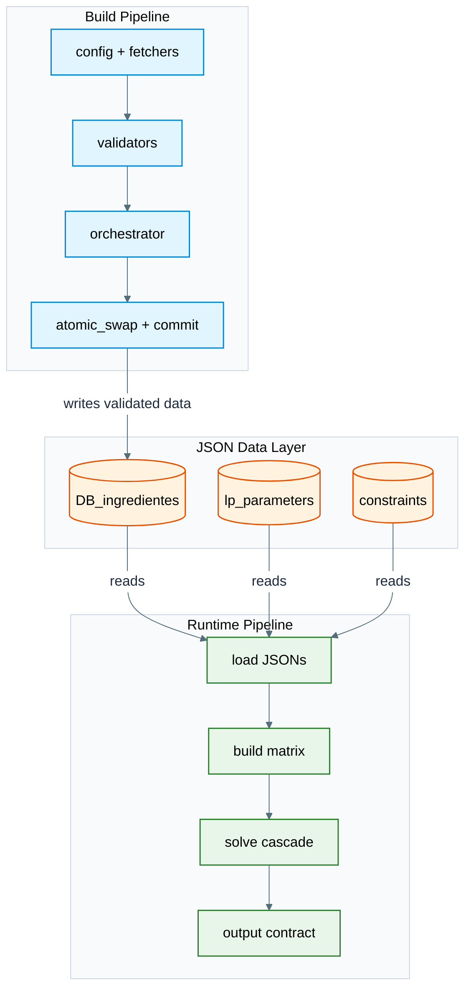
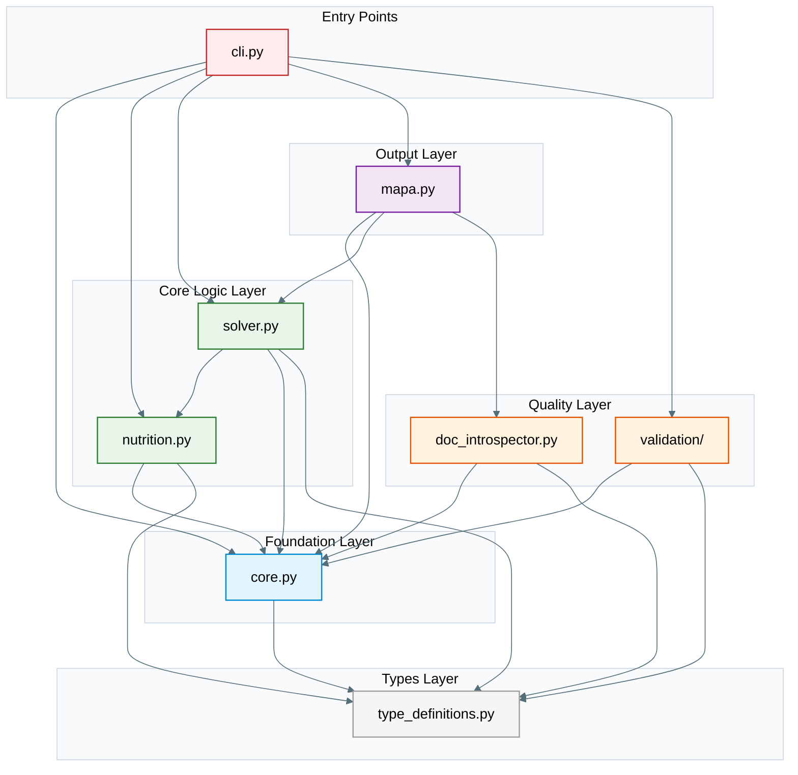
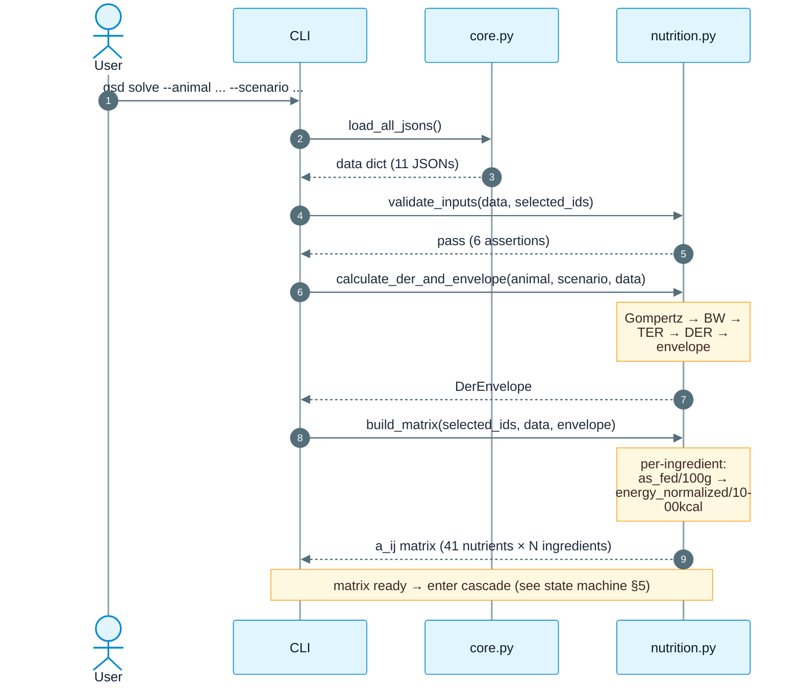
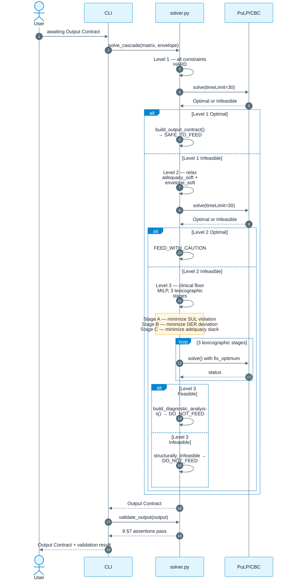
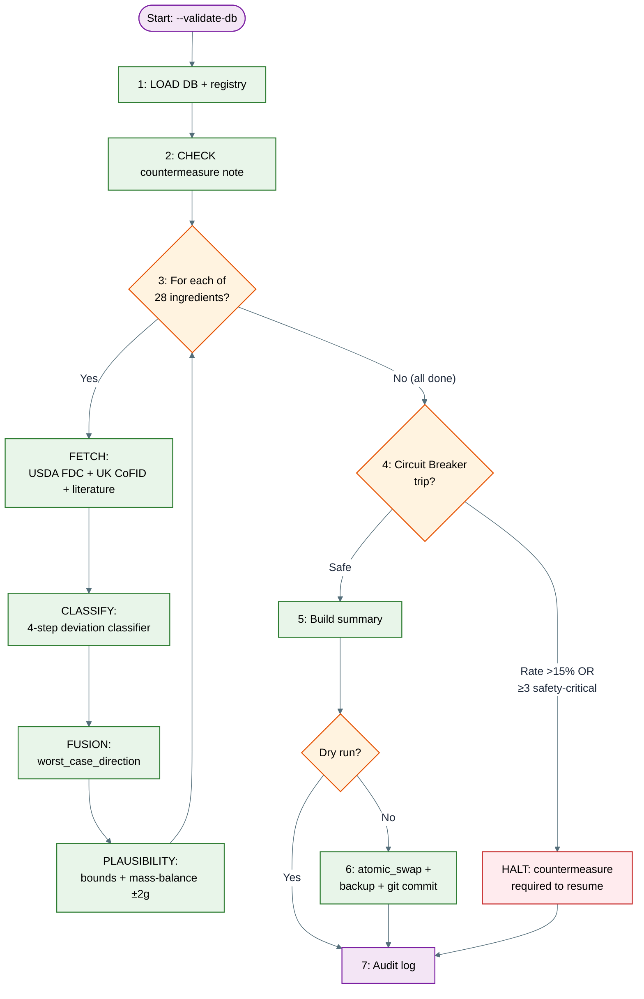
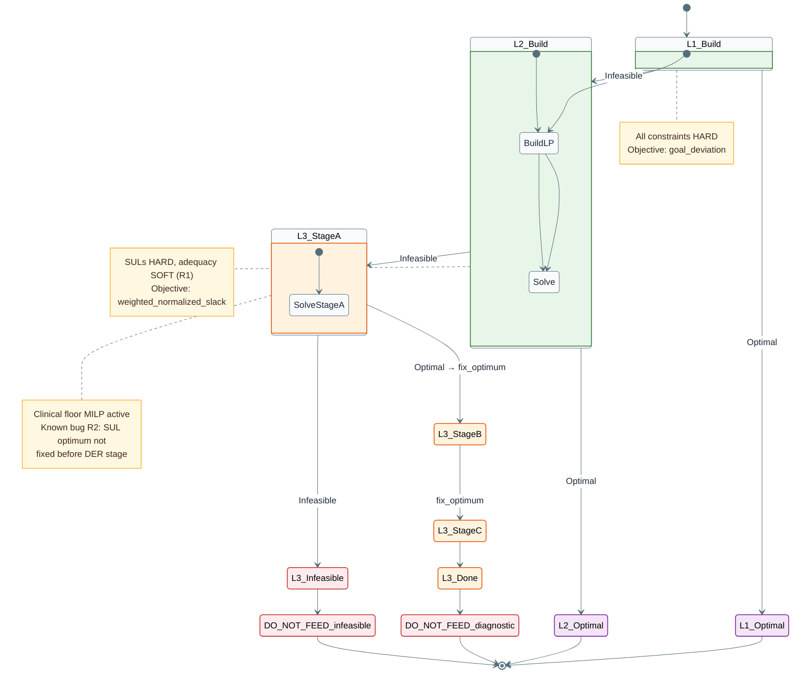
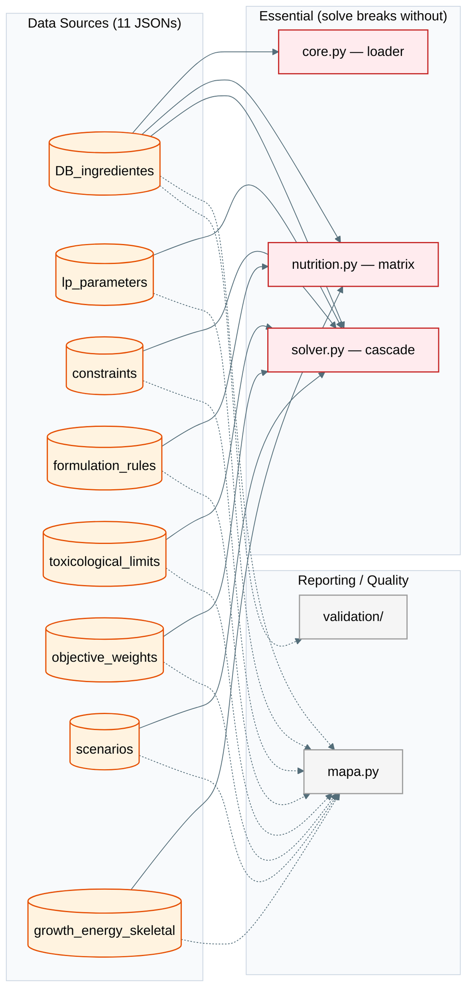
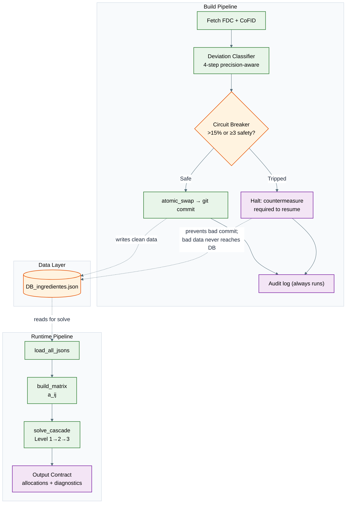

# GSD Diet Calc — Full Repo Knowledge (2026-07-25)

## Deep-Dive Progress

| #   | Part                                                                                | Status      |
| --- | ----------------------------------------------------------------------------------- | ----------- |
| 1   | `src/gsd/solver.py` — LP cascade engine                                             | ✅ COMPLETED |
| 2   | `src/gsd/mapa.py` — MAPA generator + validation gate                                | ✅ COMPLETED |
| 3   | `src/gsd/nutrition.py` — DER, matrix, unit conversion                               | ✅ COMPLETED |
| 4   | `src/gsd/core.py` — paths, JSON loader, dataclasses                                 | ✅ COMPLETED |
| 5   | `src/gsd/type_definitions.py + doc_introspector.py + cli.py`                        | ✅ COMPLETED |
| 6   | `src/gsd/validation/` — all 28 files                                                | ✅ COMPLETED |
| 7   | `data/` core JSONs — DB_ingredientes, lp_parameters, constraints, formulation_rules | ✅ COMPLETED |
| 8   | `tests/` + `scripts/`                                                               | ✅ COMPLETED |
| 9   | `docs/architecture/` + `docs/governance/`                                           | ✅ COMPLETED |

---

## Deep Dive #1: solver.py (1662 lines)

### Purpose
Core LP cascade engine. Builds a PuLP linear program from ingredient DB data and user selection, then runs a 3-level fallback cascade: **Level 1** (all constraints hard → optimal recipe), **Level 2** (adequacy relaxed via clinical-criticality-weighted slack → suboptimal recipe), **Level 3** (SULs also relaxed, lexicographic stages, clinical floor MILP → diagnostic analysis, NOT a recipe). Manages tie-break perturbation (R-03), category goals (R-04/R-05), pre-solver fat-source adequacy check, post-solver gap analysis, and output contract validation (9 §7 assertions).

### Function Map

| Function                      | Lines     | Role                                                                                      |
| ----------------------------- | --------- | ----------------------------------------------------------------------------------------- |
| `derive_tie_break_bound()`    | 25-65     | Compute bound config check for tie-break weight vs fix-optimum tolerance                  |
| `enforce_tie_break_bound()`   | 68-103    | Validate or auto-scale tie-break weight (runtime vs config-validation mode)               |
| `build_lp_problem()`          | 105-579   | Build the PuLP LpProblem for a given cascade level — variables, coefficients, constraints |
| `call_lp_solver()`            | 582-724   | Solve the LP/MILP with lexicographic objective stages                                     |
| `_build_stage_objective()`    | 727-886   | Build per-stage objective expression (7 stage kinds)                                      |
| `solve_cascade()`             | 889-981   | Orchestrate Level 1 → 2 → 3, stop at first feasible                                       |
| `compute_gaps()`              | 987-1155  | Compute nutrient adequacy gaps + antagonism ratio violations                              |
| `build_output_contract()`     | 1157-1363 | Assemble final output contract dict                                                       |
| `build_diagnostic_analysis()` | 1366-1468 | Level 3 diagnostic_analysis block                                                         |
| `validate_output()`           | 1471-1537 | Validate output contract vs §7 assertions                                                 |
| `check_fat_source_adequacy()` | 1541-1626 | Pre-solver conditional adequacy check (fat source vs AAFCO minimum)                       |
| `_get_fat_norm()`             | 1629-1642 | Helper: compute fat_g energy_normalized for an ingredient                                 |
| `_find_all_ingredients()`     | 1645-1651 | Helper: flatten DB ingredient groups into single dict                                     |

---

### Constants

```python
CRITICALITY_WEIGHT = {"critical": 10.0, "high": 5.0, "moderate": 2.0, "low": 1.0}
```
Used in `_build_stage_objective()` for all objective kinds that weight by clinical criticality.

---

### Tie-Break System (R-03, lines 20-103)

**Problem:** The deterministic tie-break added to each cascade level's final (non-fixed) stage must stay strictly below the fix-optimum tolerance. If it exceeds tolerance, it acts as a primary objective instead of a tie-break.

**Two functions:**
1. `derive_tie_break_bound(solver_params, max_single_ingredient_grams)` — computes whether `tie_break_weight × maxBigM < tolerance`. Returns dict with within_bound bool.
2. `enforce_tie_break_bound(solver_params, max_single_ingredient_grams, raise_on_violation)` — if within bound, returns weight unchanged. If exceeded:
   - `raise_on_violation=True`: raises `TieBreakConfigError` (config validation mode)
   - `raise_on_violation=False` (runtime): auto-scales weight to `tolerance * 0.99 / grams` and emits `UserWarning`

**Tolerance formula:** `max(tol_abs, tol_rel × 1.0)` where `tol_abs = 0.01`, `tol_rel = 1e-6`. Real objectives are normalized to order ~1.

**R-03 fix applied:** The old per-ingredient hash perturbation (`det_hash(iid) % 10000 * 0.1` = 0-999.9 range) was removed. Now it's a flat `tie_weight × var` with no hash multiplier.

---

### `build_lp_problem()` (lines 105-579) — Detailed Flow

1. **Variables (x_i):** Creates `pulp.LpVariable` for each ingredient that has at least one measured nutrient. Skips ingredients with no measured nutrients (prints `[WARN]`).

2. **Coefficient Compilation (as-fed/100g → energy-normalized per-gram):**
   - Reads `a_ij` from matrix (nutrient contribution per 1000kcal of that ingredient)
   - Gets `EM_100g` (energy metabolizable per 100g) from DB
   - Computes `em_per_g = EM_100g / 100.0`
   - **Formula:** `nutrient_per_gram = a_ij × em_per_g / 1000.0`
   - **Why energy normalize?** The DB stores "per 100g as-fed". But dogs eat to meet energy demand (DER), not a fixed gram target. The LP needs all nutrients expressed as "per gram per 1000kcal" so that when the solver picks grams, the nutrient contribution automatically scales with the energy that ingredient supplies. Without this, a high-fat ingredient would appear to over-supply nutrients when expressed per gram, since it packs more calories per gram.
   - **Build-time sanity assertion:** Picks first ingredient/nutrient pair, independently recomputes from stored per-100g value, asserts `abs(expected - got) < 1e-9`

3. **Big-M per ingredient:** `M_i = DER_kcal / EM_i_kcal_per_100g × 100` — grams of ingredient i alone satisfying 100% DER.

4. **Targets per day:** `scenario.targets[].value × units_of_1000kcal`

5. **SULs per day:** `toxicological_limits.sul.value × units_of_1000kcal`

6. **Constraints built:**
   - `add_nutrient_constraints()`: Nutrient minimums from `constraints.json` → `CSTR_NB_*_MIN` → tier from ID prefix (`adequacy_soft` if ends in `_MIN`, `safety_hard` if starts with `CSTR_SUL_`)
   - `add_sul_constraints()`: SUL ceilings → `safety_hard` (Level 3 relaxes with `v_plus` slack)
   - `add_inclusion_constraints(relax)`: Category inclusion limits — wildcard expansion (`_all_muscle_meat`, `_all_fat_source`, `_all_fish`). Level 3 adds slack variables for max/min inclusion
   - `add_antagonism_constraints()`: 5 mineral antagonisms (Ca:P, Zn:Cu, Fe:Zn, Ca:Mg, Lys:Arg) — each with slack variable `s_high_*/s_low_*` — **KNOWN BUG (R1):** antagonism slack only penalized in Level 1 (`goal_deviation` via `antagonism_penalty_weights`). In L2/L3 the slack is unbounded.
   - `add_envelope_constraints()`: `min_total_g` HARD always; `max_total_g` has slack in Level 2 (envelope_soft)
   - `add_der_proximity()`: `total_energy - dev_plus + dev_minus == DER` — deviation vars for Level 3

7. **Clinical Floor MILP (Level 3, line 523-557):**
   - Binary variable `y_i` per ingredient
   - `x_i ≤ M_i × y_i` (zero-out when not used)
   - `x_i ≥ floor_g × y_i` (minimum when used)
   - Floor from: `formulation_rules → _inclusion_semantics → inclusion_constraints[].clinical_floor_g` → category default → global fallback 5g

---

### `call_lp_solver()` (lines 582-724) — Lexicographic Stage Execution

1. **For each stage in `objective_stages[]`:**
   - Build objective via `_build_stage_objective()`
   - Add tie-break ONLY on final (non-fixed) stage
   - Solve with PuLP CBC: `COIN_CMD` with `timeLimit=30`, `gapRel=0.01`, `randomSeed=12345`
   - If status != "Optimal" → return `{"status": "infeasible"}`
   - If `fix_optimum=True` (not final stage): add constraint `obj_expr ≤ optimal_obj × (1 + tol_rel) + tol_abs`
   - MIP tolerance rule: if stage has binary vars, `tol_rel = max(tol_rel, mip_gap)`

2. **Extract solution:**
   - `x_values`: only grams ≥ 1e-6
   - `category_goal_deviations`: all `d_cat_*` variable values
   - `nutrient_values`: computed from `compiled_coeffs × x_values`

---

### `_build_stage_objective()` (lines 727-886) — 7 Stage Kinds

| Kind                                          | Formula                                          | Used In                    |
| --------------------------------------------- | ------------------------------------------------ | -------------------------- |
| `minimize_normalized_sul_violation`           | Σ v_j⁺ / SUL_j                                   | Level 3, Stage A           |
| `minimize_absolute_der_deviation`             | dev_plus + dev_minus                             | Level 3, Stage B           |
| `minimize_weighted_normalized_adequacy_slack` | Σ (slack_j / target_j) × crit_weight             | Level 3, Stage C           |
| `weighted_normalized_deviation`               | Σ (d_j⁻ + d_j⁺) / target_j × crit_weight        | Level 1 (goal programming) |
| `goal_deviation`                              | Same + antagonism slack penalties                | Level 1 (canonical)        |
| `weighted_normalized_slack`                   | Σ (slack_j / target_j) × crit_weight + env_slack | Level 2                    |
| `category_goal_deviation`                     | Σ (d_cat⁻ + d_cat⁺) × effective_weight           | Level 1 (if enabled)       |

**Weight source:** All `crit_weight` entries use `CRITICALITY_WEIGHT = {critical: 10, high: 5, moderate: 2, low: 1}` from the clinical_criticality field in NUTRIENT_REGISTRY. They do NOT come from `objective_weights.json` (the 29 declared weights are for MAPA reporting only and are not read by the solver).

**NOTE:** `weighted_normalized_deviation` and `goal_deviation` have the same d_j⁻/d_j⁺ core formula. `goal_deviation` additionally adds antagonism slack weighted by `antagonism_penalty_weights` (default 5000). Only `goal_deviation` is used in practice (Level 1 canonical objective); `weighted_normalized_deviation` is a legacy variant with identical d_j⁻/d_j⁺ behavior but no antagonism slack.

**Category goal deviation (R-04/R-05):**
- When disabled (default — `category_goals_enabled: false` in solver_params): returns `pulp.lpSum([])` — structural skip, still runs as non-fixed stage for tie-break
- When enabled: creates `d_cat_*_minus/plus` vars, uses `base_weight × 0.01` as coefficient

**Actual stage kind usage per level (from lp_parameters_data.json solve_cascade):**

| Level | Stage 1 (fixed)                       | Stage 2 (fixed)                           | Stage 3 (non-fixed, carries tie-break)        |
|-------|---------------------------------------|-------------------------------------------|-----------------------------------------------|
| 1     | `goal_deviation`                      | `category_goal_deviation` (→ no-op when disabled) | `minimize_absolute_der_deviation`      |
| 2     | `weighted_normalized_slack`           | `category_goal_deviation` (→ no-op when disabled) | `minimize_absolute_der_deviation`      |
| 3     | `minimize_normalized_sul_violation`   | `minimize_absolute_der_deviation`         | `minimize_weighted_normalized_adequacy_slack` |

**Key insight:** `category_goal_deviation` is disabled by default (`category_goals_enabled: false`), so Levels 1 and 2 effectively run only 2 active stages. The disabled stage is a structural no-op (`pulp.lpSum([])`) but still consumes a slot — the tie-break always attaches to the final (3rd) non-fixed stage regardless of whether it's a no-op.

The `weighted_normalized_deviation` kind is a legacy variant of `goal_deviation` that lacks antagonism slack penalties. It is **never used** by any cascade level's config — only `goal_deviation` runs in production (Level 1).

---

### `solve_cascade()` (lines 889-981) — The 3-Level Fallback Orchestrator

**Purpose:** Given a list of ingredient IDs, try to build a feasible diet. Each level progressively relaxes constraints so the solver can always return *something* (a prescription, a caution, or a diagnosis).

| Level | Name          | Relaxed Constraints                                         | Result Status       | Output Type          |
|-------|---------------|-------------------------------------------------------------|---------------------|----------------------|
| 1     | Optimal       | None (all constraints HARD)                                 | `optimal`           | Allocations (recipe) |
| 2     | Suboptimal    | Adequacy minimums + max envelope (via slack weighted by clinical criticality) | `suboptimal`        | Allocations (recipe) |
| 3     | Unsafe (diagnostic) | SULs also relaxed; clinical floor MILP enforces minimum grams per ingredient | `unsafe_diagnostic` | Diagnostic analysis (not a recipe) |

**Flow:**
1. **Build matrix once:** Calls `nutrition.build_matrix()` to convert every selected ingredient's DB nutrients (as-fed per-100g values) into energy-normalized coefficients (nutrient per gram of ingredient, scaled per 1000kcal). This matrix is reused across all levels — the levels differ only in which constraints are relaxed and which objective is minimized, not in the underlying data.
2. **Iterate `solve_cascade[]`** from `lp_parameters_data.json` (the 3 level configs).
3. **For each level:** `build_lp_problem(level=N)` builds a PuLP problem with that level's constraint relaxations; `call_lp_solver()` solves it with that level's `objective_stages`.
4. **First feasible → `build_output_contract()`** and return. The output contract shape is level-bifurcated (allocations for L1/L2, diagnostic_analysis for L3).
5. **All infeasible → fallback** `structurally_infeasible` with null values for all 41 nutrients and `DO_NOT_FEED` recommendation.

---

### `compute_gaps()` (lines 987-1155) — Diet Quality Diagnostic

**Purpose:** After the solver finds a feasible allocation, this function answers "what's still wrong with this diet?" It identifies nutrients below target and ratio violations, telling the user which categories of ingredients to add to fix deficiencies.

1. **Nutrient adequacy gaps:** For each `adequacy_soft` nutrient in registry, compute `pct_of_min = achieved / target_min × 100`. If < 100, emit gap with hardcoded `category_map` (41 entries mapping nutrient_id → category like "bone", "muscle_meat", "organ_secreting", "fat_source", "fish", "supplement"). This tells the user: "you're at 60% of calcium — add more bone ingredients."

2. **Antagonism ratio gaps:** For each of 5 mineral antagonisms, check `ratio = val1 / val2` against bounds. Emit gap if violated, with hardcoded `ratio_category_map`. These are harder to fix because adjusting one nutrient affects multiple ratios.

---

### `build_output_contract()` (lines 1157-1363)

1. Map `result_status` → `feeding_recommendation`:
   - `optimal` → `SAFE_TO_FEED`
   - `suboptimal` → `FEED_WITH_CAUTION`
   - `unsafe_diagnostic` / `structurally_infeasible` / `data_incomplete` → `DO_NOT_FEED`

2. **Allocations (Level 1/2):** Build from `x_values`, compute grams, pct_of_total, kcal_per_day per ingredient via DB lookup + `energy_metabolizable_kcal_per_100g`

3. **Nutrient results:** Iterate NUTRIENT_REGISTRY (41 entries), emit each with status "adequate", pct_of_min/pct_of_sul/target_max as None — **KNOWN BUG (R4):** real min/max/pct not computed

4. **Diagnostic analysis (Level 3):** Calls `build_diagnostic_analysis()`

5. **Template adherence (category goals, R-04/R-05):**
   - When disabled: returns `{"components": {}, "overall_score": None, "disabled": True, "reason": "..."}` with `category_goals_disabled=True` in meta
   - When enabled: computes `achieved_pct = 100 × category_grams / total_grams`, `absolute_deviation_pct`, `overall_score = max(0, 100 - total_deviation)`

6. **Metadata:** solver engine, solve_time, cascade level, objective value, tie-break info, lexicographic stage verification (Level 3), clinical floor info (Level 3)

7. **Unrounded total:** `_unrounded_total_g` exposed for envelope validation (avoids rounding error)

---

### `build_diagnostic_analysis()` (lines 1366-1468)

Level 3 diagnostic block:
1. **SUL violations inevitable:** Identify SULs exceeded regardless of quantity
2. **Counterfactual scenario (`what_would_happen`):** Grams needed for DER, nutrient at risk, clinical significance text, floor applied/relaxed status
3. **Recommended alternative actions:** 3 hardcoded strings (add calorie source without Vit A, reduce liver, use recipe mode)
4. **Reason:** Hardcoded text explaining SUL/DER inseparability

---

### `validate_output()` (lines 1471-1537)

9 assertions per §7:
1. Valid solver_status (5 canonical values)
2. feeding_recommendation matches status map
3. Level 1/2: allocations not null, within envelope (±1g tolerance)
4. Level 3 / structurally_infeasible: allocations=null, diagnostic_analysis present
5. nutrient_results ≥ 41 entries
6. Each nutrient has pct_of_min, pct_of_sul, status, constraint_tier, clinical_criticality
7. Level 3: lexicographic_stages_used.order_verified == True
8. Level 3: clinical_floor_applied bool, clinical_floor_bounds dict
9. If clinical_floor_relaxed → relaxation_note present

---

### `check_fat_source_adequacy()` (lines 1541-1626) — Why Fat Sources Need Special Handling

**Problem:** Fat sources (beef fat, duck fat, chicken fat, chicken skin, pork lard) are virtually 100% fat with zero protein. They contribute heavily to the fat minimum but nothing to protein-based nutrient minimums. A diet that's too heavy in fat sources might meet the fat target while failing every protein-based adequacy constraint.

**The check:** Before the solver runs, this function checks if fat sources at their structural minimum (8% of total grams) can meet the AAFCO fat minimum (21.25 g/1000kcal). It conservatively assumes the remaining 92% comes from typical muscle meat at average fat concentration. If not, it returns a gap dict warning the user that fat goals cannot be met with the current selection — no point solving the LP.

---

## Deep Dive #2: mapa.py (1422 lines)

### Purpose
Dual-function module:
1. **`generate_mapa()`** — Produces `MAPA_COMPLETO_JSONs_GSD_Diet_Calc.md`, a 17-section markdown document that cross-references all 11 JSON files against the architecture satellites. Used as a "single source of truth" audit artifact.
2. **`validate_mapa()`** — Validation gate with 16 checks (14 blocking + 2 informational). Called by `--gate-mapa` (CI) and `--generate-mapa` (regeneration guard).

### Function Map

| Function                          | Lines     | Role                                                                                              |
| --------------------------------- | --------- | ------------------------------------------------------------------------------------------------- |
| `section1_header()`               | 19-118    | Preamble (sentinel-extracted from indice_plano_central.md) + file manifest + bundle stats         |
| `section2_ingredients_overview()` | 123-165   | Ingredient bank table (28 items × category/nutrients/group)                                       |
| `section2_1_schema_validation()`  | 170-207   | JSON Schema validation results (Draft 2020-12)                                                    |
| `section3_nutrient_fields()`      | 212-229   | Unified set of all distinct nutrient field names                                                  |
| `section4_coverage_and_gaps()`    | 234-262   | Coverage exclusions + planned supplements                                                         |
| `section5_categories()`           | 267-284   | Category distribution table                                                                       |
| `section6_constraints()`          | 289-323   | Constraint counts + detail table (5 mineral antagonisms + bounds)                                 |
| `section7_formulation_rules()`    | 328-396   | Matrix, templates, category mapping, bioavailability, digestibility, supplements                  |
| `section8_provenance()`           | 401-441   | Source documents, references by quality flag, fallback protocols, data quality flags              |
| `section9_growth()`               | 446-524   | Gompertz params, k multipliers, energy reqs, anthropometric table, gonadal profiles, epidemiology |
| `section10_weights()`             | 529-555   | All 29 weights with priority_tier + solver_penalty_multiplier                                     |
| `section11_scenarios()`           | 560-591   | SCN_A + SCN_B with targets table                                                                  |
| `section12_tox_limits()`          | 596-622   | 8 SULs with patho refs                                                                            |
| `section13_lp_data()`             | 627-686   | NUTRIENT_REGISTRY summary + solve_cascade levels                                                  |
| `section14_naming_conventions()`  | 691-737   | DB→Solver naming map + unit conversions (requires CrossRefIndex)                                  |
| `section15_curation_status()`     | 742-801   | Group validation status + ingredient lists (requires CrossRefIndex)                               |
| `section16_gaps()`                | 806-886   | Missing supplements, orphan refs, implementation gaps via ImplIntrospector                        |
| `section17_divergence_table()`    | 891-959   | Orphan ref audit + 10 documented-vs-actual divergences with decision column                       |
| `section18_live_evidence()`       | 971-1048  | Live pipeline smoke runs from `capture_live_evidence()` (scrubbed volatile fields)                |
| `section19_test_integrity()`      | 1063-1110 | AAA+A compliance matrix via `check_test_integrity()` (D6 v1.2 regex)                              |
| `generate_mapa()`                 | 1115-1190 | Orchestrator — runs all 17 sections + informational coverage/freshness                            |
| `validate_mapa()`                 | 1198-1407 | 16-check validation gate                                                                          |

---

### Section Generator Patterns

**Data-only sections** (15): Take `data: Dict[str, Any]` (from `load_all_jsons()`). Each reads specific JSON keys and formats markdown. Error handling: `generate_mapa()` wraps each in try/except with full traceback.

**Index-requiring sections** (4): `section14_naming_conventions`, `section15_curation_status`, `section16_gaps`, `section17_divergence_table` — also take `idx: CrossRefIndex` for cross-referencing.

**Orchestration** (`generate_mapa()`, lines 1115-1190):
1. Loads data via `load_all_jsons()` (or uses passed dict)
2. Builds `CrossRefIndex` via `build_mapa_indices(data)` (from core.py)
3. Iterates 15 data-only sections + 4 idx-requiring sections
4. Each section call is try/except — errors rendered inline with traceback
5. Appends 2 informational sections (Coverage Watch, Evidence Freshness)
6. Returns joined markdown string

---

### Section 1 — Header (lines 19-118)

**Three sub-sections:**

a) **Preamble** (lines 28-46): Extracts verbatim content from `indice_plano_central.md` between `<!-- MAPA:STATIC-START -->` and `<!-- MAPA:STATIC-END -->` sentinels. Fallback: entire file if sentinels missing.

b) **File Manifest** (lines 65-88): For each of the 11 JSON_FILES: size, version (from `_db_metadata.version` or `schema_version`), last-modified date, truncated SHA-256 (first 16 chars). Total size row.

c) **Satellite Bundle Statistics** (lines 91-116): Live from `compute_satellite_stats(BASE_DIR)` — per-file line counts + bundle totals. Wrapped in try/except.

---

### Section 2 — Ingredient Overview (lines 123-165)

Flattens `DB_ingredientes.json → protein_sources → ingredients` across all groups. Emits table with: ID, category, display_name, nutrient count (+ excluded count), group name.

---

### Section 2.1 — Schema Validation (lines 170-207)

Calls `validate_ingredients_against_schema(db_path)` from core.py. Emits:
- Total ingredients, confirming count, non-confirming count, pass/fail badge
- Per-ingredient detail: line numbers, error messages with JSON path

Source annotation: `<!-- SOURCE: validate_ingredients_against_schema / db_ingredientes.schema.json -->`

---

### Section 3 — Nutrient Fields (lines 212-229)

Collects union of all nutrient field keys across all ingredients. Emits sorted list.

---

### Section 4 — Coverage & Gaps (lines 234-262)

- Ingredients with `coverage_excluded_nutrients` (per-ingredient exclude lists)
- Planned supplements absent from DB (checks `SUPPLEMENTS_PLANNED` = `["kelp_meal_dried", "salt_nacl", "copper_sulfate"]`)

---

### Section 5 — Categories (lines 267-284)

Counts per category value. Outputs a 2-column table.

---

### Section 6 — Constraints (lines 289-323)

For each of 4 sections (`nutrient_bounds`, `toxicological_limits`, `inclusion_constraints`, `mineral_antagonisms`): count, HARD count. Shows first 10 entries of `mineral_antagonisms` and `nutrient_bounds` with ID/name/expression/behavior.

---

### Section 7 — Formulation Rules (lines 328-396)

- **Nutrient Matrix**: entries count + first entry's authorities
- **Diet Templates**: count, each with components and total_pct
- **Category-to-Ingredient Mapping**: concrete vs wildcard IDs, mapped-but-absent-from-DB check
- **Bioavailability Factors**: count + first entry
- **Digestibility**: dict keys
- **Supplement Dosages**: entries with dose display

---

### Section 8 — Provenance (lines 401-441)

- **Source Documents**: count + doc_id/title/type
- **References**: total + breakdown by quality_flag (`CONFIRMED`, `INFERRED`, `LITERATURE_COMPOSITE`, etc.)
- **Algorithm Logic**: fallback protocols count
- **Data Quality Flags**: count + first entry

---

### Section 9 — Growth (lines 446-524)

- **Gompertz**: equation strings, parameters (param_id, name, value)
- **K Multipliers**: all entries with value + status
- **Energy Requirements**: count + param_id/formula
- **Anthropometric Table**: first 5 entries with age/weights/%adult
- **Gonadal Status Profiles**: count + profile_id/sex/status
- **Epidemiology (DOD)**: count + entry_id/metric_name/value

---

### Section 10 — Weights (lines 529-555)

Full table of all 29 `objective_weights.json` entries. Highlights entries missing `solver_penalty_multiplier` (e.g., `PEN_MANGANESE_NEG`).

---

### Section 11 — Scenarios (lines 560-591)

For each scenario (SCN_A, SCN_B): status, targets count, first 8 targets as table.

---

### Section 12 — Tox Limits (lines 596-622)

Notes top-level type is `list` (not dict with `safe_upper_limits` key). Table of 8 SULs with nutrient_id, value, unit, basis, patho_ref.

---

### Section 13 — LP Data (lines 627-686)

- **NUTRIENT_REGISTRY**: total count, tiers breakdown (safety_hard/adequacy_soft/envelope_soft), clinical_criticality breakdown
- **SUL Nutrients**: table from registry entries
- **Declarative Cascade**: per-level detail (level, result_status, description, relax_tiers, objective_stages, clinical_floor, output_contract params)

---

### Section 14 — Naming Conventions (lines 691-737)

Full table of all 43 solver-space nutrients with: solver_id, display_name, unit, tier, DB→Solver rename (same or "→" path). Unit conversion summary from UNIT_RENAME map.

---

### Section 15 — Curation Status (lines 742-801)

Per-group row: group name, common_name, ingredient count, IDs, status (VALIDATED/PENDING/PARTIAL/UNKNOWN). Appends planned supplements row with status "PLANNED (not applied)".

---

### Section 16 — Gaps (lines 806-886)

Three gap categories:
1. **DB Gaps**: Missing supplements, nutrients in registry but not sourced from DB fields
2. **Reference Gaps**: Internal REF_ tokens count, known count, orphans count. Notes "17 refs in §9.2 are PLANNED items, not orphans"
3. **Implementation Gaps**: Live from `ImplIntrospector.check()` against `IMPLEMENTATION_SPEC` — table with name, priority, spec_ref, status, source line, note

---

### Section 17 — Divergence Table (lines 891-959)

**Orphan Reference Audit**: Counts all REF_ tokens via regex on raw DB text, separates USDA vs internal, reports orphans.

**Documented vs Actual Divergences** (lines 940-951): 10 hardcoded divergence rows, each with `claim`, `documented value`, `actual value`, `[DIVERGE]`/`[OK]` flag, and `decision` (`accept`/`defer`):
| Claim                                | Decision |
| ------------------------------------ | -------- |
| DB version vs ingredient count       | `accept` |
| Orphan refs resolved                 | `defer`  |
| Provenance refs count                | `accept` |
| solve_cascade location               | `accept` |
| NUTRIENT_REGISTRY location           | `accept` |
| All constraints HARD_FAIL_INFEASIBLE | `defer`  |
| scenarios.json type                  | `accept` |
| Adult k_multiplier exists            | `accept` |
| Missing supplements                  | `defer`  |
| nutrient_matrix structure            | `accept` |

---

### Section 18 — Live Evidence (lines 971-1048)

Calls `capture_live_evidence()` from doc_introspector with REFERENCE_ANIMAL + REFERENCE_SELECTION. Applies `scrub_volatile()` to strip timestamps/paths/PIDs for idempotency.

Per-entry fields: label, status, severity, error (if any), solver_status, cascade_level_used, lexicographic_stages_solved, clinical_floor_relaxed, solve_time_ms, nutrients_above_90pct_sul. Scrubbed stdout + result JSON.

Gated by `_NO_LIVE_EVIDENCE` flag (set by `--no-live-evidence` CLI arg for CI).

---

### Section 19 — Test Integrity (lines 1063-1110)

Calls `check_test_integrity()` from doc_introspector (AST + D6 v1.2 regex). Renders markdown table with: file, marked_integration, loads_real_data, AAA+A compliant (violation only when marked_integration=True AND loads_real_data=False).

---

### `generate_mapa()` Orchestrator (lines 1115-1190)

**Flow:**
1. Load data (or use passed)
2. Set `_no_live_evidence` flag
3. Build CrossRefIndex
4. Run 15 data-only sections (with try/except per section — error rendered with traceback inline)
5. Run 4 idx-requiring sections (same try/except pattern)
6. Append 2 informational sections: Coverage Watch (+ `detect_coverage_drift()`) + Evidence Freshness (+ `check_evidence_freshness()`)
7. Join all parts with double newline

**Error resilience:** Every section generator is individually try/except'd. A failure in one section does not block others — error rendered as markdown with traceback.

---

### `validate_mapa()` — 16 Checks (lines 1198-1407)

**14 BLOCKING checks** (affect --gate-mapa exit code):

| Check  | Description                | Implementation                                                                                                                                                                                                                                 |
| ------ | -------------------------- | ---------------------------------------------------------------------------------------------------------------------------------------------------------------------------------------------------------------------------------------------- |
| **0**  | Phantom token detection    | Regex extracts `REF_*`, `CSTR_*`, `PEN_*`, `SCN_*`, `TPL_*` tokens from MAPA text + extracts ingredient IDs + nutrient IDs. Cross-references against CrossRefIndex                                                                             |
| **1**  | Token presence             | Verifies 4 canonical tokens exist: "MAPA Completo", "GSD Diet Calc V10.4", "**State Hash:**", "File Manifest"                                                                                                                                  |
| **2**  | Critical count assertions  | Ingredient count ≥ 20, constraints ≥ 40, NUTRIENT_REGISTRY ≥ 40, weights ≥ 25, SUL entries ≥ 8                                                                                                                                                 |
| **3**  | No stale file paths        | All 11 `JSON_FILES` filenames must appear in MAPA text                                                                                                                                                                                         |
| **4**  | Divergence table present   | Must have "Documented vs Actual Divergences" + "Decision" column                                                                                                                                                                               |
| **5**  | Canonical header match     | "## File Manifest" section must exist                                                                                                                                                                                                          |
| **6**  | Section count              | ≥ 17 `\n## ` sections                                                                                                                                                                                                                          |
| **7**  | Naming Conventions section | Must exist                                                                                                                                                                                                                                     |
| **8**  | Curation Status section    | Must exist                                                                                                                                                                                                                                     |
| **9**  | Structure contracts        | Calls `check_structure_contracts(data)`, reports all failures                                                                                                                                                                                  |
| **10** | Test integrity             | Calls `check_test_integrity()` — fails if any `marked_integration=True AND loads_real_data=False` (AAA+A violation)                                                                                                                            |
| **11** | Self-count consistency     | Introspects own source via `inspect.getsourcelines()` — asserts 16 `# Check N:` comments match docstring                                                                                                                                       |
| **12** | Sentinel presence          | All 4 sentinels (`MAPA:STATIC-START`, `MAPA:STATIC-END`, `MAPA:AUTO-ROADMAP`, `MAPA:AUTO-BUNDLES`) must exist exactly once in `indice_plano_central.md`                                                                                        |
| **13** | AUTO immutability          | Compares `compute_state_marker()` hash against MAPA's state hash (from `**State Hash: **`). During `--generate-mapa` (prev_state_hash given): fail if hashes match (nothing changed). During `--gate-mapa`: fail if hashes differ (MAPA stale) |

**2 INFORMATIONAL checks** (rendered in MAPA, do not affect exit code):

| Check  | Description        | Implementation                                                                             |
| ------ | ------------------ | ------------------------------------------------------------------------------------------ |
| **14** | Coverage Watch     | Calls `detect_coverage_drift(data, STRUCTURE_CONTRACTS)` — validates without rendering     |
| **15** | Evidence Freshness | Calls `check_evidence_freshness(worklog.md)` — warns if consecutive degraded regenerations |

---

### CrossRefIndex (from core.py, built by `build_mapa_indices()`)

Index structure used by all generators and the validation gate:
- `all_known_tokens`: Set of all recognized token IDs
- `ingredient_index`: `{ingredient_id → ing}` from DB
- `nutrient_index`: `{nutrient_id → ndata}` from NUTRIENT_REGISTRY
- `ref_index`: `{ref_id → quality_flag}` from audit_provenance
- `constraint_index`: `{constraint_id → section_name}`
- `weight_index`: `{weight_id → w}`
- `scenario_index`: `{scenario_id → s}`
- `db2solver_name_map`: DB→Solver unit rename mapping
- `solver2db_name_map`: Solver→DB unit rename mapping
- `all_ingredients`: Flat list of all ingredient dicts

Additional known tokens populated: formulation_rules category mapping IDs, supplement_dosage keys, prefix patterns (`REF_USDA_`, `REF_`, `CSTR_`, `PEN_`, `SCN_`, `TPL_`, `RCP_`).

---

## Deep Dive #3: nutrition.py (377 lines)

### Purpose
Input validation, DER/Gompertz computation, energy density, ingredient lookup, as-fed→energy-normalized conversion, and LP matrix building. Imports from `core.py` only.

### Function Map

| Function                                | Lines   | Role                                                            |
| --------------------------------------- | ------- | --------------------------------------------------------------- |
| `validate_inputs()`                     | 17-93   | 6 assertions (a-f) + schema validation warning                  |
| `gompertz_weight()`                     | 98-126  | Gompertz growth model: W(t) = W₀ × exp(-b × exp(-c×t))          |
| `get_global_density_range_from_db()`    | 129-139 | Fallback energy density from all DB ingredients                 |
| `calculate_der_and_envelope()`          | 142-206 | DER computation → dynamic envelope → DerEnvelope                |
| `get_ingredient_by_id()`                | 209-217 | Flat ingredient lookup across all protein_sources groups        |
| `energy_metabolizable_kcal_per_100g()`  | 222-242 | Modified Atwater formula (3.5×protein + 8.5×fat + 3.5×NFE)      |
| `get_bioavailability_factor()`          | 245-260 | Bioavailability multiplier from formulation_rules (default 1.0) |
| `convert_as_fed_to_energy_normalized()` | 263-333 | Single-ingredient 3-state conversion + composite amino acids    |
| `build_matrix()`                        | 336-363 | Multi-ingredient matrix build (missing ID handling)             |

---

### `validate_inputs()` (lines 17-93) — 6 Assertions (a-f)

| Assertion | Description                                                                                                 |
| --------- | ----------------------------------------------------------------------------------------------------------- |
| **a)**    | Each ingredient has ≥43 nutrient keys, each with valid 3-state status (measured/missing/not_applicable)     |
| **b)**    | Non-USDA `source_ref` values must resolve in `audit_provenance.json` refs                                   |
| **c)**    | Valid categories from enum set (16 types: muscle_meat, organ_secreting, bone, fat_source, supplement, etc.) |
| **d)**    | Mapped ingredient IDs exist in DB (tolerates `SUPPLEMENTS_PLANNED` = kelp/salt/CuSO₄)                       |
| **e)**    | NUTRIENT_REGISTRY covers all 41 `SOLVER_NUTRIENTS`                                                          |
| **f)**    | solve_cascade has Level 1 with empty `relax_tiers`                                                          |
| **g)**    | (non-blocking) JSON Schema validation — warnings only, errors reported in MAPA Section 2.1                  |

---

### Gompertz Model (lines 98-126)

**Formula:** `W(t) = W_max × exp(-b × exp(-c_monthly × t_months))`

Parameters from `growth_energy_skeletal.json → gompertz_parameters`:
- `GRO_W_MAX_MALE` / `GRO_W_MAX_FEMALE` — asymptotic weight (breed-line resolved)
- `GRO_B_PARAM` — inflection point (default 2.5)
- `GRO_C_MALE_DAYS` / `GRO_C_FEMALE_DAYS` — growth rate in days, converted to monthly: `c_monthly = c_days / 30.44`

Breed-line default: `working_exhibition_lines`. Female W_max has only one line.

---

### DER Calculation (lines 142-206)

**Flow:**
1. **Body weight:** Gompertz (if `use_gompertz=True`) or `weight_kg` directly
2. **TER:** `70 × BW^0.75` (standard metabolic scaling)
3. **k_multiplier:** From `SCENARIO_K_MAP` → `growth_energy_skeletal.json → k_multipliers`. Default: `slow_growth_recommended = 1.2`
4. **DER:** `TER × k`
5. **Energy density range:** From selected ingredients' `energy_metabolizable_kcal_per_100g() / 100`. Fallback: `get_global_density_range_from_db()`
6. **Envelope:**
   - `min_total_g = (DER / max_density) × 0.9` (10% safety margin below)
   - `max_total_g = (DER / min_density) × 1.1` (10% safety margin above)
7. **Units of 1000kcal:** `DER / 1000.0`

Returns `DerEnvelope` (satisfies 3-tuple contract via `__iter__` + named attributes).

---

### Energy Metabolizable (Modified Atwater) — lines 222-242

**Formula:** `EM = 3.5 × protein + 8.5 × fat + 3.5 × NFE`

Where `NFE = max(0, 100 - protein - fat - moisture - ash - fiber)`.

Accepts both raw DB 3-state dicts and flat `{key: value}` dicts. Fallbacks for missing proximate data: moisture=72%, ash=1%, fiber=0% (typical for raw muscle meat).

---

### As-Fed → Energy Normalized Conversion (lines 263-333)

**Per-ingredient conversion:**
1. Compute EM per 100g (modified Atwater)
2. Skip if EM ≤ 0
3. For each DB nutrient field:
   - Map via `UNIT_RENAME` (e.g., `calcium_mg` → `calcium_g`)
   - Skip DB-only keys without solver counterpart
   - If `status=measured` and has value: `converted = value × scale × (1000.0 / EM)`
   - Apply bioavailability factor
   - Otherwise: output `{"status": status}` (no value key)
4. **Composite amino acids:** `methionine_plus_cystine_g` (sum of measured methionine + cystine), `phenylalanine_plus_tyrosine_g` (sum of measured phenylalanine + tyrosine)
5. **Guarantee:** All 41 `SOLVER_NUTRIENTS` keys present in output (unmeasured ones set to `{"status": "missing"}`)

---

### Bioavailability Factors (lines 245-260)

Looks up `formulation_rules.json → bioavailability_factors` by ingredient_id + nutrient_id. Returns factor from `values.min` (or `values.value`). Defaults to 1.0 if no declared factor.

---

### `build_matrix()` (lines 336-363)

Iterates all `selected_ids`. For each:
- **Found in DB:** Calls `convert_as_fed_to_energy_normalized()` with bioavailability factors
- **Not found:** Outputs all 43 nutrients as `{"status": "data_incomplete", "anomaly_ref": "REF_MISSING_INGREDIENT_DB", "reason": "..."}` — solver knows the user's selection cannot be evaluated

---

## Deep Dive #4: core.py (594 lines)

### Purpose
Foundation module: project paths, JSON loader, dataclasses (AnimalInput, DerEnvelope, SolverRequest, CrossRefIndex), unit rename maps, nutrient constants, markdown helpers, JSON Schema validation, and CrossRefIndex builder.

### Constants

| Constant                  | Value                                                | Purpose                             |
| ------------------------- | ---------------------------------------------------- | ----------------------------------- |
| `BASE_DIR`                | Project root (2 up from `src/gsd/`)                  | All relative paths derive from here |
| `DATA_DIR`                | `BASE_DIR / "data"`                                  | JSON data files                     |
| `DOCS_DIR`                | `BASE_DIR / "docs"`                                  | Documentation                       |
| `AUDIT_DIR`               | `BASE_DIR / "audit"`                                 | Audit artifacts                     |
| `ARCHITECTURE_DIR`        | `DOCS_DIR / "architecture"`                          | Satellite docs                      |
| `JSON_FILES`              | 11 filenames                                         | Loaded by `load_all_jsons()`        |
| `SUPPLEMENTS_PLANNED`     | `["kelp_meal_dried", "salt_nacl", "copper_sulfate"]` | Not yet in DB                       |
| `SOLVER_NUTRIENTS`        | 41 solver-space IDs                                  | The 41 nutrients the LP optimizes   |
| `DB_NUTRIENTS`            | 46 DB-space IDs                                      | After UNIT_RENAME_MAP applied       |
| `EXCLUDED_NUTRIENTS`      | 7 nutrients                                          | DB-only, not in solver              |
| `VALID_NUTRIENT_STATUSES` | `{"measured", "missing", "not_applicable"}`          | 3-state contract                    |
| `ALL_REQUIRED_KEYS`       | 43 DB-space keys                                     | Must appear in every ingredient     |

### Unit Rename System

**`UNIT_RENAME_MAP`** (line 58-63): Maps solver ID → DB ID (e.g., `calcium_g` → `calcium_mg`). 11 entries.

**`UNIT_RENAME`** (line 168-180): Maps DB ID → `(solver_id, scale_factor)`. 11 entries with scale factors (e.g., `calcium_mg` → `("calcium_g", 1/1000)`, `selenium_ug` → `("selenium_mg", 1/1000)`).

**`DB2SOLVER_NAME_MAP`** and **`SOLVER2DB_NAME_MAP`**: Bidirectional name lookups.

### Dataclasses

| Dataclass       | Fields                                                                                                                                    | Usage                                     |
| --------------- | ----------------------------------------------------------------------------------------------------------------------------------------- | ----------------------------------------- |
| `AnimalInput`   | sex, weight_kg, age_months, gonadal_status, height_cm, use_gompertz                                                                       | Input to DER calculation                  |
| `SolverRequest` | animal, selected_ingredient_ids, mode, scenario_id                                                                                        | Input to solver                           |
| `CrossRefIndex` | all_known_tokens, ingredient_index, nutrient_index, ref_index, constraint_index, weight_index, scenario_index, name_maps, all_ingredients | Used by MAPA generators + validation gate |

### DerEnvelope Class (lines 224-284)

**Dual contract:** Satisfies both 3-tuple unpacking (`__iter__` returns `(der_kcal, min_total_g, max_total_g)`) and named-attribute access.

**Methods:**
- `as_envelope_dict()` → envelope dict for output contract
- `as_animal_context(sex, age_months, gonadal_status)` → animal_context dict

**Attributes:** bw_kg, ter_kcal, k_multiplier, der_kcal, units_of_1000kcal, min_total_g, max_total_g, strategy, density_source

### Functions

| Function                                | Lines   | Purpose                                        |
| --------------------------------------- | ------- | ---------------------------------------------- |
| `sha256_file()`                         | 80-85   | SHA-256 hash of a file (64KB chunks)           |
| `validate_category_goals()`             | 93-114  | Category goals sum to 100% check (R-05)        |
| `load_all_jsons()`                      | 117-131 | Load all 11 JSONs, validate category goals     |
| `fmt()`                                 | 134-150 | Format value for markdown display              |
| `hdr()`                                 | 153-154 | Markdown heading (level × `#`)                 |
| `table()`                               | 157-163 | Markdown table from headers + rows             |
| `_get_param()`                          | 198-206 | Search gompertz parameters array by param_id   |
| `_resolve_breed_value()`                | 209-219 | Resolve nested breed-line dict to scalar       |
| `is_nutrient_measured()`                | 335-337 | Check 3-state entry for measured status        |
| `get_measured_value()`                  | 340-344 | Extract value from 3-state entry               |
| `build_mapa_indices()`                  | 363-463 | Build CrossRefIndex from all JSONs             |
| `get_ingredient_line_offsets()`         | 469-495 | Find ingredient JSON line ranges               |
| `validate_ingredients_against_schema()` | 498-570 | Draft 2020-12 schema validation per ingredient |

### `load_all_jsons()` (lines 117-131)

Iterates 11 filenames in `JSON_FILES`. Missing files → empty dict + stderr warning. After load, calls `validate_category_goals()` which raises `CategoryGoalsConfigError` if any level's category targets don't sum to 100%.

### `build_mapa_indices()` (lines 363-463)

Populates CrossRefIndex from:
1. DB ingredient IDs (from protein_sources groups)
2. NUTRIENT_REGISTRY entries
3. audit_provenance references (with quality_flag)
4. constraint IDs (from 4 sections)
5. objective_weights IDs
6. scenario IDs
7. formulation_rules category mapping IDs (marks planned ones)
8. diet_template IDs
9. DB-space nutrient names
10. supplement_dosage keys
11. Well-known prefixes (REF_USDA_, REF_, CSTR_, PEN_, SCN_, TPL_, RCP_)

### Schema Validation (lines 469-570)

**`get_ingredient_line_offsets()`:** Parses DB JSON as text, finds ingredient blocks by `"ingredient_id"` pattern, tracks brace depth to find end.

**`validate_ingredients_against_schema()`:** Validates `DB_ingredientes.json` against `db_ingredientes.schema.json` using `Draft202012Validator`. Groups errors by ingredient_id (with fallback path resolution). Returns confirming/non-confirming summary with line numbers.

---

## Deep Dive #5: type_definitions.py + doc_introspector.py + cli.py

### type_definitions.py (469 lines)

### Purpose
Centralized type definitions: 40 Literal type aliases, 10 TypedDict structures, 9 type guard functions, and the `ObjectiveStageKind` union.

### Literal Types (40)

Covering every enum-like domain in the system:
- **Status:** `AnimalSex`, `AnimalGonadalStatus`, `AnimalMode`
- **Breed lines:** `BreedLine`, `FemaleBreedLine`
- **Gompertz param IDs:** `GompertzParamId`
- **K multiplier refs:** 6 `KMultiplierRef` values
- **Constraint:** `ConstraintTier` (adequacy_soft, safety_hard, envelope_soft), `SolverBehaviorConstraint`
- **Nutrient status:** `NutrientStatus` (measured, missing, not_applicable, data_incomplete)
- **Weights:** `PriorityTier` (5 values)
- **Solver output:** `SolverStatus` (5 values), `FeedingRecommendation` (3 values)
- **Nutrition output:** `NutrientResultStatus` (7 values), `AlertSeverity` (4 values)
- **Structure contracts:** `StructureContractFileRef`, `KnownTokenPrefix`
- **Clinical criticality:** `ClinicalCriticalityLevel` (4 values)
- **Nutrition internal:** `ValidCategory` (16 values), `Basis`
- **Scenarios:** `ScenarioId`

### TypedDicts (10)

| TypedDict             | Fields                                                                                                                                            | Purpose                   |
| --------------------- | ------------------------------------------------------------------------------------------------------------------------------------------------- | ------------------------- |
| `NutrientEntry`       | status, value?, unit?, basis?, source_ref?, anomaly_ref?, reason?                                                                                 | 3-state nutrient entry    |
| `NutrientMatrixEntry` | nutrient_id, status?, value?, source_ref?                                                                                                         | a_ij matrix entry         |
| `SolverMetadata`      | solver_engine, solve_time_ms, cascade_attempts, final_level, ...                                                                                  | solver_metadata block     |
| `SolverOutput`        | solver_output_schema, solver_status, feeding_recommendation, cascade_level_used, ...                                                              | Full output contract      |
| `Allocation`          | ingredient_id, display_name, category, grams_per_day, pct_of_total, kcal_per_day, cost_per_day                                                    | Per-ingredient allocation |
| `NutrientResult`      | nutrient_id, display_name, value, unit, basis, target_min, target_max, sul, pct_of_min, pct_of_sul, status, constraint_tier, clinical_criticality | Per-nutrient analysis     |
| `Gap`                 | nutrient_id, pct_of_min, category_missing, ...                                                                                                    | Adequacy gap              |
| `Alert`               | type, severity, nutrient_id, message, action                                                                                                      | Safety alert              |
| `RecommendedAddition` | category, rationale, ...                                                                                                                          | Suggestion                |
| `StructureContract`   | name, description, file, note, ...                                                                                                                | Architecture contract     |

### ObjectiveStageKind (line ~140)

Union of 7 stage kinds: `"minimize_normalized_sul_violation"`, `"minimize_absolute_der_deviation"`, `"minimize_weighted_normalized_adequacy_slack"`, `"weighted_normalized_deviation"`, `"goal_deviation"`, `"weighted_normalized_slack"`, `"category_goal_deviation"`.

### Type Guards (9)

| Function                            | Checks                           |
| ----------------------------------- | -------------------------------- |
| `is_valid_nutrient_status()`        | Entry against 3 valid statuses   |
| `is_valid_constraint_tier()`        | Tier against 3 valid values      |
| `is_valid_solver_status()`          | Status against 5 valid values    |
| `is_valid_feeding_recommendation()` | Rec against 3 valid values       |
| `is_valid_clinical_criticality()`   | Level against 4 valid values     |
| `is_valid_category()`               | Category against 16 valid values |
| `is_valid_scenario_id()`            | ID against 2 valid values        |
| `is_valid_breed_line()`             | Line against 2 valid values      |
| `is_valid_priority_tier()`          | Tier against 5 valid values      |

---

### doc_introspector.py (1106 lines)

### Purpose
Self-introspection module: checks structure contracts between code and JSONs, computes satellite stats, detects coverage drift, checks test integrity, captures live evidence, computes state markers.

### Key Functions

| Function                      | Lines | Purpose                                                          |
| ----------------------------- | ----- | ---------------------------------------------------------------- |
| `compute_satellite_stats()`   | ~50   | Count lines per satellite doc + bundle totals                    |
| `compute_state_marker()`      | ~30   | Deterministic 16-char hash of all JSON files + satellite bundles |
| `check_structure_contracts()` | ~60   | 20+ structural assertions against live JSONs                     |
| `detect_coverage_drift()`     | ~40   | Detect new JSON keys not covered by contracts                    |
| `check_evidence_freshness()`  | ~30   | Warn if consecutive MAPA regens used --no-live-evidence          |
| `check_test_integrity()`      | ~60   | AST-based AAA+A check (D6 v1.2 regex)                            |
| `capture_live_evidence()`     | ~80   | Run pipeline smoke tests, capture stdout/result                  |
| `scrub_volatile()`            | ~30   | Strip timestamps/paths/PIDs from output                          |
| `ImplIntrospector.check()`    | ~50   | Match IMPLEMENTATION_SPEC entries against source code            |

### ImplIntrospector (lines ~450-540)

Scans source files for function/class definitions. Checks `IMPLEMENTATION_SPEC` table entries (name, priority, spec_ref, status) against actual source lines. Returns matched entries with source line numbers.

### IMPLEMENTATION_SPEC (lines ~80-200)

Table of ~30 implementation items covering all pipeline features. Each entry: name, priority (P0/P1/P2), spec_ref, status (IMPLEMENTED/PARTIAL/PENDING/PLANNED), note. Used by MAPA Section 16 to report implementation gaps.

---

### cli.py (274 lines)

### Purpose
CLI dispatch. Called via `build_pipeline.py` which delegates to `gsd.cli:main()`.

### Modes

| Argument             | Handler                           | Description                                       |
| -------------------- | --------------------------------- | ------------------------------------------------- |
| `--generate-mapa`    | `generate_mapa()`                 | Full MAPA document (17 sections)                  |
| `--gate-mapa`        | `validate_mapa()`                 | 16-check validation gate (exit code 1 on failure) |
| `--audit-mapa`       | `build_mapa_indices()` + validate | CrossRefIndex + drift report                      |
| `--validate-db`      | `validate_inputs()`               | 6 assertions per §6.4a                            |
| `--runtime`          | `solve_cascade()`                 | Full LP solver for user selection                 |
| `--build-recipes`    | (stub)                            | Placeholder — prints "not yet implemented"        |
| `--no-live-evidence` | Flag                              | Disables live evidence in MAPA for CI             |

### Additional args
- `--ingredients` / `-i`: Ingredient selection list
- `--scenario` / `-s`: Scenario ID (default SCN_B_SLOW_GROWTH)
- `--animal` / `-a`: Animal JSON string

### Entry Point
```
build_pipeline.py (15 lines) → from gsd.cli import main; main()
```

---

## Deep Dive #6: validation/ (28 files)

### Overview
Complete ingredient DB validation pipeline. Tier-3 system: external source fetch → precision-aware deviation classification → plausibility → circuit breaker → auto-apply → atomic swap → git commit → audit log.

### Module Structure

```
src/gsd/validation/
├── __init__.py              # Package docstring
├── config.py                # Environment-based config (paths, tolerances, API keys)
├── safety.py                # NutrientSafety — tier/direction/bone lookups (singleton)
├── schemas.py               # Pydantic models (DeviationResult, ValidationResult, etc.)
├── registry_loader.py       # Load ingredient_registry.json → IngredientSourceEntry
│
├── fetchers/
│   ├── __init__.py          # Exports: BaseFetcher, CachedFetcher, CofidFetcher, FdcFetcher
│   ├── base.py              # BaseFetcher ABC, FetchResult, NutrientValue, FetchStatus
│   ├── cached_fetcher.py    # Literature cache (DogsFirst.ie, Milagres2020 iodine)
│   ├── cofid_fetcher.py     # CoFID UK open data (CSV download, checksum-pinned)
│   ├── fdc_fetcher.py       # USDA FDC API (batch POST, rate-limited, fixture caching)
│   └── local_fdc_fetcher.py # Offline FDC fetcher (local index, extends FdcFetcher)
│
├── pipeline/
│   ├── __init__.py          # Exports staging, backup, git, orchestrator
│   ├── orchestrator.py      # run_pipeline() — main engine (§6.1 flow)
│   ├── staging.py           # CandidateWriter — tempfile staging + atomic_swap
│   ├── backup_manager.py    # Timestamped backups + pruning + integrity verification
│   ├── diff_generator.py    # Human-readable markdown diff reports
│   ├── audit_logger.py      # JSON + Markdown audit trail per run
│   └── git_manager.py       # Git commit management (stage, commit, dirty-tree check)
│
└── validators/
    ├── __init__.py          # Exports all validators
    ├── _shared.py           # SOLVER_TO_DB_NUTRIENT, DB_TO_SOLVER_FACTOR, extract_db_value
    ├── deviation.py         # classify_deviation() — single shared 4-step classifier
    ├── fdc_validator.py     # validate_ingredient_fdc() — DB vs FDC comparison
    ├── cofid_validator.py   # validate_ingredient_cofid() — DB vs CoFID comparison
    ├── bone_validator.py    # Two-layer bone composite validator (FDC×mf + bone_table×(1-mf))
    ├── plausibility_validator.py # Absolute bounds + mass-balance check
    ├── coverage_analyzer.py # FDC coverage %, registry/provenance consistency, staleness
    ├── source_searcher.py   # FDC search for better sources (low-coverage ingredients)
    └── fusion.py            # Multi-source fusion via worst_case_direction (higher/lower)
```

**Total:** 28 files | **Lines:** ~5500

---

### Config (`config.py`) — Key Tolerances

| Setting                                          | Default | Purpose                                       |
| ------------------------------------------------ | ------- | --------------------------------------------- |
| `PRECISION_BAND_MULTIPLIER`                      | 1.0     | Precision band width multiplier               |
| `ROUNDING_THRESHOLD_PCT`                         | 0.1%    | Rounding vs small drift boundary              |
| `SMALL_DRIFT_THRESHOLD_PCT`                      | 1.0%    | Small drift vs mismatch boundary (TIGHT)      |
| `WIDE_DRIFT_PCT`                                 | 30.0%   | Drift threshold for WIDE nutrients            |
| `CIRCUIT_BREAKER_PCT`                            | 15.0%   | Max deviation rate before breaker trips       |
| `CIRCUIT_BREAKER_SAFETY_CRITICAL_PER_INGREDIENT` | 3       | Max safety-critical violations before breaker |
| `MASS_BALANCE_TOLERANCE_G`                       | 2.0g    | Protein+fat+carbs+moisture+ash ≤ 100g ± this  |
| `STALENESS_WINDOW_DAYS`                          | 365     | Days before literature source flagged stale   |
| `LOW_COVERAGE_THRESHOLD_PCT`                     | 50.0%   | Coverage below this triggers source search    |
| `TIGHT_AUTO_APPLY_MAX_NET_PCT`                   | 2.0%    | TIGHT nutrients can auto-apply if net ≤ this  |

---

### Safety (`safety.py`) — Tier Classification

**Singleton pattern:** `get_safety()` caches at module level.

**Tiers:**
- **TIGHT**: Safety-bounded (Ca, P, Cu, Fe, Zn, I, Se, Vit A, Vit D, Na, Mn, Cl). TIGHT band = `SMALL_DRIFT_THRESHOLD_PCT` (1%).
- **WIDE**: Non-safety macros (protein, fat, fatty acids, Vit E, thiamine, riboflavin). WIDE band = `WIDE_DRIFT_PCT` (30%).
- **IGNORE**: Not modeled (moisture, fiber, ash). Skip classification entirely.

**Worst-case direction:**
- `higher`: pick max(DB, source) — toxicity ceiling binds (Cu, Fe, Vit A, Vit D)
- `lower`: pick min(DB, source) — narrow toxicity window (Se, I)
- `absolute`: any drift unsafe (Ca, P, Zn, Na)
- `ratio`: pairwise (Ca:P)

**P11:** Validates minimal nutrient set at init — hard-fails if any minimal-set nutrient lacks a tier.

---

### Schema Models (`schemas.py`)

**Enums (7):** `DeviationClass` (7 values), `SourceType` (5), `RiskLevel` (4), `ConfidenceCode` (4), `PlausibilityViolationType` (6), `FetchStatus` (4), `AlertSeverity` (4).

**BaseModel types (8):** `DeviationResult`, `IngredientValidationResult`, `RunSummary`, `ValidationResult`, `NutrientValue`, `FetchResult`, `IngredientSourceEntry`, `PlausibilityViolation`.

---

### Fetchers

| Fetcher           | Source                  | Key Features                                                                                                                                  |
| ----------------- | ----------------------- | --------------------------------------------------------------------------------------------------------------------------------------------- |
| `FdcFetcher`      | USDA FDC API (live)     | Batch POST (200 IDs), token-bucket 1/120s, 429 retry, unit conversion (mg→g, ug→mg, ug→IU), composite nutrient summing, local fixture caching |
| `LocalFdcFetcher` | `fdc_local_index.json`  | Extends FdcFetcher, overrides `_fetch_batch()`, no network/API key needed                                                                     |
| `CofidFetcher`    | UK CoFID CSV            | Gov.uk download, checksum-pinned per release, species+keyword name matching, CSV caching                                                      |
| `CachedFetcher`   | `literature_cache.json` | Staleness check (365 days), prefix/suffix extraction                                                                                          |

---

### Pipeline

**Orchestrator** (`pipeline/orchestrator.py` — 764 lines):

7-step flow:
1. LOAD live DB + registry
2. CHECK countermeasure_note (if last run tripped breaker without explanation)
3. FOR each ingredient: FETCH (all fetchers) → VALIDATE (by source_type: fdc_direct/fdc_mixed/bone_composite/literature) → CoFID fusion → Ca:P ratio → plausibility
4. CIRCUIT BREAKER check
5. BUILD summary
6. STAGE + SWAP + COMMIT (if not dry_run)
7. AUDIT LOG (always)

**Circuit breaker conditions:**
- Deviation rate > 15% (all ingredients)
- Any ingredient has ≥ 3 safety-critical MISMATCH/MISSING
- WIDE-band deviations don't count toward breaker (P8)

**Staging** (`pipeline/staging.py`): `CandidateWriter` (tempfile context manager) + `atomic_swap()` (os.replace). Safety guard prevents path confusion.

**Backup** (`pipeline/backup_manager.py`): Timestamped `.backup-{YYYYMMDD-HHMMSS}`, retention N=10, JSON structure verification.

**Git** (`pipeline/git_manager.py`): Standardized commit message, dirty-tree detection (only DB + provenance changes allowed), no force-push/amend/empty.

---

### Validators

**Deviation Classifier** (`deviation.py` — 661 lines):

Single shared classifier used by ALL validators. 4-step process:
1. **Precision-aware base:** If DB value within source's precision band → CLEAN. Small-value absolute override for tiny values.
2. **Percentage bands:** ROUNDING (≤0.1%) → SMALL_DRIFT (≤1% TIGHT / ≤30% WIDE) → MISMATCH
3. **Auto-apply eligibility** (Rule 2): Gated by tier, safety-critical list, cross-check agreement, risk level, confidence code
4. **Independent cross-check** (Rule 4): Structurally separate percentage check — if disagrees, force human review

**FDC Validator** (`fdc_validator.py`): Compares DB vs FDC per-ingredient. Bone ingredients apply `meat_fraction` (FDC × mf). Coverage % computed from measured/FDC ratio.

**CoFID Validator** (`cofid_validator.py`): Same pattern for CoFID sources. IGNORE → emit CLEAN.

**Bone Validator** (`bone_validator.py`): Two-layer — FDC meat values + composite = FDC×mf + bone_table×(1-mf). Safety-critical bone nutrients (Ca, P, D3) always route to human review.

**Plausibility Validator** (`plausibility_validator.py`): Absolute bounds from `nutrient_bounds.json` + mass-balance (`protein+fat+carb+moisture+ash ≤ 100g ± 2g`). Always blocks auto-apply on violation.

**Coverage Analyzer** (`coverage_analyzer.py`): Flags ingredients below 50% FDC coverage, stale literature (>365 days), and registry/provenance ref mismatches (Rule 3).

**Source Searcher** (`source_searcher.py`): FDC search for low-coverage ingredients. Weighted candidate scoring (species 0.4 + organ 0.3 + preparation 0.2 + recency 0.1). Threshold ≥ 0.6.

**Fusion** (`fusion.py`): Multi-source fusion (FDC + CoFID) via `worst_case_direction`. `higher` → max, `lower` → min, `absolute`/`ratio` → human review.

---

## Deep Dive #7: data/ Core JSONs

### DB_ingredientes.json (v3.3.0)

- **28 ingredients** across 5 groups (bovinos: 11, aves: 4, suinos: 4, peixes: 4, fat_sources: 5)
- **3 planned supplements** (kelp_meal_dried, salt_nacl, copper_sulfate) — not in DB
- **43 nutrient fields per ingredient** (41 solver-space + biotin_ug + vitamin_k_ug)
- **3-state contract:** Each nutrient entry has `status` (measured/missing/not_applicable), optional `value`/`unit`/`basis`/`source_ref`, optional `anomaly_ref`/`reason`
- **Coverage_excluded_nutrients:** Per-ingredient backward-compat list
- **DB metadata:** version 3.3.0, schema_ref, template_ref, last_updated, validated/pending/partial sources

**Validation status:** Only bovinos source is VALIDATED. Aviaes, suinos, peixes, fat_sources are PARTIAL.

### lp_parameters_data.json

- **schema_version:** 10.4.0
- **NUTRIENT_REGISTRY:** 41 entries, each with: constraint_tier (adequacy_soft/safety_hard), clinical_criticality (critical/high/moderate/low), display_name, unit, basis, optional sul_value
- **solve_cascade:** 3-level configuration (Level 1: empty relax_tiers, 3 objective stages; Level 2: relax adequacy_soft+envelope_soft; Level 3: relax 3 tiers, clinical floor enabled, 3 lexicographic stages)
- **solver_params:** big_m_strategy, fix_optimum tolerances, cbc_time_limit 30s, cbc_mip_gap 0.01, tie_break_objective, category_goals_enabled

### constraints.json

- **60 constraints** total across 4 sections
- **5 mineral antagonisms:** Ca:P (1.1-1.3), Zn:Cu (≤12), Fe:Zn (≤3), Ca:Mg (12-18), Lys:Arg (1.0-1.4) — all HARD_FAIL_INFEASIBLE
- **nutrient_bounds:** Per-nutrient minimums with `solver_behavior: HARD_FAIL_INFEASIBLE`
- **inclusion_constraints:** Category-level max/min inclusion percentages
- **toxicological_limits:** 8 SULs embedded

### formulation_rules.json

- **nutrient_matrix:** 41-entry target array with values per authority
- **diet_templates:** PMR/BARF template with component pct sums
- **_inclusion_semantics:** category_to_ingredient_mapping (wildcards: _all_muscle_meat, _all_fat_source, _all_fish), inclusion_constraints with optional clinical_floor_g, scope: "category_sum"
- **bioavailability_factors:** Per-ingredient/nutrient multipliers
- **digestibility:** General digestibility coefficients
- **supplement_dosages:** Dosage definitions for planned supplements

---

## Deep Dive #8: tests/ + scripts/

### Tests (15 files)

| File                             | Lines | Focus                                                                                            |
| -------------------------------- | ----- | ------------------------------------------------------------------------------------------------ |
| `test_cascade_integration.py`    | 1332  | Full cascade end-to-end (22 tests) — builds real LP, solves with PuLP, validates output contract |
| `test_validation_phase1.py`      | ~200  | Foundation: config, safety singleton, schemas                                                    |
| `test_validation_phase2.py`      | ~200  | Staging: CandidateWriter, atomic_swap, backup, git                                               |
| `test_validation_phase3.py`      | ~200  | FDC integration: fetcher, fixture cache, nutrient extraction                                     |
| `test_validation_phase4.py`      | ~200  | Pipeline: orchestrator, circuit breaker, CLI                                                     |
| `test_validation_phase5.py`      | ~200  | CoFID: fetcher, validator, bone composite                                                        |
| `test_validation_phase6.py`      | ~200  | Source search: FDC search, scoring, BETTER_SOURCE_FOUND                                          |
| `test_dimensional_pipeline.py`   | ~150  | Dimensional integrity: unit conversion round-trip                                                |
| `test_category_goals_disable.py` | ~100  | Category goals disabled state (R-04/R-05)                                                        |
| `test_category_goals_fix.py`     | ~100  | Category goals achieved_pct computation fix                                                      |
| `test_tie_break_bound.py`        | ~100  | Tie-break bound derivation (R-03)                                                                |
| `test_tie_break_permutation.py`  | ~100  | Tie-break permutation invariance                                                                 |
| `reference_cases.py`             | ~50   | REFERENCE_ANIMAL, REFERENCE_SELECTION, REFERENCE_SCENARIO_ID                                     |
| `smoke_local_fdc_fetcher.py`     | ~50   | LocalFdcFetcher smoke test                                                                       |

**Test count:** 37 pass (`py -m pytest tests -q`). Key test patterns:
- **AAA+A anti-gamification:** Every integration test loads real production JSONs via `load_all_jsons()`, builds a real PuLP problem with real coefficients, solves with real CBC solver, and asserts against actual solver output — no mock data, no mock solver. The "+A" means each test also writes an audit trail to `test_audit_log.md` for traceability. This prevents "gamification" (writing tests that pass against fake data but fail on real data). Gate check: `check_test_integrity()` in `doc_introspector.py` flags any `@pytest.mark.integration` test that doesn't load real data. Currently 0 violations.
- **Tie-break tests:** `test_tie_break_permutation.py` verifies different ingredient orderings produce identical gram assignments
- **Cascade integration:** 22 tests covering Level 1 (optimal), Level 2 (suboptimal), Level 3 (unsafe_diagnostic), clinical floor, lexicographic order, degenerate solution prevention

### Scripts (14 entries)

| Script                            | Purpose                                                         |
| --------------------------------- | --------------------------------------------------------------- |
| `validate_db.py`                  | Main validation CLI (--apply, --report-only, --filter, --limit) |
| `build_local_fdc_index.py`        | Build offline FDC index from USDA dump                          |
| `canonical_fdc_picker.py`         | Canonical FDC ID assignment per ingredient                      |
| `realign_fdc_mappings.py`         | FDC mapping realignment                                         |
| `check_audit.py`                  | Audit trail inspection                                          |
| `check_cofid.py`                  | CoFID data cross-check                                          |
| `cross_check_fdc_registry.py`     | FDC ↔ registry cross-check                                      |
| `fdc_alignment_score.py`          | FDC alignment scoring                                           |
| `fdc_alignment_decision_table.py` | FDC decision table generation                                   |
| `add_fdc_ids_to_local_index.py`   | FDC ID augmentation                                             |
| `search_fdc_dump.py`              | FDC dump text search                                            |
| `mapa/`                           | MAPA-related helper scripts                                     |
| `archive/`                        | Historical build scripts                                        |

---

## Deep Dive #9: docs/architecture/ + governance/

### Architecture Satellite Docs (7 files, ~2500 lines)

| File                        | Lines | Responsibility                                                                                                                                |
| --------------------------- | ----- | --------------------------------------------------------------------------------------------------------------------------------------------- |
| `indice_plano_central.md`   | 294   | Canonical index, §0-§2 systemic map, §11 anti-gamification, 8 bundles, 5-phase roadmap                                                        |
| `sat_princípios.md`         | 162   | 6 canonical principles (§3.1-§3.6): output inviolability, selection freedom, dynamic envelope, cascade, model/data separation, acute toxicity |
| `sat_dados_schema.md`       | 381   | JSON schemas (§4.1), constraint_tier (§4.2), declarative solve_cascade (§4.3), curation pending (§9), data integrity tests (§A)               |
| `sat_pipeline_fluxo.md`     | 271   | Usage categories (§5: free/precomputed), runtime flow (§6.1-6.3), conversion notes (§6.5), recipe tests (§A)                                  |
| `sat_pipeline_codigo.md`    | 1000  | Python code reference (§6.4), function signatures (§6.4a), mandatory dataclasses, conversion pseudocode — heaviest satellite                  |
| `sat_solver_contrato.md`    | 742   | Output contract (§7), LP formulation (§8.1), level transition (§8.2), SUL/DER collision (§8.3), animal stages (§10), cascade tests (§A)       |
| `sat_testes_consolidado.md` | 27    | AAA+A test methodology (§11.5), 8-item DoD checklist                                                                                          |

**Key architecture features:**
- **8 bundles** for selective loading (BUNDLE_CURADORIA: ~455 lines, BUNDLE_SOLVER_IMPL: ~1138 lines)
- **3-Satellite Rule:** Tasks needing 4+ satellites must be decomposed
- **5-phase roadmap:** Phase 0 (data curation) → Phase 1 (dimensional contract) → Phase 2 (solver) → Phase 3 (tests) → Phase 4 (recipes) → Phase 5 (anti-patterns)
- **MAPA sentinels:** `<!-- MAPA:STATIC-START/END -->`, `<!-- MAPA:AUTO-ROADMAP/BUNDLES -->` in indice_plano_central.md
- **§A appendix convention:** Every §A section is embedded tests at end of file

### Governance Docs (4 files)

| File                                        | Purpose                                                                |
| ------------------------------------------- | ---------------------------------------------------------------------- |
| `systemic_review_pipeline_vs_satellites.md` | 148 lines — 7 known deviations (R1-R7) with status/required correction |
| `systemic_review_findings.md`               | Original code review findings (historical, superseded)                 |
| `sat_operacional.md`                        | Anti-patterns, roadmap, curation status, changelog — ~174 lines        |
| `sat_testes_consolidado.md`                 | AAA+A Golden Rule methodology — 27 lines                               |

**Key known deviations (R1-R7):**
- **R1 (BUG):** Mineral antagonisms always have unbounded slack
- **R2 (✅ FIXED):** Level 3 now correctly fixes SUL optimum before DER stage (`fix_optimum: true` on `sul_violation` stage)
- **R3 (✅ FIXED):** Old hash perturbation removed; now flat `tie_weight × var` with bound enforcement
- **R4 (INCOMPLETE):** nutrient_results emit null pct_of_min/pct_of_sul for all
- **R5 (TEMPORARY):** _MIN constraint IDs forcibly assigned adequacy_soft
- **R6 (NOISE):** LP construction prints [DEBUG] per constraint
- **R7 (VERIFIED):** pytest passes (37 tests)

---

## Project Identity
- **Name:** GSD Diet Calc V10.4
- **Name:** GSD Diet Calc V10.4
- **Purpose:** Formulate raw canine diets (German Shepherd, growth) via LP with preemptive/lexicographic goal programming (3-level cascade)
- **Species:** *Canis lupus familiaris* | **Standard:** AAFCO Large Breed Growth
- **Python:** ≥3.10 | **Key dep:** PuLP==3.3.2 | **License:** Not specified (private)

---

## Repository Structure

```
projeto/
├── .github/workflows/ci.yml     # CI: pytest + mypy (Ubuntu, Python 3.12)
├── .gitignore                    # 52 entries — FDC dumps, solver outputs, MAPA backups, audit/
├── .opencode/rules.md            # Architecture rules for AI agent
├── README.md                     # Project overview + known-bug disclosure
├── pyproject.toml                # Build config: setuptools, mypy strict, package gsd
├── requirements.txt              # jsonschema, pulp==3.3.2
│
├── src/gsd/                     # Core package (8 modules, ~5900 lines)
│   ├── __init__.py               # Flat re-exports
│   ├── cli.py                    # CLI: 6 modes (--generate-mapa, --gate-mapa, --audit-mapa, --runtime, --validate-db, --build-recipes)
│   ├── core.py                   # BASE_DIR, JSON loader, Dataclasses (AnimalInput, DerEnvelope, SolverRequest, CrossRefIndex), helpers
│   ├── nutrition.py              # Input validation, DER/Gompertz, matrix builder, unit conversion
│   ├── solver.py                 # LP cascade engine (build_lp_problem, call_lp_solver, solve_cascade) + output contract
│   ├── mapa.py                   # MAPA document generator (17 sections) + validate_mapa (16 checks)
│   ├── type_definitions.py       # 40 Literal types, TypedDict structures, type guards
│   ├── doc_introspector.py       # IMPLEMENTATION_SPEC, ImplIntrospector, satellite stats, structure contracts
│   └── validation/               # Ingredient DB validation pipeline (28 files)
│       ├── config.py, safety.py, schemas.py, registry_loader.py
│       ├── fetchers/             # FDC, LocalFDC, CoFID, CachedFetcher
│       ├── pipeline/             # Orchestrator, staging, backup, audit_logger, diff_generator, git_manager
│       └── validators/           # Deviation, FDC, CoFID, bone, plausibility, coverage, source_searcher, fusion
│
├── src/gsd_diet_calc.egg-info/  # Package metadata
│
├── data/                        # 33 entries — 11 core JSON files + supporting data
│   ├── DB_ingredientes.json      # v3.3.0 — 28 ingredients × 43 nutrients (3-state contract)
│   ├── lp_parameters_data.json   # NUTRIENT_REGISTRY (41 entries) + solve_cascade config
│   ├── constraints.json          # 60 constraints, 63 LP bounds, 5 mineral antagonisms
│   ├── formulation_rules.json    # Templates, inclusion, bioavailability, supplement_dosages
│   ├── audit_provenance.json     # Provenance refs (143+ REF_* tokens)
│   ├── toxicological_limits.json # 8 SULs
│   ├── objective_weights.json    # 29 weights + 5 tiers
│   ├── scenarios.json            # SCN_A (discouraged), SCN_B (recommended)
│   ├── growth_energy_skeletal.json # Gompertz parameters, k_multipliers
│   ├── db_ingredientes.schema.json # JSON Schema for DB
│   ├── lp_parameters.schema.json  # JSON Schema for LP parameters
│   └── ...                        # Safety, bounds, FDC maps, literature cache, etc.
│
├── docs/
│   ├── architecture/             # 7 satellite docs (indice_plano_central + sat_*)
│   ├── governance/               # System review, findings, test methodology, operational
│   ├── data-specs/               # INGREDIENTE_TEMPLATE_SPEC, PROMPT_PESQUISA
│   ├── plan/                     # This file + phase planning docs
│   └── archive/                  # Historical monolithic plan
│
├── scripts/                      # 14 entries — validation CLI, FDC alignment, MAPA helpers
├── tests/                        # 15 test files — cascade, validation (6 phases), dimensional, tie-break, category goals
└── audit/                        # Cross-reference index, baseline manifest (generated)
```

---

## Core Package (`src/gsd/`)

### Module Map

| Module                | Lines    | Responsibility                                                                                                                                                            |
| --------------------- | -------- | ------------------------------------------------------------------------------------------------------------------------------------------------------------------------- |
| `core.py`             | 594      | Paths, `load_all_jsons()`, `CrossRefIndex`, `DerEnvelope`, `AnimalInput`, `SolverRequest`, unit rename maps, schema validation                                            |
| `cli.py`              | 274      | `main()` — dispatches 6 CLI modes                                                                                                                                         |
| `nutrition.py`        | 377      | `validate_inputs()`, `calculate_der_and_envelope()`, `build_matrix()`, `convert_as_fed_to_energy_normalized()`                                                            |
| `solver.py`           | 1662     | `build_lp_problem()`, `call_lp_solver()`, `solve_cascade()`, `build_output_contract()`, `build_diagnostic_analysis()`, `validate_output()`, `check_fat_source_adequacy()` |
| `mapa.py`             | 1422     | `generate_mapa()` (17 sections), `validate_mapa()` (16 checks), `CrossRefIndex`, `build_mapa_indices()`                                                                   |
| `type_definitions.py` | 469      | 40 Literal types, 10 TypedDicts, 9 type guards                                                                                                                            |
| `doc_introspector.py` | 1106     | `ImplIntrospector`, `compute_satellite_stats()`, `check_structure_contracts()`, `detect_coverage_drift()`                                                                 |
| `validation/`         | 28 files | Entire ingredient DB validation pipeline                                                                                                                                  |

### Data Flow (Runtime)

```
CLI --runtime → AnimalInput + ingredient selection
    → load_all_jsons()             (core.py:117 — 11 JSONs)
    → validate_inputs()            (nutrition.py — 6 assertions)
    → calculate_der_and_envelope() (nutrition.py — Gompertz → BW → TER → DER → envelope)
    → build_matrix()               (nutrition.py — as_fed/100g → energy_normalized/1000kcal → a_ij)
    → solve_cascade()              (solver.py — Level 1 → 2 → 3, stops at first feasible)
        → build_lp_problem()       (solver.py — LP matrix assembly)
        → call_lp_solver()         (solver.py — PuLP CBC solve)
    → build_output_contract()      (solver.py — Level-bifurcated output)
    → validate_output()            (solver.py — 9 assertions per §7)
```

### LP Cascade (3-Level)

| Level | Status              | Constraints                                                                               | Output                                                     |
| ----- | ------------------- | ----------------------------------------------------------------------------------------- | ---------------------------------------------------------- |
| 1     | `optimal`           | All hard (SUL, adequacy, ratios, inclusion, envelope)                                     | `allocations` + `SAFE_TO_FEED`                             |
| 2     | `suboptimal`        | SULs hard; adequacy relaxed via `clinical_criticality`-weighted slack                     | `allocations` + `FEED_WITH_CAUTION`                        |
| 3     | `unsafe_diagnostic` | SULs relaxed (minimized); lexicographic stages: SUL → DER → adequacy; clinical floor MILP | `allocations=null` + `diagnostic_analysis` + `DO_NOT_FEED` |

### Known Deviations (from `docs/governance/systemic_review_pipeline_vs_satellites.md`)

| ID  | Severity   | Issue                                                                            |
| --- | ---------- | -------------------------------------------------------------------------------- |
| R1  | BUG        | Mineral antagonisms only penalized in Level 1 (`goal_deviation` via `antagonism_penalty_weights`). In L2/L3 slack is unbounded — not hard. |
| R2  | ✅ FIXED   | Level 3 correctly fixes SUL optimum before later stages (`fix_optimum: true` on `sul_violation` stage, `call_lp_solver` lines 667-680) |
| R3  | ✅ FIXED   | Old hash perturbation removed; now flat `tie_weight × var` with bound enforcement (lines 20-103) |
| R4  | INCOMPLETE | `pct_of_min`, `pct_of_sul`, `status` all set to null/adequate for every nutrient |
| R5  | TEMPORARY  | `_MIN` constraint IDs forcibly assigned `adequacy_soft` ignoring registry        |
| R6  | NOISE      | LP construction prints `[DEBUG]` for every constraint                            |

### CLI Modes

| Mode              | Status    | Description                                                     |
| ----------------- | --------- | --------------------------------------------------------------- |
| `--generate-mapa` | ✅         | Generate MAPA_COMPLETO_JSONs_GSD_Diet_Calc.md (17 sections)     |
| `--gate-mapa`     | ✅         | Validate MAPA against 16 checks (14 blocking + 2 informational) |
| `--audit-mapa`    | ✅         | CrossRefIndex + drift report                                    |
| `--validate-db`   | ✅         | 6 assertions per §6.4a                                          |
| `--runtime`       | ✅         | Full solve_cascade                                              |
| `--build-recipes` | ❌ PENDING | Generate precomputed recipes                                    |

---

## Data Layer (`data/`)

### Core JSON Files (11)

| File                          | Purpose                                                                                                    |
| ----------------------------- | ---------------------------------------------------------------------------------------------------------- |
| `DB_ingredientes.json`        | Ingredient bank v3.3.0 — 28 items × 43 nutrients, 3-state contract (measured/missing/not_applicable)       |
| `lp_parameters_data.json`     | NUTRIENT_REGISTRY (41 entries with constraint_tier + clinical_criticality) + solve_cascade + solver_params |
| `lp_parameters.schema.json`   | JSON Schema for LP parameters                                                                              |
| `constraints.json`            | 5 mineral antagonisms (Ca:P, Zn:Cu, Fe:Zn, Ca:Mg, Lys:Arg) + inclusion + bounds                            |
| `formulation_rules.json`      | Diet templates, inclusion limits, bioavailability factors, supplement_dosages, category mappings           |
| `audit_provenance.json`       | 143+ REF tokens with quality flags, source documents                                                       |
| `toxicological_limits.json`   | 8 SULs (Vitamin A, D3, I, Se, Cu, Fe, Zn, Mn)                                                              |
| `scenarios.json`              | SCN_A (rapid growth, discouraged), SCN_B (slow growth, recommended)                                        |
| `objective_weights.json`      | 29 weights, 5 priority tiers, gonadal multipliers                                                          |
| `growth_energy_skeletal.json` | Gompertz parameters, k_multipliers, energy density bounds                                                  |
| `db_ingredientes.schema.json` | JSON Schema for ingredient DB                                                                              |

### Supporting Data

| File                                        | Purpose                                                                                              |
| ------------------------------------------- | ---------------------------------------------------------------------------------------------------- |
| `ingredient_registry.json` + `.schema.json` | Per-ingredient metadata (FDC IDs, cofid_nutrients, estimated_nutrients, risk_level, redirect_source) |
| `nutrient_safety.json` + `.schema.json`     | Tier classification (TIGHT/WIDE/IGNORE) + worst_case_direction                                       |
| `nutrient_bounds.json`                      | Physiological plausibility bounds                                                                    |
| `nutrient_set_minimal.json`                 | Minimal tier-coverage check set                                                                      |
| `bone_mineral_mix.json`                     | Bone composition data for validation                                                                 |
| `fdc_nutrient_map.json`                     | FDC nutrient ID → solver nutrient mapping                                                            |
| `fdc_local_index.json`                      | Offline FDC data index                                                                               |
| `cofid_nutrient_map.json`                   | CoFID → solver mapping                                                                               |
| `canonical_fdc.json`                        | Canonical FDC ID assignments                                                                         |
| `literature_cache.json`                     | Cached literature values                                                                             |
| `fdc_realignment_plan.json`                 | FDC realignment tracking                                                                             |
| `orphan_refs_manifest.json`                 | Orphan reference tracking                                                                            |
| `verification_checklist.json`               | External verification state                                                                          |

### DB Composition (v3.3.0)
- **28 ingredients across 5 animal groups:**
  - bovinos (11): muscle, lung, foot_tendon, tail, tongue, blood, heart, green_tripe, liver, kidney, spleen
  - aves (4): chicken_back, chicken_muscle, chicken_neck, chicken_gizzard
  - suinos (4): pork_muscle, pork_heart, pork_liver, pork_kidney
  - peixes (4): salmon, sardine, cod_liver_oil, salmon_oil
  - fat_sources (5): beef_fat, duck_fat, chicken_skin, chicken_fat, pork_lard
- **3 planned supplements (not yet in DB):** kelp_meal_dried, salt_nacl, copper_sulfate
- **43 nutrients per ingredient** (41 solver + biotin_ug + vitamin_k_ug)
- **Only 1 validated source** (bovinos), 4 partial sources

---

## Validation Pipeline (`src/gsd/validation/`)

28 files across 4 subdirectories (~5500 lines). Full documented coverage in prior version of this file (lines 1-340). Key highlights:

### Fetchers
- **FdcFetcher**: USDA FDC API (batch POST, token-bucket 1/120s, 429 retry)
- **LocalFdcFetcher**: Offline from `fdc_local_index.json` (no network)
- **CofidFetcher**: UK CoFID CSV (checksum-pinned, species-keyword matching)
- **CachedFetcher**: Literature cache (DogsFirst.ie, Milagres2020)

### Pipeline
- **Orchestrator**: 7-step flow: LOAD → CHECK → FETCH+VALIDATE → BREAKER → BUILD → COMMIT → AUDIT
- **Circuit Breaker**: >15% deviation rate OR ≥3 safety-critical MISMATCH/MISSING per ingredient
- **Staging**: `CandidateWriter` + `atomic_swap()` — never writes live DB directly
- **Backup**: Timestamped backups, retention N=10, JSON structure verification
- **Git**: Standardized commit, dirty-tree detection (only DB + provenance changes allowed)

### Validators
- **Deviation Classifier**: 4-step (precision → bands → auto-apply gate → cross-check)
- **FDC Validator**: DB vs FDC per-ingredient
- **CoFID Validator**: DB vs CoFID for cofid-sourced nutrients
- **Bone Validator**: Two-layer composite (FDC×mf + bone_table×(1-mf))
- **Plausibility Validator**: Absolute bounds + mass-balance (100g ± tolerance)
- **Source Searcher**: FDC search for low-coverage ingredients (weighted scoring ≥0.6)
- **Fusion**: Multi-source fusion via `worst_case_direction`

---

## Tests (`tests/`)

| File                             | Focus                                      | Lines |
| -------------------------------- | ------------------------------------------ | ----- |
| `test_cascade_integration.py`    | Full cascade end-to-end (22 tests)         | 1332  |
| `test_validation_phase1.py`      | Foundation: config, safety, schemas        | ~200  |
| `test_validation_phase2.py`      | Staging, atomic swap, backup               | ~200  |
| `test_validation_phase3.py`      | FDC integration, fixture caching           | ~200  |
| `test_validation_phase4.py`      | Pipeline, CLI, circuit breaker             | ~200  |
| `test_validation_phase5.py`      | CoFID, bone composite                      | ~200  |
| `test_validation_phase6.py`      | Source search, coverage                    | ~200  |
| `test_dimensional_pipeline.py`   | Dimensional integrity (unit conversion)    | ~150  |
| `test_category_goals_disable.py` | Category goals disabled state              | ~100  |
| `test_category_goals_fix.py`     | Category goals R-04/R-05 fix               | ~100  |
| `test_tie_break_bound.py`        | Tie-break bound derivation                 | ~100  |
| `test_tie_break_permutation.py`  | Tie-break permutation invariance           | ~100  |
| `smoke_local_fdc_fetcher.py`     | LocalFdcFetcher smoke test                 | ~50   |
| `reference_cases.py`             | Shared reference animal/selection fixtures | ~50   |
| `fixtures/`                      | FDC fixture JSON files                     | —     |

**Test count:** 37 pass (`py -m pytest tests -q`)

---

## Architecture Documents (`docs/architecture/`)

7 modular satellites totaling ~2500 lines:

| File                        | Lines | Responsibility                                                                                                                         |
| --------------------------- | ----- | -------------------------------------------------------------------------------------------------------------------------------------- |
| `indice_plano_central.md`   | 294   | Canonical index, §0-§2 map, §11 anti-gamification, bundles, roadmap                                                                    |
| `sat_princípios.md`         | 162   | 6 canonical principles (§3.1-§3.6): inviolability, selection freedom, dynamic envelope, cascade, model/data separation, acute toxicity |
| `sat_dados_schema.md`       | 381   | JSON schemas, constraint_tier, nomenclature, curation pending, data tests                                                              |
| `sat_pipeline_fluxo.md`     | 271   | Usage categories, runtime/build flow, conversion notes                                                                                 |
| `sat_pipeline_codigo.md`    | 1000  | Python code reference (function signatures, §6.4)                                                                                      |
| `sat_solver_contrato.md`    | 742   | Output data contract (§7), LP formulation (§8), cascade integration tests (§A)                                                         |
| `sat_testes_consolidado.md` | 27    | AAA+A test methodology                                                                                                                 |

Key architecture features:
- **3-Satellite Rule**: Tasks needing 4+ satellites must be broken up
- **8 bundles**: Selective loading for agentic AI (BUNDLE_CURADORIA, BUNDLE_SOLVER_IMPL, etc.)
- **MAPA sentinels**: `<!-- MAPA:STATIC-START/END -->`, `<!-- MAPA:AUTO-ROADMAP/BUNDLES -->`
- **5-phase Build Roadmap**: Phase 0 (data curation) → Phase 1 (dimensional contract) → Phase 2 (solver) → Phase 3 (tests) → Phase 4 (recipes) → Phase 5 (anti-patterns)

---

## Scripts (`scripts/`)

| Script                            | Purpose                                                         |
| --------------------------------- | --------------------------------------------------------------- |
| `validate_db.py`                  | Main validation CLI (--apply, --report-only, --filter, --limit) |
| `build_local_fdc_index.py`        | Build offline FDC index from USDA dump                          |
| `canonical_fdc_picker.py`         | Canonical FDC ID assignment                                     |
| `realign_fdc_mappings.py`         | FDC mapping realignment                                         |
| `check_audit.py`                  | Audit trail inspection                                          |
| `check_cofid.py`                  | CoFID data cross-check                                          |
| `cross_check_fdc_registry.py`     | FDC ↔ registry cross-check                                      |
| `fdc_alignment_score.py`          | FDC alignment scoring                                           |
| `fdc_alignment_decision_table.py` | FDC decision table generation                                   |
| `add_fdc_ids_to_local_index.py`   | FDC ID augmentation                                             |
| `search_fdc_dump.py`              | FDC dump search                                                 |
| `mapa/`                           | MAPA-related scripts                                            |

---

## CI (`pipeline/ci.yml`)

Two jobs on push/PR (Ubuntu, Python 3.12):
1. **test**: `pip install -r requirements.txt pytest && pip install -e . && pytest tests/ -v`
2. **type-check**: `mypy --show-error-codes --package gsd` (strict mode)

---

## Git History (30 recent commits, ~6 branches)

**Recent themes:**
- FDC realignment pipeline (LocalFdcFetcher, canonical picker, Ca:P fix) — `9a24a43`
- DB v3.3.0 cleanup (28→12 top-level entries, recipe ingestion removal, mypy CI) — `ab9fab1`
- Plan Part 2 (R-03: tie-break final-stage-only, R-04: category goals achieved_pct, R-05: target sum 100%) — `ca95f79`
- Clinical criticality weights wired into objective + normalized Level 1 goal_deviation — `bf15ee9`
- Validation pipeline R-03/R-04/R-05 implementation — `f424293`
- Mypy strict compliance fixes
- Beef green tripe Vitamin A correction + CoFID matching — `c7ca04d`

---

## Systemic Analysis: Part Interactions & Pipelines

All diagrams in this section share one color legend:

| Color    | Meaning                                   |
| -------- | ----------------------------------------- |
| 🟦 Blue   | Build / validation pipeline steps         |
| 🟩 Green  | Runtime / process steps                   |
| 🟧 Orange | Data sources, decision points             |
| 🟥 Red    | Critical paths, root causes, safety gates |
| 🟪 Purple | Terminal states, final output             |
| ⬜ Gray   | Secondary / reporting-only components     |

### 1. Two-Pipeline Architecture



### 2. Module Dependency Graph (top = most depended-on)



### 3. Runtime Pipeline: Setup Phase (Linear)



### 3b. Runtime Pipeline: Cascade Solve (see §5 for full state machine)



### 4. Validation Pipeline: 7-Step Orchestrator



### 5. Cascade Level Transitions (State Machine)



### 6. JSON → Code: Essential vs Informational



### 7. Cross-Cutting Concerns Map

| Concern                        | Primary Module(s)                                              | Consumed By                                     | Description                                                                                                                                                                 |
| ------------------------------ | -------------------------------------------------------------- | ----------------------------------------------- | --------------------------------------------------------------------------------------------------------------------------------------------------------------------------- |
| **Tie-Break System (R-03)**    | solver.py:20-103                                               | solver.py final stage                           | `derive_tie_break_bound()` + `enforce_tie_break_bound()`. Perturbation must stay below fix-optimum tolerance. Applied ONLY to final (non-fixed) stage of each cascade level |
| **Category Goals (R-04/R-05)** | solver.py stages, core.py:93-114                               | build_output_contract, MAPA Section 7           | Sum-to-100% check at load time (`validate_category_goals()`). Achieved_pct = `100 × cat_grams / total_grams`. Can be disabled entirely                                      |
| **Clinical Criticality**       | solver.py:727-886, lp_parameters_data.json                     | Level 2 slack, Level 3 Stage C                  | Weight map: `{critical: 10, high: 5, moderate: 2, low: 1}`. Drives how severely a nutrient deficiency is penalized                                                          |
| **3-State Contract**           | nutrition.py:263-333, DB_ingredientes.json                     | solver.py, validators/                          | `measured` → used in LP. `missing` → skipped (0 contribution). `not_applicable` → ignored. Propagates through `build_matrix()`                                              |
| **Constraint Tier**            | lp_parameters_data.json → `constraint_tier`                    | solver.py cascade, validators/                  | `adequacy_soft` → relaxes in L2. `safety_hard` → stays hard until L3. `envelope_soft` → relaxes in L2. **KNOWN BUG (R5):** `_MIN` IDs forced `adequacy_soft`                |
| **Unit Rename System**         | core.py:58-63 (UNIT_RENAME_MAP), core.py:168-180 (UNIT_RENAME) | nutrition.py conversion, solver.py coefficients | 11 bidirectional mappings with scale factors (mg→/1000→g, ug→/1000→mg). DB IDs ↔ solver IDs                                                                                 |
| **State Marker**               | doc_introspector.py → `compute_state_marker()`                 | MAPA validate_mapa Check 13                     | Deterministic 16-char hash of all JSON file contents + satellite line counts. Used for MAPA staleness detection                                                             |
| **Circuit Breaker**            | validation/pipeline/orchestrator.py                            | validation/ pipeline                            | Two thresholds: deviation rate >15% OR ≥3 safety-critical violations per ingredient. Tripped state requires `countermeasure_note` to resume                                 |
| **MAPA Sentinel System**       | indice_plano_central.md                                        | mapa.py section1_header, validate_mapa Check 12 | `<!-- MAPA:STATIC-START/END -->` for preamble extraction. `<!-- MAPA:AUTO-ROADMAP/BUNDLES -->` for auto-generated sections. Must appear exactly once each                   |

### 8. Known Deviation Ripple Effects

```mermaid
%%{init: {"theme": "base", "themeVariables": {"fontSize": "17px", "fontFamily": "\"Segoe UI\", Helvetica, Arial, sans-serif", "primaryColor": "#f8fafc", "primaryBorderColor": "#64748b", "primaryTextColor": "#1e293b", "lineColor": "#546e7a", "secondaryColor": "#f8fafc", "tertiaryColor": "#f8fafc", "clusterBkg": "#f8fafc", "clusterBorder": "#cbd5e1", "edgeLabelBackground": "#ffffff", "background": "#ffffff", "noteBkgColor": "#fff8e1", "noteBorderColor": "#f9a825", "noteTextColor": "#3e2723"}, "flowchart": {"nodeSpacing": 40, "rankSpacing": 55, "curve": "basis"}} }%%
flowchart TD
    classDef rootCause fill:#ffebee,stroke:#c62828,color:#000,stroke-width:1.5px
    classDef impactL1 fill:#fff3e0,stroke:#e65100,color:#000,stroke-width:1.5px
    classDef impactL2 fill:#fff3e0,stroke:#e65100,color:#000,stroke-width:1.5px
    classDef impactL3 fill:#fff3e0,stroke:#e65100,color:#000,stroke-width:1.5px
    classDef impactOut fill:#f3e5f5,stroke:#7b1fa2,color:#000,stroke-width:1.5px

    %% ==== ROOT CAUSES ====
    r1["R1: Mineral antagonisms<br/>unbounded slack"]:::rootCause
    r2["R2: Level 3 doesn't<br/>fix SUL optimum"]:::rootCause
    r3["R3: Tie-break can<br/>dominate nutrition"]:::rootCause
    r4["R4: pct_of_min/pct_of_sul<br/>both null"]:::rootCause
    r5["R5: _MIN IDs forced<br/>adequacy_soft"]:::rootCause

    %% ==== IMPACTS BY LEVEL ====
    subgraph L1["Level 1 Impacts"]
        l1Min["Mineral ratios not<br/>actually hard"]:::impactL1
        l1Tie["Tie-break adds<br/>artificial variance"]:::impactL1
    end

    subgraph L2["Level 2 Impacts"]
        l2Antag["Antagonisms have<br/>unlimited slack"]:::impactL2
        l2Tier["_MIN forced<br/>adequacy_soft"]:::impactL2
    end

    subgraph L3["Level 3 Impacts"]
        l3Sul["SUL optimum not fixed →<br/>DER stage re-introduces violations"]:::impactL3
        l3Diag["Diagnostic omits<br/>real pct values"]:::impactL3
    end

    subgraph Out["Output Contract"]
        outPct["pct_of_min + pct_of_sul<br/>both null → gap analysis broken"]:::impactOut
    end

    %% ==== EDGES ====
    r1 --> l1Min
    r1 --> l2Antag
    r3 --> l1Tie
    r5 --> l2Tier
    r2 --> l3Sul
    r4 --> l3Diag
    r4 --> outPct

    %% ==== EDGE STYLING ====
    linkStyle 0,1,2,3,4,5,6 stroke:#c62828,stroke-width:2px
```



### 9. Validation-to-Runtime Feedback Loop



### 10. Data Integrity Contract Chain

The 3-state contract (`measured`/`missing`/`not_applicable`) propagates through every layer:

```
DB_ingredientes.json  ──→  nutrition.py          ──→  solver.py               ──→  Output Contract
  per cell:                convert_as_fed_to_       build_lp_problem():         nutrient_results[]
  {status, value}           energy_normalized():     - measured → constraint      {status, value,
  - measured ↴              - measured → convert     - missing → skip              pct_of_min: null (R4)
  - missing                 - missing → {status:     - not_applicable → skip     }
  - not_applicable           "missing", no value}
                            - not_applicable →
                             {status:
                              "not_applicable"}
                                    ↓
                            bioavailability_factor()
                            (default 1.0)
```

**Validation pipeline** improves DB quality over time: FDC/CoFID comparisons detect `measured` values that are inaccurate, `missing` values that could be filled, and `not_applicable` that should be `measured`. The pipeline validates each cell independently and classifies deviations (`CLEAN → ROUNDING → SMALL_DRIFT → MISMATCH → MISSING`).

### 11. Key Architectural Patterns

| Pattern                              | Location                            | Description                                                                                                                           |
| ------------------------------------ | ----------------------------------- | ------------------------------------------------------------------------------------------------------------------------------------- |
| **Pipeline Architecture**            | Two independent pipelines           | The repo has two completely separate pipelines that share only the JSON data layer (`load_all_jsons()`). **Runtime (solve) pipeline:** entry point `scripts/mapa/build_pipeline.py` → `gsd.cli --runtime` → `solver.solve_cascade()` — loads JSONs, builds LP matrix, runs the 3-level cascade, outputs `solver_output.json`. **Build (validate) pipeline:** entry point `scripts/validate_db.py` → `validation.pipeline.orchestrator.run_pipeline()` — fetches reference data from USDA FDC / UK CoFID APIs, compares against live DB, classifies deviations, stages corrections via `CandidateWriter`, atomically swaps with `os.replace`, git commits. They have separate lifecycles: the runtime pipeline is read-only and runs on every user request; the build pipeline is write-capable (with `--apply`) and runs on a curation schedule. They never call each other. |
| **Level-Bifurcated Output**          | solver.py → build_output_contract() | The same `solve_cascade()` call produces fundamentally different output shapes depending on which level solved the problem. **Level 1** (result_status=`optimal`) and **Level 2** (`suboptimal`): `allocations` is a list of dicts with `{ingredient_id, grams_per_day, pct_of_total, kcal_per_day, cost_per_day}` — this IS a feeding prescription, so `feeding_recommendation` = `SAFE_TO_FEED` / `FEED_WITH_CAUTION`. `diagnostic_analysis` = `None`. `_unrounded_total_g` is computed for envelope validation. **Level 3** (`unsafe_diagnostic`): `allocations` = `None` (mechanical barrier — cannot be used as prescription), `diagnostic_analysis` is a full dict with `{sul_violations_inevitable[], what_would_happen{grams_needed_for_der, nutrient_at_risk, clinical_significance, clinical_floor_applied, clinical_floor_relaxed, ingredients_below_floor[]}, recommended_alternative_actions[]}` — this is a diagnostic/counterfactual scenario, NOT a prescription. `feeding_recommendation` = `DO_NOT_FEED`. `_unrounded_total_g` = `None`. Additionally, `solver_metadata` is level-bifurcated: L3 adds `lexicographic_stages_used{stages[], order_verified}` and `clinical_floor_applied`/`clinical_floor_bounds`. This bifurcation is enforced by `validate_output()` at `solver.py:1491-1505`: assertions check that L1/L2 have `allocations != None` within envelope, and L3 has `allocations == None` and `diagnostic_analysis != None`. |
| **Satellite Documentation**          | docs/architecture/ (7 files)        | Modular doc designed for AI context windows. 3-Satellite Rule: tasks needing 4+ must be decomposed                                    |
| **CCC (Candidate → Check → Commit)** | validation/pipeline/                | Never writes live DB directly: tempfile staging → atomic_swap → backup → git commit                                                   |
| **Singleton Safety**                 | validation/safety.py                | `get_safety()` caches tier classification at module level. P11 validates minimal set at init                                          |
| **Lexicographic Goal Programming**   | solver.py call_lp_solver()          | Multi-stage solve with `fix_optimum` constraints: each stage minimizes a new objective while keeping prior optima within tolerance    |
| **Dual-Contract Dataclass**          | core.py DerEnvelope                 | Satisfies both `__iter__` (3-tuple unpacking) and named-attribute access. Used by `nutrition.py` and `solver.py`                      |
| **Sentinel-Based Extraction**        | indice_plano_central.md ↔ mapa.py   | HTML comments as document boundaries for automated section extraction in MAPA generation                                              |
| **Anti-Gamification (AAA+A)**        | tests/ methodology                  | Every test in `tests/test_cascade_integration.py`, `tests/test_tie_break_*.py`, `tests/test_category_goals_*.py`, and `tests/test_dimensional_pipeline.py` calls `load_all_jsons()` to load real production JSONs, then builds a real PuLP LP/MILP problem with real coefficients, solves it with real CBC solver, and asserts on actual solver output. The "Arrange" step uses real data files; the "Act" step calls production solver code; the "Assert" step checks real solver results; the "+A" (Audit) writes to `test_audit_log.md` for traceability. No test mocks PuLP, the solver, or the JSON loader. Mock usage (`MagicMock`, `patch`) is limited to `test_validation_phase3/4/5.py` which test the data-validation pipeline's network-dependent fetchers — a completely separate code path from the core solve. |

### 12. Integration Points Summary

| Interface                               | Provider                       | Consumer(s)                                           | Contract                                                                            |
| --------------------------------------- | ------------------------------ | ----------------------------------------------------- | ----------------------------------------------------------------------------------- |
| `load_all_jsons()` → dict               | core.py                        | nutrition.py, solver.py, mapa.py, cli.py, validation/ | Dict with 11+ top-level keys matching JSON filenames                                |
| `build_matrix()` → a_ij                 | nutrition.py                   | solver.py                                             | 2D: 41 nutrients × N ingredients. Energy-normalized/1000kcal                        |
| `solve_cascade()` → SolverOutput dict   | solver.py                      | CLI output, MAPA section18                            | TypedDict with 7+ top-level keys, level-bifurcated                                  |
| `CrossRefIndex` dataclass               | core.py (build_mapa_indices)   | mapa.py (12+ section generators, validate_mapa)       | 10-field named tuple: token sets, indices, name maps                                |
| `validate_ingredients_against_schema()` | core.py                        | mapa.py section2.1                                    | Per-ingredient schema validation results with line numbers                          |
| `compute_state_marker()` → hash         | doc_introspector.py            | validate_mapa Check 13, MAPA header                   | Deterministic 16-char hex of all JSON files + satellite counts                      |
| `check_structure_contracts()`           | doc_introspector.py            | validate_mapa Check 9, MAPA section17                 | 20+ assertions against live JSON structure                                          |
| `ImplIntrospector.check()`              | doc_introspector.py            | MAPA section16                                        | IMPLEMENTATION_SPEC entries matched against source                                  |
| `classify_deviation()` → DeviationClass | validation/deviation.py        | All validators (fdc, cofid, bone, plausibility)       | 7-value enum: CLEAN / ROUNDING / SMALL_DRIFT / MISMATCH / MISSING / ERROR / UNKNOWN |
| `atomic_swap()`                         | validation/pipeline/staging.py | pipeline/orchestrator.py                              | os.replace with safety guard: no path confusion                                     |
| `CandidateWriter`                       | validation/pipeline/staging.py | pipeline/orchestrator.py                              | Tempfile context manager for staging writes                                         |

